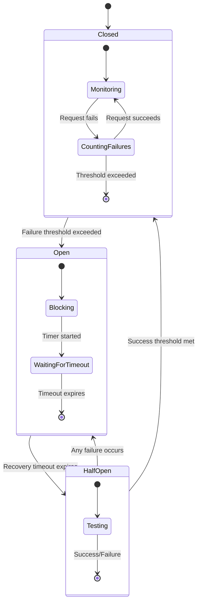

# Design Document

## Overview

The Circuit Breaker Implementation adds resilience patterns to the VEEDS Proofreader system by implementing circuit breaker functionality for AWS Bedrock calls. This design prevents cascade failures, provides graceful degradation, and ensures system stability during external service outages or throttling scenarios.

The implementation uses the cockatiel library for robust circuit breaker patterns, integrates seamlessly with existing retry logic and Langfuse tracing, and provides comprehensive observability for monitoring circuit breaker state and performance.

## Architecture

### High-Level Architecture

```mermaid
graph TB
    subgraph "Client Layer"
        API[VEEDS API<br/>GraphQL Endpoint]
    end
    
    subgraph "Circuit Breaker Layer"
        CBM[Circuit Breaker Manager<br/>Multi-Service Support]
        CB1[Bedrock Circuit Breaker<br/>Claude 3.5 Sonnet]
        CB2[Bedrock Circuit Breaker<br/>Claude Haiku]
        CBM --> CB1
        CBM --> CB2
    end
    
    subgraph "Service Layer"
        PS[Proofreader Service<br/>proofreadEntry()]
        RC[Retry Controller<br/>Exponential Backoff]
        PS --> CBM
        CBM --> RC
    end
    
    subgraph "External Services"
        BED1[AWS Bedrock<br/>Claude 3.5 Sonnet]
        BED2[AWS Bedrock<br/>Claude Haiku]
        RC --> BED1
        RC --> BED2
    end
    
    subgraph "Observability"
        LF[Langfuse Tracing<br/>Circuit Breaker Events]
        METRICS[Circuit Breaker Metrics<br/>State, Failures, Recovery]
    end
    
    API --> PS
    CBM --> LF
    CBM --> METRICS
    
    classDef client fill:#e1f5fe
    classDef breaker fill:#fff3e0
    classDef service fill:#e8f5e8
    classDef external fill:#ffebee
    classDef observability fill:#f3e5f5
    
    class API client
    class CBM,CB1,CB2 breaker
    class PS,RC service
    class BED1,BED2 external
    class LF,METRICS observability
```

### Circuit Breaker State Machine



## Components and Interfaces

### Circuit Breaker Manager

The Circuit Breaker Manager provides centralized management of multiple circuit breakers for different services and models.

```typescript
interface CircuitBreakerManager {
  // Get or create circuit breaker for service
  getCircuitBreaker(serviceName: string, config?: CircuitBreakerConfig): ICircuitBreaker;
  
  // Get circuit breaker state for monitoring
  getCircuitBreakerState(serviceName: string): CircuitBreakerState;
  
  // Get all circuit breaker states
  getAllStates(): Map<string, CircuitBreakerState>;
  
  // Shutdown all circuit breakers
  shutdown(): Promise<void>;
}

interface CircuitBreakerConfig {
  failureThreshold: number;        // Default: 5
  recoveryTimeout: number;         // Default: 30000ms
  successThreshold: number;        // Default: 2
  requestTimeout: number;          // Default: 5000ms
  name?: string;                   // For observability
}

interface CircuitBreakerState {
  name: string;
  state: 'closed' | 'open' | 'half-open';
  failureCount: number;
  successCount: number;
  lastFailureTime?: Date;
  nextAttemptTime?: Date;
  totalRequests: number;
  totalFailures: number;
}
```

### Bedrock Circuit Breaker Wrapper

Wraps AWS Bedrock calls with circuit breaker protection while maintaining existing interfaces.

```typescript
interface BedrockCircuitBreakerWrapper {
  // Execute Bedrock call with circuit breaker protection
  executeWithCircuitBreaker<T>(
    operation: () => Promise<T>,
    serviceName: string,
    context: BedrockCallContext
  ): Promise<T>;
  
  // Check if circuit breaker allows request
  canExecute(serviceName: string): boolean;
  
  // Get fallback response for open circuit
  getFallbackResponse(serviceName: string, context: BedrockCallContext): ProofreadResult;
}

interface BedrockCallContext {
  modelId: string;
  yamlEntry: string;
  traceId?: string;
  spanId?: string;
}
```

### Fallback Response Generator

Generates meaningful fallback responses when circuit breakers are open.

```typescript
interface FallbackResponseGenerator {
  // Generate fallback response for circuit breaker open state
  generateFallbackResponse(
    serviceName: string, 
    state: CircuitBreakerState,
    context: BedrockCallContext
  ): ProofreadResult;
  
  // Estimate recovery time based on circuit breaker state
  estimateRecoveryTime(state: CircuitBreakerState): number;
}

interface ProofreadResult {
  isValid: boolean;
  errors: ProofreadError[];
  metadata?: {
    circuitBreakerState?: string;
    estimatedRecoveryTime?: number;
    fallbackReason?: string;
  };
}
```

### Circuit Breaker Metrics Collector

Collects and reports circuit breaker metrics to Langfuse and other observability systems.

```typescript
interface CircuitBreakerMetricsCollector {
  // Record circuit breaker state change
  recordStateChange(
    serviceName: string,
    fromState: string,
    toState: string,
    context: MetricsContext
  ): void;
  
  // Record request execution
  recordExecution(
    serviceName: string,
    success: boolean,
    duration: number,
    circuitBreakerState: string
  ): void;
  
  // Record fallback usage
  recordFallback(serviceName: string, reason: string): void;
  
  // Get metrics summary
  getMetricsSummary(): CircuitBreakerMetrics;
}

interface CircuitBreakerMetrics {
  totalRequests: number;
  totalFailures: number;
  totalFallbacks: number;
  averageResponseTime: number;
  circuitBreakerStates: Map<string, CircuitBreakerState>;
  stateChangeHistory: StateChangeEvent[];
}
```

## Data Models

### Circuit Breaker Configuration

```typescript
interface CircuitBreakerConfiguration {
  // Service-specific configurations
  services: Map<string, ServiceCircuitBreakerConfig>;
  
  // Global defaults
  defaults: CircuitBreakerConfig;
  
  // Environment-specific overrides
  environment: {
    development?: Partial<CircuitBreakerConfig>;
    staging?: Partial<CircuitBreakerConfig>;
    production?: Partial<CircuitBreakerConfig>;
  };
}

interface ServiceCircuitBreakerConfig extends CircuitBreakerConfig {
  serviceName: string;
  enabled: boolean;
  fallbackStrategy: 'static' | 'dynamic' | 'cached';
  monitoringEnabled: boolean;
}
```

### Circuit Breaker Events

```typescript
interface CircuitBreakerEvent {
  eventId: string;
  timestamp: Date;
  serviceName: string;
  eventType: 'state_change' | 'request_executed' | 'fallback_used';
  data: CircuitBreakerEventData;
}

interface StateChangeEvent extends CircuitBreakerEvent {
  eventType: 'state_change';
  data: {
    fromState: string;
    toState: string;
    reason: string;
    failureCount: number;
    duration: number;
  };
}

interface RequestExecutionEvent extends CircuitBreakerEvent {
  eventType: 'request_executed';
  data: {
    success: boolean;
    duration: number;
    circuitBreakerState: string;
    error?: string;
  };
}

interface FallbackUsageEvent extends CircuitBreakerEvent {
  eventType: 'fallback_used';
  data: {
    reason: string;
    fallbackStrategy: string;
    estimatedRecoveryTime: number;
  };
}
```

## Correctness Properties

*A property is a characteristic or behavior that should hold true across all valid executions of a system—essentially, a formal statement about what the system should do. Properties serve as the bridge between human-readable specifications and machine-verifiable correctness guarantees.*

<function_calls>
<invoke name="prework">
<parameter name="featureName">circuit-breaker-implementation

Based on the prework analysis, the following properties validate the circuit breaker implementation:

### Property 1: Circuit Breaker State Transitions
*For any* circuit breaker configuration and failure sequence, when consecutive failures exceed the configured threshold, the circuit breaker should transition to open state.
**Validates: Requirements 1.1**

### Property 2: Open State Fallback Behavior  
*For any* circuit breaker in open state, all requests should return fallback responses immediately without calling external services.
**Validates: Requirements 1.2**

### Property 3: Recovery Timeout Transitions
*For any* circuit breaker in open state, when the recovery timeout expires, the circuit breaker should transition to half-open state.
**Validates: Requirements 1.3**

### Property 4: Half-Open Success Transitions
*For any* circuit breaker in half-open state, when a request succeeds, the circuit breaker should transition to closed state.
**Validates: Requirements 1.4**

### Property 5: Half-Open Failure Transitions
*For any* circuit breaker in half-open state, when a request fails, the circuit breaker should return to open state.
**Validates: Requirements 1.5**

### Property 6: Configuration Parameter Application
*For any* valid configuration parameters (failure threshold, recovery timeout, success threshold, request timeout), the circuit breaker should apply these values correctly and override defaults when environment variables are provided.
**Validates: Requirements 2.1, 2.2, 2.3, 2.4, 2.5**

### Property 7: Fallback Response Structure and Content
*For any* circuit breaker in open state, the fallback response should maintain the same JSON schema as normal responses, set isValid to false, include service unavailable error, and contain circuit breaker state with estimated recovery time.
**Validates: Requirements 3.1, 3.2, 3.3, 3.4, 3.5**

### Property 8: Retry Logic Integration
*For any* circuit breaker state, when the circuit breaker is closed, existing retry mechanisms should be used, and when the circuit breaker is open, retry logic should be bypassed entirely.
**Validates: Requirements 4.1, 4.2, 4.3**

### Property 9: Error Handling and Tracing Preservation
*For any* circuit breaker operation, existing error handling patterns and Langfuse tracing should be preserved without breaking spans or logging behavior.
**Validates: Requirements 4.4, 4.5**

### Property 10: Multi-Service Circuit Breaker Isolation
*For any* set of named circuit breakers, the circuit breaker manager should support multiple independent circuit breakers with per-service configuration and isolate failures between different service endpoints.
**Validates: Requirements 5.1, 5.2, 5.3, 5.4, 5.5**

### Property 11: Observability and Metrics Collection
*For any* circuit breaker state change or request execution, the system should emit appropriate events to Langfuse traces, track counters correctly, and record timing metrics accurately.
**Validates: Requirements 6.1, 6.2, 6.3, 6.4, 6.5**

### Property 12: Library Integration and Error Handling
*For any* circuit breaker library operation, the system should handle initialization errors gracefully, fall back to direct service calls when library operations fail, and validate configuration parameters at startup.
**Validates: Requirements 7.2, 7.3, 7.4, 7.5**

### Property 13: Performance and Resource Management
*For any* circuit breaker request, the system should add minimal overhead to successful requests, use minimal memory footprint, clean up expired state data automatically, handle high concurrency without blocking, and provide immediate responses when in open state.
**Validates: Requirements 8.1, 8.2, 8.3, 8.4, 8.5**

## Error Handling

### Circuit Breaker Library Failures

When the circuit breaker library (cockatiel) fails to initialize or operate:

1. **Graceful Degradation**: Fall back to direct service calls without circuit breaker protection
2. **Error Logging**: Log library failures with appropriate severity levels
3. **Monitoring**: Track library failure rates and alert on degraded operation
4. **Recovery**: Attempt to reinitialize the library on subsequent requests

### Configuration Validation Errors

Invalid configuration parameters should be handled as follows:

1. **Startup Validation**: Validate all configuration parameters during application startup
2. **Default Fallback**: Use default values for invalid or missing configuration
3. **Error Reporting**: Log configuration errors with specific details about invalid values
4. **Fail-Safe Operation**: Continue operation with default configuration rather than failing

### External Service Integration Errors

When integrating with AWS Bedrock and Langfuse:

1. **Bedrock Failures**: Circuit breaker should protect against Bedrock throttling and service errors
2. **Langfuse Failures**: Circuit breaker metrics and tracing should degrade gracefully if Langfuse is unavailable
3. **Network Errors**: Handle network timeouts and connection failures appropriately
4. **Authentication Errors**: Distinguish between transient and permanent authentication failures

### Concurrent Access Errors

Handle high-concurrency scenarios:

1. **Thread Safety**: Ensure circuit breaker state is thread-safe across concurrent requests
2. **Race Conditions**: Prevent race conditions during state transitions
3. **Resource Contention**: Avoid blocking operations that could impact performance
4. **State Consistency**: Maintain consistent state even under high load

## Testing Strategy

### Dual Testing Approach

The circuit breaker implementation requires both unit testing and property-based testing for comprehensive coverage:

**Unit Tests** focus on:
- Specific configuration scenarios and edge cases
- Integration points with existing retry logic and Langfuse tracing
- Error conditions and fallback behavior
- Library initialization and configuration validation

**Property Tests** focus on:
- Universal circuit breaker state machine behavior across all configurations
- Comprehensive input coverage through randomized failure patterns and configurations
- Performance characteristics under various load conditions
- Concurrent access patterns and thread safety

### Property-Based Testing Configuration

Each property test will be configured to run a minimum of 100 iterations using the cockatiel library's built-in testing utilities and custom generators for:

- Random failure sequences and success patterns
- Various configuration parameter combinations
- Concurrent request scenarios
- Different service and model combinations

Property tests will be tagged with comments referencing their design document properties:
- **Feature: circuit-breaker-implementation, Property 1: Circuit Breaker State Transitions**
- **Feature: circuit-breaker-implementation, Property 2: Open State Fallback Behavior**
- And so on for each property

### Integration Testing

Integration tests will verify:
- End-to-end circuit breaker behavior with real AWS Bedrock calls
- Langfuse tracing integration with circuit breaker events
- Configuration loading from environment variables
- Multi-service circuit breaker isolation in realistic scenarios

### Performance Testing

Performance tests will validate:
- Circuit breaker overhead measurements under normal operation
- Response time characteristics when circuit breaker is open
- Memory usage patterns during extended operation
- Concurrent request handling without blocking