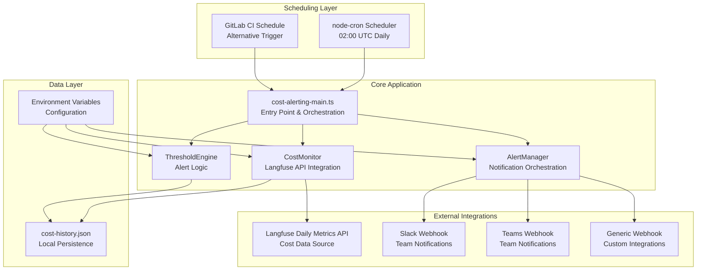

# Design Document

## Overview

The Cost Alerting Nightly system is a Node.js TypeScript application that monitors LLM usage costs through the Langfuse Daily Metrics API. It implements threshold-based alerting with support for both absolute cost limits and percentage-based increase detection. The system runs as a scheduled job and sends notifications through multiple channels including Slack, Microsoft Teams, and generic webhooks.

## Architecture

The system follows a modular architecture with clear separation of concerns:



## Components and Interfaces

### CostMonitor Class

**Purpose**: Handles Langfuse API integration and historical data management.

**Interface**:
```typescript
interface ICostMonitor {
  fetchDailyCosts(date: Date): Promise<DailyCostData>;
  getHistoricalData(days: number): Promise<DailyCostData[]>;
  storeCostData(data: DailyCostData): Promise<void>;
  validateDataIntegrity(): Promise<boolean>;
}

interface DailyCostData {
  date: string; // ISO date string
  totalCostUsd: number;
  requestCount: number;
  averageCostPerRequest: number;
  modelBreakdown: ModelCostBreakdown[];
}

interface ModelCostBreakdown {
  model: string;
  costUsd: number;
  requestCount: number;
  inputTokens: number;
  outputTokens: number;
}
```

**Key Methods**:
- `fetchDailyCosts()`: Queries Langfuse API with retry logic and circuit breaker
- `getHistoricalData()`: Retrieves stored cost data for trend analysis
- `storeCostData()`: Persists daily cost data to local JSON file
- `validateDataIntegrity()`: Checks historical data consistency on startup

### ThresholdEngine Class

**Purpose**: Evaluates cost data against configured thresholds and determines when alerts should be triggered.

**Interface**:
```typescript
interface IThresholdEngine {
  evaluateAbsoluteThreshold(currentCost: number): ThresholdResult;
  evaluatePercentageThreshold(currentCost: number, historicalData: DailyCostData[]): ThresholdResult;
  calculateSevenDayAverage(historicalData: DailyCostData[]): number;
}

interface ThresholdResult {
  triggered: boolean;
  thresholdType: 'absolute' | 'percentage';
  currentValue: number;
  thresholdValue: number;
  message: string;
}

interface ThresholdConfig {
  absoluteThresholdUsd: number;
  percentageThreshold: number;
  comparisonPeriodDays: number;
}
```

**Key Methods**:
- `evaluateAbsoluteThreshold()`: Checks if current cost exceeds fixed threshold
- `evaluatePercentageThreshold()`: Compares current cost to historical average
- `calculateSevenDayAverage()`: Computes baseline for percentage comparisons

### AlertManager Class

**Purpose**: Orchestrates notification delivery across multiple channels with appropriate formatting.

**Interface**:
```typescript
interface IAlertManager {
  sendAlert(alert: AlertData): Promise<AlertResult[]>;
  formatSlackMessage(alert: AlertData): SlackMessage;
  formatTeamsMessage(alert: AlertData): TeamsMessage;
  formatGenericMessage(alert: AlertData): GenericMessage;
}

interface AlertData {
  date: string;
  currentCost: number;
  thresholdResults: ThresholdResult[];
  historicalContext: HistoricalContext;
  dashboardUrl: string;
}

interface AlertResult {
  channel: string;
  success: boolean;
  error?: string;
  responseTime: number;
}
```

**Key Methods**:
- `sendAlert()`: Coordinates notification delivery to all configured channels
- `formatSlackMessage()`: Creates Slack-specific message format with blocks
- `formatTeamsMessage()`: Creates Teams-specific adaptive card format
- `formatGenericMessage()`: Creates simple JSON payload for custom webhooks

### WebhookClient Class

**Purpose**: Handles HTTP communication with webhook endpoints including retry logic and error handling.

**Interface**:
```typescript
interface IWebhookClient {
  sendWebhook(url: string, payload: any, options?: WebhookOptions): Promise<WebhookResponse>;
  validateWebhookUrl(url: string): boolean;
}

interface WebhookOptions {
  timeout: number;
  retries: number;
  headers: Record<string, string>;
}

interface WebhookResponse {
  success: boolean;
  statusCode: number;
  responseTime: number;
  error?: string;
}
```

## Data Models

### Cost History Storage

The system maintains historical cost data in a local JSON file with the following structure:

```typescript
interface CostHistoryFile {
  version: string;
  lastUpdated: string;
  retentionDays: number;
  entries: DailyCostData[];
}
```

**File Location**: `data/cost-history.json`
**Retention Policy**: 90 days maximum, 30 days minimum
**Backup Strategy**: Daily rotation with 7-day backup retention

### Configuration Schema

All configuration is managed through environment variables with validation:

```typescript
interface CostAlertingConfig {
  // Langfuse API Configuration
  langfuseApiUrl: string;
  langfusePublicKey: string;
  langfuseSecretKey: string;
  
  // Threshold Configuration
  absoluteThresholdUsd: number; // Default: 50.00
  percentageThreshold: number;  // Default: 50
  comparisonPeriodDays: number; // Default: 7
  
  // Notification Configuration
  slackWebhookUrl?: string;
  teamsWebhookUrl?: string;
  genericWebhookUrls?: string[]; // Comma-separated
  
  // System Configuration
  scheduleEnabled: boolean;     // Default: true
  scheduleTime: string;         // Default: "0 2 * * *"
  dataRetentionDays: number;    // Default: 90
  
  // Langfuse Dashboard
  dashboardBaseUrl: string;     // Default: http://localhost:3000
}
```

Now I need to use the prework tool to analyze the acceptance criteria before writing correctness properties.

<function_calls>
<invoke name="prework">
<parameter name="featureName">cost-alerting-nightly

## Correctness Properties

*A property is a characteristic or behavior that should hold true across all valid executions of a system—essentially, a formal statement about what the system should do. Properties serve as the bridge between human-readable specifications and machine-verifiable correctness guarantees.*

### Property Reflection

After analyzing all acceptance criteria, several properties can be consolidated to eliminate redundancy:

- Properties for configuration loading (environment variables, defaults) can be combined into comprehensive configuration validation properties
- Message formatting properties for different channels can be unified into channel-specific formatting properties
- Error handling properties across different components can be consolidated into resilience properties

### Core Properties

**Property 1: API Integration Reliability**
*For any* valid date parameter, when the Cost_Monitor queries the Langfuse Daily Metrics API, it should either return valid cost data or exhaust all retry attempts before failing gracefully
**Validates: Requirements 1.1, 1.3, 1.4**

**Property 2: Data Persistence Consistency**
*For any* valid cost data, when stored by the Cost_Monitor, it should be retrievable from the Cost_History with identical values and proper JSON structure
**Validates: Requirements 1.2, 7.1**

**Property 3: Absolute Threshold Detection**
*For any* cost value and configured absolute threshold, the Threshold_Engine should trigger an alert if and only if the cost exceeds the threshold
**Validates: Requirements 2.1, 2.2**

**Property 4: Percentage Threshold Calculation**
*For any* current cost and historical data set with at least 7 days, the percentage increase calculation should be mathematically accurate and trigger alerts only when exceeding the configured percentage
**Validates: Requirements 3.1, 3.2**

**Property 5: Multi-Channel Notification Delivery**
*For any* triggered alert and set of configured notification channels, all reachable channels should receive appropriately formatted notifications
**Validates: Requirements 4.1, 4.2, 4.3, 4.4**

**Property 6: Configuration Loading and Defaults**
*For any* combination of present and missing environment variables, the system should load configured values where available and apply documented defaults for missing values
**Validates: Requirements 2.4, 3.4, 6.1, 6.2, 6.3, 6.4**

**Property 7: Message Content Completeness**
*For any* alert type (absolute or percentage), the formatted message should contain all required fields specific to that alert type and be valid for the target channel format
**Validates: Requirements 5.1, 5.2, 5.3, 5.4, 5.5**

**Property 8: Historical Data Management**
*For any* historical data file, the Cost_Monitor should maintain data within retention limits, validate integrity on startup, and recover gracefully from corruption
**Validates: Requirements 7.2, 7.3, 7.4, 7.5**

**Property 9: Error Isolation and Resilience**
*For any* external service failure (API, webhook), the system should continue operating with other services and log appropriate error information without crashing
**Validates: Requirements 4.5, 8.1, 8.2, 8.3, 8.5**

**Property 10: Circuit Breaker Protection**
*For any* sequence of external API failures, the circuit breaker should activate after the configured failure threshold and prevent further calls during the open state
**Validates: Requirements 8.4**

## Error Handling

### API Error Handling

The system implements comprehensive error handling for Langfuse API interactions:

- **Retry Logic**: Exponential backoff with jitter (1s, 2s, 4s base intervals)
- **Circuit Breaker**: Opens after 5 consecutive failures, half-open after 60 seconds
- **Timeout Handling**: 30-second timeout per API call
- **Rate Limiting**: Respects API rate limits with automatic backoff

### Webhook Error Handling

Notification delivery implements resilient error handling:

- **Individual Channel Isolation**: Failure in one channel doesn't affect others
- **Timeout Configuration**: 10-second timeout per webhook call
- **Retry Strategy**: Single retry with 5-second delay for transient failures
- **Error Logging**: Detailed error information for troubleshooting

### Data Integrity Error Handling

Historical data management includes robust error recovery:

- **JSON Validation**: Schema validation on file read/write operations
- **Corruption Recovery**: Automatic reinitialization with current data
- **Backup Strategy**: Daily snapshots with 7-day retention
- **Graceful Degradation**: Continue operation with reduced functionality

## Testing Strategy

### Dual Testing Approach

The system requires both unit testing and property-based testing for comprehensive coverage:

**Unit Tests** focus on:
- Specific configuration scenarios and edge cases
- Error condition handling and recovery
- Message formatting for different channels
- Integration points with external services

**Property Tests** focus on:
- Universal properties across all inputs and configurations
- Mathematical correctness of threshold calculations
- Data consistency across storage and retrieval operations
- Comprehensive input coverage through randomization

### Property-Based Testing Configuration

- **Testing Library**: fast-check for TypeScript property-based testing
- **Test Iterations**: Minimum 100 iterations per property test
- **Test Tagging**: Each property test tagged with feature name and property reference
- **Tag Format**: `Feature: cost-alerting-nightly, Property {number}: {property_text}`

### Testing Environment Requirements

- **Mock Langfuse API**: Configurable responses for different scenarios
- **Webhook Test Server**: Capture and validate notification payloads
- **Time Mocking**: Control scheduling and date-based logic
- **File System Mocking**: Test data persistence without side effects