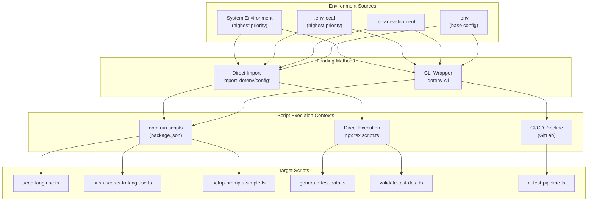
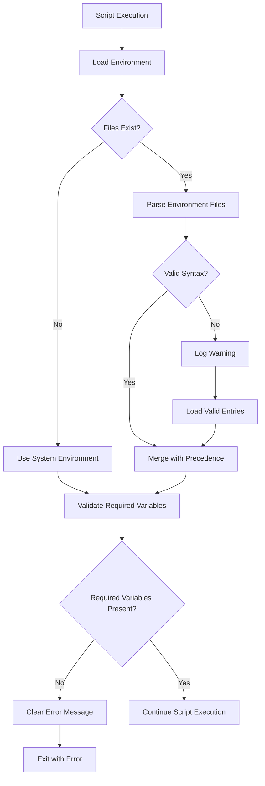

# Design Document

## Overview

The dotenv scripts integration feature will implement automatic environment variable loading for all TypeScript scripts in the VEEDS LLMOps system. The solution provides two complementary approaches: direct import integration for individual scripts and CLI wrapper integration for npm scripts, ensuring consistent environment variable access across all execution contexts.

The design prioritizes developer experience, backward compatibility, and robust error handling while maintaining the existing security practices and CI/CD pipeline compatibility.

## Architecture

### High-Level Architecture



### Component Architecture

The system consists of three main components:

1. **Environment Loader**: Handles automatic loading of `.env` files with proper precedence
2. **Script Integration Layer**: Provides integration methods for different execution contexts
3. **Validation and Error Handling**: Ensures robust operation with clear error reporting

## Components and Interfaces

### Environment Loading Strategy

The environment loading follows a clear precedence hierarchy:

1. **System Environment Variables** (highest priority)
2. **`.env.local`** (local overrides, gitignored)
3. **`.env.development`** (development-specific)
4. **`.env`** (base configuration)

### Direct Import Integration

For individual script integration, scripts will use:

```typescript
import "dotenv/config";
// This must be the first import in every script
```

The `dotenv/config` module automatically:
- Loads `.env` files in the correct precedence order
- Merges with existing `process.env` without overriding system variables
- Handles missing files gracefully
- Provides no-op behavior in production environments where system variables are preferred

### CLI Wrapper Integration

For npm scripts integration, `package.json` scripts will use:

```json
{
  "scripts": {
    "seed": "dotenv -e .env -e .env.local -- npx tsx scripts/seed-langfuse.ts",
    "eval:push": "dotenv -e .env -e .env.local -- npx tsx scripts/push-scores-to-langfuse.ts"
  }
}
```

The `dotenv-cli` wrapper:
- Loads multiple environment files with `-e` flags
- Preserves system environment variables
- Works in CI/CD environments where files may not exist
- Provides consistent behavior across different execution contexts

### Script Integration Points

The following scripts require environment variable integration:

#### Core Scripts (`/scripts/`)
- `seed-langfuse.ts`: Requires `LANGFUSE_PUBLIC_KEY`, `LANGFUSE_SECRET_KEY`, `LANGFUSE_HOST`
- `push-scores-to-langfuse.ts`: Requires `LANGFUSE_PUBLIC_KEY`, `LANGFUSE_SECRET_KEY`, `LANGFUSE_HOST`
- `setup-prompts-simple.ts`: Requires `LANGFUSE_PUBLIC_KEY`, `LANGFUSE_SECRET_KEY`, `LANGFUSE_HOST`
- `generate-test-data.ts`: May require `AWS_REGION`, `AWS_ACCESS_KEY_ID`, `AWS_SECRET_ACCESS_KEY`
- `validate-test-data.ts`: May require `LANGFUSE_PUBLIC_KEY`, `LANGFUSE_SECRET_KEY`
- `ci-test-pipeline.ts`: Requires various environment variables for CI/CD execution

#### Evaluation Scripts (`/eval/`)
- `generate-promptfoo-tests.ts`: May require `PROMPTFOO_CACHE_ENABLED`
- `upload-dataset-to-langfuse.ts`: Requires `LANGFUSE_PUBLIC_KEY`, `LANGFUSE_SECRET_KEY`, `LANGFUSE_HOST`

### Error Handling Strategy



## Data Models

### Environment Configuration Model

```typescript
interface EnvironmentConfig {
  // Core Langfuse configuration
  LANGFUSE_PUBLIC_KEY: string;
  LANGFUSE_SECRET_KEY: string;
  LANGFUSE_HOST: string;
  
  // AWS Bedrock configuration
  AWS_REGION: string;
  AWS_ACCESS_KEY_ID?: string;
  AWS_SECRET_ACCESS_KEY?: string;
  AWS_PROFILE?: string;
  
  // Optional configuration
  PROMPTFOO_CACHE_ENABLED?: string;
  OPENAI_API_KEY?: string;
}

interface EnvironmentLoadResult {
  loaded: boolean;
  sources: string[];
  errors: string[];
  missingRequired: string[];
}
```

### Script Configuration Model

```typescript
interface ScriptConfig {
  name: string;
  requiredEnvVars: string[];
  optionalEnvVars: string[];
  loadingMethod: 'direct' | 'cli-wrapper';
  fallbackBehavior: 'error' | 'warn' | 'continue';
}
```

### Environment File Precedence Model

```typescript
interface EnvironmentSource {
  type: 'system' | 'file';
  path?: string;
  priority: number;
  variables: Record<string, string>;
}

interface EnvironmentResolution {
  finalVariables: Record<string, string>;
  sources: EnvironmentSource[];
  conflicts: Array<{
    variable: string;
    sources: EnvironmentSource[];
    resolvedValue: string;
  }>;
}
```

## Correctness Properties

*A property is a characteristic or behavior that should hold true across all valid executions of a system—essentially, a formal statement about what the system should do. Properties serve as the bridge between human-readable specifications and machine-verifiable correctness guarantees.*

Based on the prework analysis and property reflection, the following properties validate the system's correctness:

### Property 1: Automatic Environment Loading
*For any* TypeScript script in the `/scripts/` or `/eval/` directories, when executed through any method (npm run, npx tsx, CI/CD), environment variables should be automatically available without manual intervention.
**Validates: Requirements 1.1, 1.3, 5.1, 5.2**

### Property 2: Environment Precedence Resolution
*For any* environment variable name and any combination of environment files (`.env`, `.env.local`, `.env.development`) and system variables, the final value should follow the precedence order: system variables > `.env.local` > `.env.development` > `.env`.
**Validates: Requirements 1.2, 2.1, 2.2, 2.3, 2.5**

### Property 3: Graceful Degradation
*For any* script execution when `.env` files are missing, malformed, or inaccessible, the script should continue execution using available environment sources without throwing errors.
**Validates: Requirements 1.4, 4.1, 4.2, 4.4**

### Property 4: Integration Method Consistency
*For any* script, both direct import (`import "dotenv/config"`) and CLI wrapper (`dotenv-cli`) methods should successfully load environment variables with identical results and proper timing.
**Validates: Requirements 3.1, 3.2, 3.3, 3.4, 3.5**

### Property 5: Environment File Exclusion
*For any* content placed in `.env.example`, those values should never be loaded into the runtime environment, ensuring the file serves only as documentation.
**Validates: Requirements 2.4**

### Property 6: Cross-Environment Compatibility
*For any* script execution across different environments (local, CI, production), the environment loading behavior should be consistent and compatible with existing configurations while prioritizing system variables in production contexts.
**Validates: Requirements 5.1, 5.2, 5.3, 5.4, 5.5**

### Property 7: Required Variable Validation
*For any* script with defined required environment variables, when those variables are missing after loading, the script should provide clear error messages indicating which variables are needed without revealing sensitive configuration details.
**Validates: Requirements 4.3, 6.3**

### Property 8: Secure Sensitive Data Handling
*For any* environment variable containing sensitive data (API keys, passwords, tokens), the system should handle them securely without exposing actual values in logs, error messages, or debug output while maintaining useful troubleshooting information.
**Validates: Requirements 6.1, 6.2, 6.4, 6.5**

### Property 9: Comprehensive Secure Logging
*For any* environment loading operation, the system should provide detailed logging for troubleshooting while consistently masking sensitive values across all environments and execution contexts.
**Validates: Requirements 1.5, 4.5, 5.5**

## Error Handling

### Error Categories

The system handles four categories of errors:

1. **Missing Environment Files**: When `.env` files don't exist, the system continues with system environment variables
2. **Malformed Environment Files**: When `.env` files contain syntax errors, the system logs warnings and loads valid entries
3. **Missing Required Variables**: When required environment variables are not found, the system provides clear error messages
4. **Loading Failures**: When the environment loading mechanism fails, the system falls back to system variables

### Fallback Mechanisms

1. **File Loading Fallback**: System environment variables when files are missing
2. **Parsing Fallback**: Valid entries when files are partially malformed
3. **Validation Fallback**: Clear error messages when required variables are missing
4. **Method Fallback**: Direct import method when CLI wrapper fails

### Security Considerations

The error handling system implements several security measures:

- **Sensitive Value Masking**: All logging and error messages mask sensitive values using pattern matching
- **Minimal Information Disclosure**: Error messages provide helpful information without revealing system internals
- **Secure Fallback**: Fallback mechanisms maintain security practices even when primary loading fails

## Testing Strategy

### Dual Testing Approach

The testing strategy combines unit tests for specific scenarios and property-based tests for comprehensive coverage:

**Unit Tests Focus:**
- Specific environment file configurations
- Error message formatting and clarity
- Integration with existing scripts
- CI/CD pipeline compatibility
- Security constraint validation

**Property Tests Focus:**
- Environment variable precedence across all combinations
- Script execution across all methods and contexts
- Error handling across all failure scenarios
- Backward compatibility across all existing scripts
- Security behavior across all sensitive data patterns

### Property Test Configuration

- **Minimum 100 iterations** per property test for thorough randomization
- **Test data generation** for environment files, variable names, and script configurations
- **Cross-platform testing** to ensure consistent behavior across development environments
- **Security-focused generators** that create realistic sensitive data patterns for testing

Each property test references its corresponding design document property with the tag format:
**Feature: dotenv-scripts-integration, Property {number}: {property_text}**

### Integration Testing

- **End-to-end script execution** testing across all integration methods
- **CI/CD pipeline simulation** to verify compatibility with GitLab configurations
- **Multi-environment testing** to ensure consistent behavior across local, CI, and production contexts
- **Security validation** to ensure no sensitive data leakage in logs or error messages