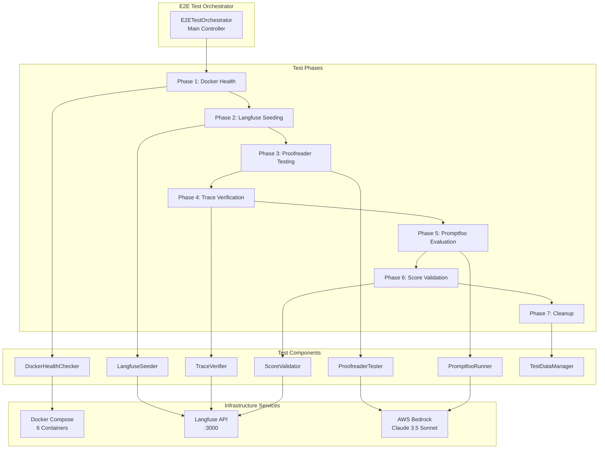
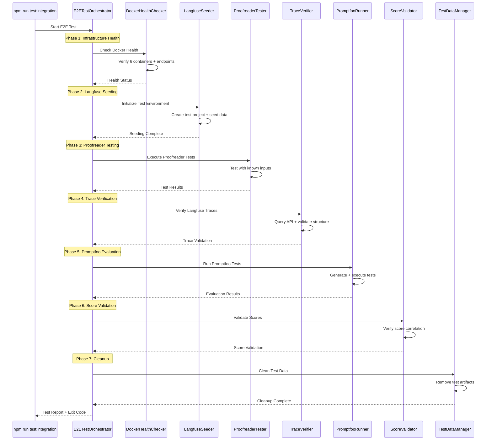

# Design Document

## Overview

The E2E Integration Test system provides comprehensive end-to-end testing of the VEEDS LLMOps pipeline. It implements a sequential test workflow that validates Docker infrastructure, Langfuse integration, proofreader functionality, trace verification, Promptfoo evaluation, and score validation. The system is designed to run both locally and in CI/CD environments with comprehensive error handling and diagnostic capabilities.

## Architecture

### System Architecture



### Test Flow Architecture



## Components and Interfaces

### E2ETestOrchestrator

**Purpose**: Main controller that orchestrates the entire test workflow

**Interface**:
```typescript
interface E2ETestOrchestrator {
  runTests(config: E2ETestConfig): Promise<E2ETestResult>
  getTestReport(): E2ETestReport
  cleanup(): Promise<void>
}

interface E2ETestConfig {
  environment: 'local' | 'ci'
  timeout: number
  skipCleanup: boolean
  testDataSubset: number
  logLevel: 'debug' | 'info' | 'warn' | 'error'
}

interface E2ETestResult {
  success: boolean
  phases: PhaseResult[]
  duration: number
  errors: TestError[]
}
```

### DockerHealthChecker

**Purpose**: Validates Docker infrastructure health and service availability

**Interface**:
```typescript
interface DockerHealthChecker {
  checkContainerHealth(): Promise<ContainerHealthResult>
  checkServiceEndpoints(): Promise<EndpointHealthResult>
  waitForHealthy(timeout: number): Promise<void>
}

interface ContainerHealthResult {
  containers: ContainerStatus[]
  allHealthy: boolean
}

interface ContainerStatus {
  name: string
  status: 'running' | 'stopped' | 'unhealthy'
  health: 'healthy' | 'unhealthy' | 'starting'
  ports: number[]
}
```

### LangfuseSeeder

**Purpose**: Initializes Langfuse with test data and configuration

**Interface**:
```typescript
interface LangfuseSeeder {
  createTestProject(): Promise<string>
  seedPrompts(projectId: string): Promise<void>
  seedDatasets(projectId: string): Promise<void>
  verifySeeding(projectId: string): Promise<SeedingVerification>
  cleanup(projectId: string): Promise<void>
}

interface SeedingVerification {
  promptsCreated: number
  datasetItemsCreated: number
  apiKeysGenerated: boolean
}
```

### ProofreaderTester

**Purpose**: Executes proofreader function tests with known inputs

**Interface**:
```typescript
interface ProofreaderTester {
  runProofreaderTests(testCases: TestCase[]): Promise<ProofreaderTestResult[]>
  validateResponse(response: any, expected: any): ValidationResult
  testErrorHandling(): Promise<ErrorHandlingResult>
}

interface ProofreaderTestResult {
  testCase: TestCase
  response: any
  duration: number
  success: boolean
  validationErrors: string[]
}
```

### TraceVerifier

**Purpose**: Verifies traces are created correctly in Langfuse

**Interface**:
```typescript
interface TraceVerifier {
  waitForTraces(traceIds: string[], timeout: number): Promise<void>
  verifyTraceStructure(traceId: string): Promise<TraceValidation>
  validateSpans(traceId: string): Promise<SpanValidation[]>
  checkScores(traceId: string): Promise<ScoreValidation>
}

interface TraceValidation {
  traceExists: boolean
  hasRequiredSpans: boolean
  hasGenerationSpan: boolean
  hasScores: boolean
  structure: TraceStructure
}
```

### PromptfooRunner

**Purpose**: Executes Promptfoo evaluations and validates results

**Interface**:
```typescript
interface PromptfooRunner {
  generateTests(): Promise<void>
  runEvaluation(): Promise<PromptfooResult>
  validateResults(result: PromptfooResult): Promise<ResultValidation>
  pushScores(): Promise<void>
}

interface PromptfooResult {
  totalTests: number
  passed: number
  failed: number
  results: TestResult[]
  stats: EvaluationStats
}
```

### ScoreValidator

**Purpose**: Validates evaluation scores and correlation

**Interface**:
```typescript
interface ScoreValidator {
  validateScoreCorrelation(): Promise<CorrelationValidation>
  checkScoreRanges(scores: Score[]): Promise<RangeValidation>
  verifyAggregation(): Promise<AggregationValidation>
}

interface CorrelationValidation {
  promptfooScoresMatch: boolean
  langfuseScoresMatch: boolean
  correlationCoefficient: number
}
```

### TestDataManager

**Purpose**: Manages test data lifecycle and isolation

**Interface**:
```typescript
interface TestDataManager {
  createTestDataset(): Promise<TestDataset>
  cleanupTestData(datasetId: string): Promise<void>
  preserveResults(results: any): Promise<string>
  ensureIsolation(): Promise<void>
}

interface TestDataset {
  id: string
  testCases: TestCase[]
  expectedResults: ExpectedResult[]
  metadata: TestMetadata
}
```

## Data Models

### Test Configuration

```typescript
interface E2ETestConfig {
  environment: 'local' | 'ci'
  timeout: number
  skipCleanup: boolean
  testDataSubset: number
  logLevel: 'debug' | 'info' | 'warn' | 'error'
  docker: {
    composeFile: string
    healthCheckTimeout: number
  }
  langfuse: {
    baseUrl: string
    testProjectName: string
  }
  promptfoo: {
    configFile: string
    maxConcurrency: number
  }
  aws: {
    region: string
    model: string
  }
}
```

### Test Results

```typescript
interface E2ETestReport {
  summary: TestSummary
  phases: PhaseReport[]
  performance: PerformanceMetrics
  diagnostics: DiagnosticInfo
  timestamp: string
}

interface TestSummary {
  totalDuration: number
  phasesCompleted: number
  totalPhases: number
  success: boolean
  errorCount: number
}

interface PhaseReport {
  name: string
  duration: number
  success: boolean
  details: any
  errors: TestError[]
}

interface PerformanceMetrics {
  dockerHealthTime: number
  seedingTime: number
  proofreaderAvgLatency: number
  traceVerificationTime: number
  promptfooEvaluationTime: number
  scoreValidationTime: number
}
```

### Error Handling

```typescript
interface TestError {
  phase: string
  component: string
  type: 'timeout' | 'api_error' | 'validation_error' | 'infrastructure_error'
  message: string
  details: any
  timestamp: string
  recoverable: boolean
}

interface DiagnosticInfo {
  containerStatuses: ContainerStatus[]
  apiEndpointHealth: EndpointHealth[]
  resourceUsage: ResourceUsage
  logFiles: string[]
}
```

## Correctness Properties

*A property is a characteristic or behavior that should hold true across all valid executions of a system—essentially, a formal statement about what the system should do. Properties serve as the bridge between human-readable specifications and machine-verifiable correctness guarantees.*

<function_calls>
<invoke name="prework">
<parameter name="featureName">e2e-integration-test

### Property Reflection

After reviewing all properties identified in the prework analysis, I've identified several areas where properties can be consolidated to eliminate redundancy:

**Consolidation Areas:**
- Properties 1.1-1.5 (Docker health checking) can be combined into comprehensive container health validation
- Properties 2.1-2.5 (Langfuse seeding) can be consolidated into seeding workflow validation
- Properties 3.1-3.5 (Proofreader testing) can be combined into proofreader validation
- Properties 4.1-4.5 (Trace verification) can be consolidated into trace validation
- Properties 5.1-5.5 (Promptfoo execution) can be combined into evaluation validation
- Properties 6.1-6.5 (Score validation) can be consolidated into score correlation validation
- Properties 7.1-7.5 (Test data management) can be combined into data lifecycle validation
- Properties 8.1-8.5 (CI/CD integration) can be consolidated into pipeline execution validation
- Properties 9.1-9.5 (Error handling) can be combined into error handling validation
- Properties 10.1-10.5 (Performance testing) can be consolidated into performance validation

**Consolidated Properties:**

Property 1: Container Health Validation
*For any* E2E test execution, all Docker containers must be running and healthy, and all service endpoints must respond successfully before proceeding to the next phase
**Validates: Requirements 1.1, 1.2, 1.4, 1.5**

Property 2: Container Error Handling
*For any* unhealthy container state, the system must fail with descriptive error messages that specify which container and endpoint failed
**Validates: Requirements 1.3**

Property 3: Seeding Workflow Validation
*For any* Langfuse seeding operation, the system must create isolated test projects, upload prompts with correct labels, seed datasets, and verify creation via API calls
**Validates: Requirements 2.1, 2.2, 2.3, 2.4, 2.5**

Property 4: Proofreader Function Validation
*For any* proofreader test execution, the system must test with known inputs, validate response structure and content, test both valid and invalid scenarios, and verify error handling
**Validates: Requirements 3.1, 3.2, 3.3, 3.4, 3.5**

Property 5: Trace Verification Validation
*For any* proofreader execution, corresponding traces must be queryable via Langfuse API, contain required spans with model/usage information, include processing_time_ms scores, and be retrieved with exponential backoff
**Validates: Requirements 4.1, 4.2, 4.3, 4.4, 4.5**

Property 6: Evaluation Execution Validation
*For any* Promptfoo evaluation, tests must be generated from golden dataset, executed against prompts, create results files, validate metrics within expected ranges, and verify assertions pass for known good inputs
**Validates: Requirements 5.1, 5.2, 5.3, 5.4, 5.5**

Property 7: Score Correlation Validation
*For any* score validation operation, scores must appear in Langfuse, be within expected ranges, have correct aggregation, include proper metadata, and correlate between Promptfoo and Langfuse systems
**Validates: Requirements 6.1, 6.2, 6.3, 6.4, 6.5**

Property 8: Test Data Lifecycle Validation
*For any* test execution, the system must create isolated datasets, clean up test data after completion, use dataset subsets for performance, preserve results for debugging, and ensure isolation between concurrent runs
**Validates: Requirements 7.1, 7.2, 7.3, 7.4, 7.5**

Property 9: Pipeline Execution Validation
*For any* CI/CD execution, the system must execute phases sequentially, provide detailed failure information, generate test reports with metrics, adapt to environment configurations, and support both local and CI modes
**Validates: Requirements 8.1, 8.2, 8.3, 8.4, 8.5**

Property 10: Error Handling Validation
*For any* error condition, the system must provide detailed error messages with context, specify timeout components, log API request/response details, preserve diagnostic information, and provide health check commands
**Validates: Requirements 9.1, 9.2, 9.3, 9.4, 9.5**

Property 11: Performance Validation
*For any* performance measurement, the system must verify response times within limits, handle expected load, monitor resource consumption, validate throughput, and recover gracefully from transient failures
**Validates: Requirements 10.1, 10.2, 10.3, 10.4, 10.5**

## Error Handling

### Error Classification

The system implements comprehensive error handling with categorized error types:

1. **Infrastructure Errors**: Docker container failures, service unavailability
2. **API Errors**: Langfuse API failures, AWS Bedrock throttling
3. **Validation Errors**: Response structure mismatches, assertion failures
4. **Timeout Errors**: Component timeouts with specific timeout reasons
5. **Configuration Errors**: Missing environment variables, invalid configurations

### Error Recovery Strategies

```typescript
interface ErrorRecoveryStrategy {
  retryable: boolean
  maxRetries: number
  backoffStrategy: 'exponential' | 'linear' | 'fixed'
  fallbackAction?: () => Promise<void>
}

const errorStrategies: Record<string, ErrorRecoveryStrategy> = {
  'docker_container_unhealthy': {
    retryable: true,
    maxRetries: 3,
    backoffStrategy: 'exponential'
  },
  'langfuse_api_timeout': {
    retryable: true,
    maxRetries: 5,
    backoffStrategy: 'exponential'
  },
  'bedrock_throttling': {
    retryable: true,
    maxRetries: 3,
    backoffStrategy: 'exponential'
  },
  'validation_failure': {
    retryable: false,
    maxRetries: 0,
    backoffStrategy: 'fixed'
  }
}
```

### Diagnostic Information Collection

The system collects comprehensive diagnostic information for troubleshooting:

- Container status and health information
- API endpoint response times and status codes
- Resource usage metrics (CPU, memory, disk)
- Log file locations and relevant log entries
- Configuration values (sanitized)
- Network connectivity status

## Testing Strategy

### Dual Testing Approach

The E2E Integration Test system itself requires comprehensive testing using both unit tests and property-based tests:

**Unit Tests**:
- Test individual component functionality (DockerHealthChecker, LangfuseSeeder, etc.)
- Test specific error scenarios and edge cases
- Test configuration parsing and validation
- Test report generation and formatting

**Property-Based Tests**:
- Test universal properties across all test executions
- Validate error handling across different failure modes
- Test data isolation across concurrent executions
- Validate performance characteristics under various loads

### Property Test Configuration

Each property test will run with minimum 100 iterations and reference the corresponding design property:

```typescript
// Example property test configuration
describe('E2E Integration Tests - Property Tests', () => {
  test('Property 1: Container Health Validation', async () => {
    // Tag: Feature: e2e-integration-test, Property 1: Container Health Validation
    await fc.assert(
      fc.asyncProperty(
        fc.record({
          containers: fc.array(containerStatusArb, { minLength: 6, maxLength: 6 }),
          endpoints: fc.array(endpointArb, { minLength: 5, maxLength: 5 })
        }),
        async ({ containers, endpoints }) => {
          const healthChecker = new DockerHealthChecker();
          const result = await healthChecker.checkContainerHealth();
          
          // All containers must be running and healthy
          expect(result.allHealthy).toBe(
            containers.every(c => c.status === 'running' && c.health === 'healthy')
          );
        }
      ),
      { numRuns: 100 }
    );
  });
});
```

### Integration Test Levels

The system supports multiple levels of integration testing:

1. **Component Integration**: Test individual components against real services
2. **Service Integration**: Test service-to-service communication
3. **End-to-End Integration**: Test complete workflow from start to finish
4. **Performance Integration**: Test system performance under load
5. **Failure Integration**: Test system behavior under various failure conditions

### Test Data Management

The testing strategy includes comprehensive test data management:

- **Golden Dataset Subset**: Use configurable subset of golden dataset for faster execution
- **Synthetic Test Data**: Generate additional test data for edge cases
- **Test Data Isolation**: Ensure test data doesn't interfere with production
- **Test Data Cleanup**: Automatic cleanup of test artifacts
- **Test Data Versioning**: Version test data with the system

### CI/CD Integration

The E2E Integration Test system integrates with CI/CD pipelines:

```yaml
# GitLab CI integration example
e2e-integration-test:
  stage: integration
  script:
    - npm run test:integration
  artifacts:
    reports:
      junit: test-results/e2e-integration-report.xml
    paths:
      - test-results/
      - logs/
    expire_in: 7 days
  only:
    - merge_requests
    - main
    - develop
```

### Performance Requirements

The E2E Integration Test system has specific performance requirements:

- **Total Execution Time**: < 10 minutes for full test suite
- **Docker Health Check**: < 30 seconds
- **Langfuse Seeding**: < 2 minutes
- **Proofreader Testing**: < 3 minutes
- **Trace Verification**: < 1 minute
- **Promptfoo Evaluation**: < 3 minutes
- **Score Validation**: < 30 seconds
- **Cleanup**: < 30 seconds

### Monitoring and Observability

The system includes comprehensive monitoring:

- **Test Execution Metrics**: Duration, success rate, failure patterns
- **Resource Usage Monitoring**: CPU, memory, disk usage during tests
- **API Performance Monitoring**: Response times, error rates
- **Infrastructure Health Monitoring**: Container status, service availability
- **Test Result Trending**: Historical test performance analysis