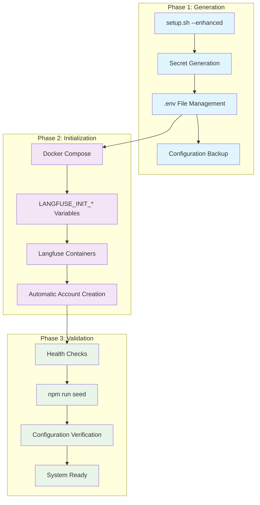
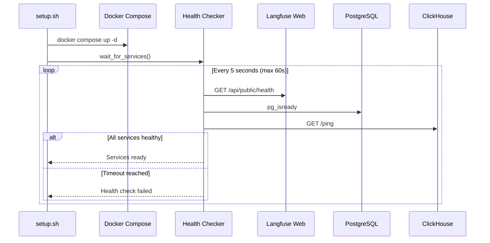

# Design Document

## Overview

The Headless Init (Zero-Click Setup) feature transforms the VEEDS LLMOps deployment from a manual, browser-dependent process to a fully automated command-line workflow. The design leverages Langfuse's built-in initialization environment variables and extends the existing setup.sh script to handle API key generation, organization creation, and validation.

The system follows a three-phase approach: **Generate** (API keys and secrets), **Initialize** (Langfuse containers with pre-configuration), and **Validate** (health checks and seeding). This ensures each step can be independently verified and debugged.

## Architecture



## Components and Interfaces

### Enhanced Setup Script (`setup.sh`)

The setup script becomes the orchestrator for the entire headless initialization process.

**Core Functions:**
- `generate_api_keys()`: Creates Langfuse-compatible API key pairs
- `setup_environment()`: Manages .env file creation and updates
- `backup_configuration()`: Creates timestamped backups
- `validate_prerequisites()`: Checks Docker, Node.js, and network connectivity
- `test_configuration()`: Validates generated keys and settings

**Interface:**
```bash
# Basic usage
./setup.sh

# Force regeneration of existing keys
./setup.sh --force

# Custom organization/project names
./setup.sh --org "MyOrg" --project "MyProject"

# Restore from backup
./setup.sh --restore .kiro/backups/env-2024-01-31-14-30-00.backup
```

### API Key Generator

Generates cryptographically secure API keys following Langfuse conventions.

**Key Format:**
- Public Key: `pk-lf-{32-char-hex}`
- Secret Key: `sk-lf-{64-char-hex}`

**Implementation:**
```typescript
interface ApiKeyPair {
  publicKey: string;   // pk-lf-...
  secretKey: string;   // sk-lf-...
  projectId: string;   // Generated UUID
  organizationId: string; // Generated UUID
}

function generateApiKeys(): ApiKeyPair {
  const publicKey = `pk-lf-${crypto.randomBytes(16).toString('hex')}`;
  const secretKey = `sk-lf-${crypto.randomBytes(32).toString('hex')}`;
  const projectId = crypto.randomUUID();
  const organizationId = crypto.randomUUID();
  
  return { publicKey, secretKey, projectId, organizationId };
}
```

### Environment Configuration Manager

Manages .env file creation, updates, and validation with backup support.

**Configuration Template:**
```bash
# Langfuse Configuration
LANGFUSE_PUBLIC_KEY=pk-lf-{generated}
LANGFUSE_SECRET_KEY=sk-lf-{generated}
LANGFUSE_HOST=http://localhost:3000

# Headless Initialization
LANGFUSE_INIT_ORG_ID={generated-uuid}
LANGFUSE_INIT_ORG_NAME=VEEDS-LLMOps
LANGFUSE_INIT_PROJECT_ID={generated-uuid}
LANGFUSE_INIT_PROJECT_NAME=veeds-proofreader
LANGFUSE_INIT_USER_EMAIL=admin@veeds-llmops.local
LANGFUSE_INIT_USER_PASSWORD={generated-secure-password}

# AWS Bedrock (preserved from existing .env)
AWS_REGION=eu-central-1
AWS_ACCESS_KEY_ID={preserved}
AWS_SECRET_ACCESS_KEY={preserved}
```

### Docker Compose Integration

Activates the commented LANGFUSE_INIT_* variables in docker-compose.yml.

**Current State (Commented):**
```yaml
# langfuse-web:
#   environment:
#     - LANGFUSE_INIT_ORG_ID=${LANGFUSE_INIT_ORG_ID}
#     - LANGFUSE_INIT_ORG_NAME=${LANGFUSE_INIT_ORG_NAME}
```

**Enhanced State (Active):**
```yaml
langfuse-web:
  environment:
    - LANGFUSE_INIT_ORG_ID=${LANGFUSE_INIT_ORG_ID}
    - LANGFUSE_INIT_ORG_NAME=${LANGFUSE_INIT_ORG_NAME:-VEEDS-LLMOps}
    - LANGFUSE_INIT_PROJECT_ID=${LANGFUSE_INIT_PROJECT_ID}
    - LANGFUSE_INIT_PROJECT_NAME=${LANGFUSE_INIT_PROJECT_NAME:-veeds-proofreader}
    - LANGFUSE_INIT_USER_EMAIL=${LANGFUSE_INIT_USER_EMAIL:-admin@veeds-llmops.local}
    - LANGFUSE_INIT_USER_PASSWORD=${LANGFUSE_INIT_USER_PASSWORD}
```

### Health Check System

Validates system readiness across all components.

**Health Check Endpoints:**
- Langfuse Web: `GET http://localhost:3000/api/public/health`
- PostgreSQL: Connection test via `pg_isready`
- ClickHouse: `GET http://localhost:8123/ping`
- Redis: `PING` command
- MinIO: `GET http://localhost:9090/minio/health/live`

**Health Check Flow:**


## Data Models

### Configuration State

```typescript
interface ConfigurationState {
  apiKeys: ApiKeyPair;
  organization: {
    id: string;
    name: string;
  };
  project: {
    id: string;
    name: string;
  };
  adminUser: {
    email: string;
    password: string;
  };
  backupPath?: string;
  timestamp: Date;
}
```

### Health Check Result

```typescript
interface HealthCheckResult {
  service: string;
  status: 'healthy' | 'unhealthy' | 'unknown';
  responseTime?: number;
  error?: string;
  timestamp: Date;
}

interface SystemHealth {
  overall: 'healthy' | 'degraded' | 'unhealthy';
  services: HealthCheckResult[];
  readyForSeeding: boolean;
}
```

### Backup Metadata

```typescript
interface BackupMetadata {
  filename: string;
  timestamp: Date;
  originalEnvHash: string;
  configurationState: ConfigurationState;
  restorable: boolean;
}
```

## Correctness Properties

*A property is a characteristic or behavior that should hold true across all valid executions of a system—essentially, a formal statement about what the system should do. Properties serve as the bridge between human-readable specifications and machine-verifiable correctness guarantees.*

### Property 1: API Key Generation Correctness
*For any* setup script execution, generated API keys should follow Langfuse naming conventions (pk-lf-* for public, sk-lf-* for secret) and be cryptographically unique across multiple generations.
**Validates: Requirements 1.1, 1.4**

### Property 2: Environment File Management
*For any* setup script execution, the .env file should contain all required variables with proper formatting, and existing keys should be preserved unless force regeneration is requested.
**Validates: Requirements 1.2, 1.3**

### Property 3: Default Configuration Values
*For any* setup script execution without custom parameters, the organization should be named "VEEDS-LLMOps" and the project should be named "veeds-proofreader".
**Validates: Requirements 2.3, 2.4**

### Property 4: Configuration Completeness
*For any* successful setup script execution, all required secrets, API keys, and configuration variables should be generated and properly stored.
**Validates: Requirements 3.1, 3.2**

### Property 5: Error Handling and Recovery
*For any* setup script execution that encounters errors, the system should provide clear error messages, maintain system integrity, and offer recovery guidance.
**Validates: Requirements 1.5, 2.5, 3.4, 5.4**

### Property 6: Backup and Restore Functionality
*For any* setup script execution with existing configuration, timestamped backups should be created in .kiro/backups directory and be restorable to previous states.
**Validates: Requirements 7.1, 7.3, 7.4**

### Property 7: Docker Compose Integration
*For any* Docker Compose startup with LANGFUSE_INIT_* variables set, the system should automatically create admin users, organizations, and projects without manual intervention.
**Validates: Requirements 4.1, 4.2, 4.3**

### Property 8: System Health Validation
*For any* completed deployment sequence, all critical services should be healthy, accessible, and ready for operation with seeded data successfully created.
**Validates: Requirements 6.1, 6.3, 6.5, 6.6**

### Property 9: Zero-Click Deployment Workflow
*For any* execution of the command sequence `./setup.sh && docker compose up -d && npm run seed`, the system should complete successfully within 5 minutes and provide operational access URLs.
**Validates: Requirements 5.1, 5.2, 5.5, 5.6**

### Property 10: Configuration Customization
*For any* setup script execution with custom organization or project names provided via environment variables, those custom names should be used instead of defaults.
**Validates: Requirements 2.6**

### Property 11: Backup Cleanup and Maintenance
*For any* setup script execution, backups older than 30 days should be automatically cleaned up, and backup integrity should be validated during restore operations.
**Validates: Requirements 7.5, 7.6**

Now I'll use the prework tool to analyze the acceptance criteria before writing correctness properties.

<function_calls>
<invoke name="prework">
<parameter name="featureName">headless-init-setup

## Error Handling

### Setup Script Error Categories

**Configuration Errors:**
- Missing or invalid AWS credentials
- Docker not running or accessible
- Node.js/npm not installed or wrong version
- Network connectivity issues

**Generation Errors:**
- Insufficient entropy for key generation
- File system permissions preventing .env creation
- Backup directory creation failures

**Validation Errors:**
- Generated API keys fail connectivity test
- Docker services fail to start within timeout
- Health checks return unhealthy status
- Seeding process fails or times out

### Error Recovery Strategies

**Graceful Degradation:**
- If Langfuse API key validation fails, continue with warning
- If backup creation fails, warn but proceed with setup
- If optional services (MinIO) fail health checks, continue with core services

**Rollback Mechanisms:**
- Automatic restoration of .env backup on critical failures
- Docker Compose down on container initialization failures
- Cleanup of partially created resources

**User Guidance:**
- Specific error messages with suggested remediation steps
- Links to troubleshooting documentation
- Command examples for manual recovery

### Error Response Format

```typescript
interface SetupError {
  code: string;
  message: string;
  details?: string;
  remediation?: string[];
  rollbackRequired: boolean;
}

// Example error responses
const ERRORS = {
  DOCKER_NOT_RUNNING: {
    code: 'DOCKER_NOT_RUNNING',
    message: 'Docker is not running or not accessible',
    remediation: [
      'Start Docker Desktop or Docker daemon',
      'Verify Docker is in PATH',
      'Check Docker permissions for current user'
    ],
    rollbackRequired: false
  },
  
  API_KEY_VALIDATION_FAILED: {
    code: 'API_KEY_VALIDATION_FAILED', 
    message: 'Generated API keys failed connectivity test',
    details: 'Langfuse service may not be ready',
    remediation: [
      'Wait for Langfuse containers to fully start',
      'Check Docker container logs: docker compose logs langfuse-web',
      'Verify network connectivity to localhost:3000'
    ],
    rollbackRequired: false
  }
};
```

## Testing Strategy

### Dual Testing Approach

The headless init setup feature requires both **unit tests** and **property-based tests** for comprehensive coverage:

**Unit Tests** focus on:
- Specific API key format validation examples
- Error message content verification
- File system operation edge cases
- Docker command execution scenarios

**Property-Based Tests** focus on:
- Universal properties across all setup executions
- Randomized input validation (custom org/project names)
- Comprehensive error condition coverage
- System state consistency verification

### Property-Based Testing Configuration

Property tests will use **fast-check** (JavaScript property testing library) with minimum 100 iterations per property test. Each property test must reference its design document property and use the tag format:

**Feature: headless-init-setup, Property {number}: {property_text}**

### Test Environment Requirements

**Isolated Test Environment:**
- Docker-in-Docker for container testing
- Temporary file system for .env manipulation
- Mock AWS Bedrock endpoints for validation testing
- Network isolation for connectivity failure simulation

**Test Data Generation:**
- Random organization and project names (valid and invalid)
- Various .env file states (missing, partial, complete)
- Simulated Docker service failure conditions
- Different system resource availability scenarios

### Integration Testing

**End-to-End Workflow Tests:**
- Complete deployment sequence from clean state
- Failure recovery and rollback scenarios
- Multi-environment deployment (different Docker versions)
- Performance testing under resource constraints

**Compatibility Testing:**
- Different operating systems (Linux, macOS, Windows WSL)
- Various Docker Compose versions
- Different Node.js versions
- Network connectivity variations

## Correctness Properties

*A property is a characteristic or behavior that should hold true across all valid executions of a system-essentially, a formal statement about what the system should do. Properties serve as the bridge between human-readable specifications and machine-verifiable correctness guarantees.*

### Property 1: Secure Credential Generation and Storage
*For any* setup execution, all generated credentials (passwords, API keys, UUIDs) should be cryptographically secure, unique across generations, and properly stored in the .env file with correct variable names and formatting.
**Validates: Requirements 1.2, 3.1, 3.2**

### Property 2: Idempotent Setup Execution
*For any* system state, running the setup script multiple times should produce the same final configuration without creating duplicate accounts, organizations, or projects, and should complete successfully without errors.
**Validates: Requirements 1.5, 2.5, 7.5**

### Property 3: Organization and Project Creation
*For any* successful setup execution, the system should create an organization named "VEEDS LLMOps" and a project named "veeds-proofreader" within that organization, with both entities accessible via API.
**Validates: Requirements 2.1, 2.2**

### Property 4: API Key Validation and Retry Logic
*For any* generated API key pair, the keys should successfully authenticate with the Langfuse API, and if validation fails, the system should retry up to 3 times before reporting failure.
**Validates: Requirements 3.3, 3.4, 3.5**

### Property 5: Environment File Completeness and Integrity
*For any* successful setup completion, the .env file should contain all required variables with valid values, preserve existing non-Langfuse configuration, and be restorable from backup if initialization fails.
**Validates: Requirements 1.3, 2.3, 6.2, 6.3, 6.4, 6.5**

### Property 6: Docker Compose Integration and Timing
*For any* Docker Compose startup with LANGFUSE_INIT_* variables, the langfuse-web container should process initialization variables, create the specified entities, and become ready to accept API requests within 30 seconds.
**Validates: Requirements 4.2, 7.1, 7.2, 7.4**

### Property 7: Health Check and Initialization Sequencing
*For any* setup execution, the script should wait for all Docker containers to be healthy before proceeding with validation, and should automatically run the seed process after successful initialization.
**Validates: Requirements 4.3, 4.4**

### Property 8: Comprehensive Validation Chain
*For any* completed initialization, the validation system should verify admin account authentication, organization/project existence, API key functionality for read/write operations, and successful seed process execution.
**Validates: Requirements 5.1, 5.2, 5.3, 5.4**

### Property 9: Error Categorization and User Guidance
*For any* error condition during setup, the system should provide specific error messages with context, distinguish between different error types (network, authentication, server), and suggest actionable remediation steps.
**Validates: Requirements 1.4, 2.4, 8.1, 8.2, 8.3, 8.5**

### Property 10: Backup and Recovery Operations
*For any* setup execution with existing configuration, the system should create timestamped backups before making changes and restore the original state if initialization fails or is interrupted.
**Validates: Requirements 6.1, 6.4, 8.4**

### Property 11: Container Error Logging and Diagnostics
*For any* container initialization failure, the system should log descriptive error messages with sufficient context and provide container-specific diagnostic information to aid troubleshooting.
**Validates: Requirements 7.3, 8.2**

## Error Handling

### Setup Script Error Categories

**Configuration Errors:**
- Missing or invalid AWS credentials
- Docker not running or accessible
- Node.js/npm not installed or wrong version
- Network connectivity issues

**Generation Errors:**
- Insufficient entropy for key generation
- File system permissions preventing .env creation
- Backup directory creation failures

**Validation Errors:**
- Generated API keys fail connectivity test
- Docker services fail to start within timeout
- Health checks return unhealthy status
- Seeding process fails or times out

### Error Recovery Strategies

**Graceful Degradation:**
- If Langfuse API key validation fails, continue with warning
- If backup creation fails, warn but proceed with setup
- If optional services (MinIO) fail health checks, continue with core services

**Rollback Mechanisms:**
- Automatic restoration of .env backup on critical failures
- Docker Compose down on container initialization failures
- Cleanup of partially created resources

**User Guidance:**
- Specific error messages with suggested remediation steps
- Links to troubleshooting documentation
- Command examples for manual recovery

### Error Response Format

```typescript
interface SetupError {
  code: string;
  message: string;
  details?: string;
  remediation?: string[];
  rollbackRequired: boolean;
}

// Example error responses
const ERRORS = {
  DOCKER_NOT_RUNNING: {
    code: 'DOCKER_NOT_RUNNING',
    message: 'Docker is not running or not accessible',
    remediation: [
      'Start Docker Desktop or Docker daemon',
      'Verify Docker is in PATH',
      'Check Docker permissions for current user'
    ],
    rollbackRequired: false
  },
  
  API_KEY_VALIDATION_FAILED: {
    code: 'API_KEY_VALIDATION_FAILED', 
    message: 'Generated API keys failed connectivity test',
    details: 'Langfuse service may not be ready',
    remediation: [
      'Wait for Langfuse containers to fully start',
      'Check Docker container logs: docker compose logs langfuse-web',
      'Verify network connectivity to localhost:3000'
    ],
    rollbackRequired: false
  }
};
```

## Testing Strategy

### Dual Testing Approach

The headless init setup feature requires both **unit tests** and **property-based tests** for comprehensive coverage:

**Unit Tests** focus on:
- Specific API key format validation examples
- Error message content verification
- File system operation edge cases
- Docker command execution scenarios

**Property-Based Tests** focus on:
- Universal properties across all setup executions
- Randomized input validation (custom org/project names)
- Comprehensive error condition coverage
- System state consistency verification

### Property-Based Testing Configuration

Property tests will use **bats** (Bash Automated Testing System) with custom property generators for bash script testing, with minimum 100 iterations per property test. Each property test must reference its design document property and use the tag format:

**Feature: headless-init-setup, Property {number}: {property_text}**

### Test Environment Requirements

**Isolated Test Environment:**
- Docker-in-Docker for container testing
- Temporary file system for .env manipulation
- Mock network endpoints for connectivity failure simulation
- Controlled resource constraints for performance testing

**Test Data Generation:**
- Random organization and project names (valid and invalid)
- Various .env file states (missing, partial, complete)
- Simulated Docker service failure conditions
- Different system resource availability scenarios

### Integration Testing

**End-to-End Workflow Tests:**
- Complete deployment sequence from clean state
- Failure recovery and rollback scenarios
- Multi-environment deployment (different Docker versions)
- Performance testing under resource constraints

**Compatibility Testing:**
- Different operating systems (Linux, macOS, Windows WSL)
- Various Docker Compose versions
- Different Node.js versions
- Network connectivity variations

Both unit tests and property tests are complementary and necessary for comprehensive coverage. Unit tests catch concrete bugs and validate specific behaviors, while property tests verify general correctness across a wide range of scenarios.