# Design Document

## Overview

The Human-in-the-Loop Annotations system creates a continuous improvement feedback loop for the VEEDS Proofreader by automatically identifying low-confidence traces, queuing them for expert review, and flowing approved annotations back into the Golden Dataset. This system leverages Langfuse's native annotation queue capabilities and integrates seamlessly with the existing LLMOps infrastructure.

## Architecture

The system consists of five main components working together to create a complete feedback loop:

```mermaid
graph TB
    subgraph "🔍 Detection Layer"
        CD[Confidence Detector<br/>Analyzes traces for low confidence]
        CS[Confidence Scorer<br/>Calculates composite scores]
    end
    
    subgraph "📋 Queue Management Layer"
        AQ[Annotation Queue Manager<br/>Langfuse API integration]
        QP[Queue Processor<br/>Prioritization & assignment]
    end
    
    subgraph "👥 Expert Interface Layer"
        AI[Annotation Interface<br/>Langfuse UI + Custom views]
        AV[Annotation Validator<br/>Format & quality checks]
    end
    
    subgraph "🎯 Quality Control Layer"
        QC[Quality Controller<br/>Expert agreement tracking]
        AC[Approval Controller<br/>Consensus management]
    end
    
    subgraph "🔄 Integration Layer"
        GI[Golden Dataset Integrator<br/>Annotation → Golden conversion]
        TG[Test Generator Trigger<br/>Regenerate test cases]
    end
    
    CD --> CS
    CS --> AQ
    AQ --> QP
    QP --> AI
    AI --> AV
    AV --> QC
    QC --> AC
    AC --> GI
    GI --> TG
```



## Components and Interfaces

### Confidence Detection System

**Purpose**: Automatically identify traces that require expert review based on confidence indicators.

**Key Classes**:
- `ConfidenceDetector`: Main orchestrator for confidence analysis
- `ConfidenceScorer`: Calculates composite confidence scores
- `ConfidenceThresholdManager`: Manages configurable thresholds per category

**Confidence Calculation Algorithm**:
```typescript
interface ConfidenceIndicators {
  modelConfidence: number;      // From LLM response metadata
  validationConsistency: number; // Internal validation checks
  responseComplexity: number;   // Parsing difficulty
  historicalAccuracy: number;   // Similar trace performance
}

function calculateCompositeConfidence(indicators: ConfidenceIndicators): number {
  const weights = {
    modelConfidence: 0.4,
    validationConsistency: 0.3,
    responseComplexity: 0.2,
    historicalAccuracy: 0.1
  };
  
  return Object.entries(weights).reduce((sum, [key, weight]) => 
    sum + indicators[key] * weight, 0
  );
}
```

### Annotation Queue Management

**Purpose**: Interface with Langfuse annotation queues for trace management.

**Key Classes**:
- `AnnotationQueueManager`: Langfuse API wrapper
- `QueuePrioritizer`: Implements priority algorithms
- `ExpertAssignmentManager`: Handles expert workload distribution

**Queue Priority Algorithm**:
```typescript
interface QueueItem {
  traceId: string;
  confidence: number;
  category: string;
  timestamp: Date;
  complexity: number;
}

function calculatePriority(item: QueueItem): number {
  const urgencyScore = (1 - item.confidence) * 100;
  const ageScore = Math.min((Date.now() - item.timestamp.getTime()) / (24 * 60 * 60 * 1000), 7) * 10;
  const complexityScore = item.complexity * 5;
  
  return urgencyScore + ageScore + complexityScore;
}
```

### Expert Annotation Interface

**Purpose**: Provide domain experts with efficient annotation tools.

**Key Classes**:
- `AnnotationInterface`: Custom UI components for expert review
- `AnnotationValidator`: Validates annotation format and completeness
- `DiffHighlighter`: Shows differences between system and expert annotations

**Annotation Data Model**:
```typescript
interface ExpertAnnotation {
  traceId: string;
  expertId: string;
  timestamp: Date;
  annotation: {
    isValid: boolean;
    errors: ValidationError[];
    confidence: number;
    comments?: string;
  };
  reviewTime: number;
  difficulty: 'easy' | 'medium' | 'hard';
}
```

### Quality Control System

**Purpose**: Ensure annotation quality through expert agreement tracking.

**Key Classes**:
- `QualityController`: Manages quality metrics and thresholds
- `AgreementCalculator`: Computes inter-expert agreement scores
- `ExpertPerformanceTracker`: Monitors individual expert quality

**Agreement Calculation**:
```typescript
function calculateAgreement(annotations: ExpertAnnotation[]): number {
  if (annotations.length < 2) return 1.0;
  
  const agreements = [];
  for (let i = 0; i < annotations.length; i++) {
    for (let j = i + 1; j < annotations.length; j++) {
      agreements.push(compareAnnotations(annotations[i], annotations[j]));
    }
  }
  
  return agreements.reduce((sum, score) => sum + score, 0) / agreements.length;
}

function compareAnnotations(a1: ExpertAnnotation, a2: ExpertAnnotation): number {
  const isValidMatch = a1.annotation.isValid === a2.annotation.isValid ? 1 : 0;
  const errorMatch = calculateErrorSimilarity(a1.annotation.errors, a2.annotation.errors);
  
  return (isValidMatch * 0.6) + (errorMatch * 0.4);
}
```

### Golden Dataset Integration

**Purpose**: Convert approved annotations into Golden Dataset entries.

**Key Classes**:
- `GoldenDatasetIntegrator`: Manages annotation to golden dataset conversion
- `ConflictResolver`: Handles conflicts with existing golden data
- `TestCaseGenerator`: Triggers regeneration of test cases

**Conversion Process**:
```typescript
interface GoldenDatasetEntry {
  id: string;
  category: 'true_positive' | 'true_negative' | 'edge_case' | 'adversarial';
  description: string;
  input: string;
  expectedErrors: ExpectedError[];
  expectedIsValid: boolean;
  source: 'annotation';
  annotationMetadata: {
    expertId: string;
    agreementScore: number;
    reviewDate: Date;
  };
}

function convertAnnotationToGoldenEntry(
  annotation: ExpertAnnotation,
  originalTrace: Trace
): GoldenDatasetEntry {
  return {
    id: generateGoldenId('ann', annotation.traceId),
    category: inferCategory(annotation, originalTrace),
    description: generateDescription(annotation, originalTrace),
    input: originalTrace.input.yaml_entry,
    expectedErrors: annotation.annotation.errors,
    expectedIsValid: annotation.annotation.isValid,
    source: 'annotation',
    annotationMetadata: {
      expertId: annotation.expertId,
      agreementScore: calculateAgreementScore(annotation),
      reviewDate: annotation.timestamp
    }
  };
}
```

## Data Models

### Core Data Structures

```typescript
// Confidence scoring
interface ConfidenceScore {
  traceId: string;
  compositeScore: number;
  indicators: ConfidenceIndicators;
  threshold: number;
  flaggedForAnnotation: boolean;
  calculatedAt: Date;
}

// Queue management
interface AnnotationQueueItem {
  id: string;
  traceId: string;
  queueId: string;
  priority: number;
  assignedExpertId?: string;
  status: 'pending' | 'in_progress' | 'completed' | 'skipped';
  createdAt: Date;
  assignedAt?: Date;
  completedAt?: Date;
}

// Quality control
interface ExpertAgreement {
  traceId: string;
  annotations: ExpertAnnotation[];
  agreementScore: number;
  consensusReached: boolean;
  approvedAnnotation?: ExpertAnnotation;
  requiresAdditionalReview: boolean;
}

// Integration tracking
interface AnnotationIntegration {
  annotationId: string;
  goldenDatasetEntryId: string;
  integrationStatus: 'pending' | 'integrated' | 'conflict' | 'rejected';
  integrationDate?: Date;
  conflictReason?: string;
  testCasesRegenerated: boolean;
}
```

### Database Schema Extensions

```sql
-- Confidence scores table
CREATE TABLE confidence_scores (
  id UUID PRIMARY KEY DEFAULT gen_random_uuid(),
  trace_id VARCHAR(255) NOT NULL,
  composite_score DECIMAL(3,2) NOT NULL,
  model_confidence DECIMAL(3,2),
  validation_consistency DECIMAL(3,2),
  response_complexity DECIMAL(3,2),
  historical_accuracy DECIMAL(3,2),
  threshold_used DECIMAL(3,2) NOT NULL,
  flagged_for_annotation BOOLEAN DEFAULT FALSE,
  calculated_at TIMESTAMP DEFAULT NOW(),
  FOREIGN KEY (trace_id) REFERENCES traces(id)
);

-- Expert annotations table
CREATE TABLE expert_annotations (
  id UUID PRIMARY KEY DEFAULT gen_random_uuid(),
  trace_id VARCHAR(255) NOT NULL,
  expert_id VARCHAR(255) NOT NULL,
  annotation_data JSONB NOT NULL,
  review_time_seconds INTEGER,
  difficulty VARCHAR(10) CHECK (difficulty IN ('easy', 'medium', 'hard')),
  created_at TIMESTAMP DEFAULT NOW(),
  FOREIGN KEY (trace_id) REFERENCES traces(id)
);

-- Annotation agreements table
CREATE TABLE annotation_agreements (
  id UUID PRIMARY KEY DEFAULT gen_random_uuid(),
  trace_id VARCHAR(255) NOT NULL,
  agreement_score DECIMAL(3,2) NOT NULL,
  consensus_reached BOOLEAN DEFAULT FALSE,
  approved_annotation_id UUID,
  requires_additional_review BOOLEAN DEFAULT FALSE,
  calculated_at TIMESTAMP DEFAULT NOW(),
  FOREIGN KEY (trace_id) REFERENCES traces(id),
  FOREIGN KEY (approved_annotation_id) REFERENCES expert_annotations(id)
);
```

## Correctness Properties

*A property is a characteristic or behavior that should hold true across all valid executions of a system—essentially, a formal statement about what the system should do. Properties serve as the bridge between human-readable specifications and machine-verifiable correctness guarantees.*

### Property 1: Confidence-based trace flagging
*For any* trace with a confidence score below the configured threshold for its category, the system should automatically flag it for annotation and add it to the annotation queue with complete metadata
**Validates: Requirements 1.1, 1.3, 7.1**

### Property 2: Composite confidence calculation
*For any* set of confidence indicators, the system should calculate a composite confidence score using the weighted formula and handle calculation failures gracefully with error logging
**Validates: Requirements 1.2, 1.5**

### Property 3: Configurable threshold support
*For any* trace category and threshold configuration, the system should apply the correct threshold when determining annotation eligibility
**Validates: Requirements 1.4**

### Property 4: Queue data integrity
*For any* trace added to the annotation queue, the stored data should exactly match the original trace inputs, outputs, and confidence scores
**Validates: Requirements 2.1**

### Property 5: Queue ordering and assignment
*For any* annotation queue state, traces should be displayed in priority order and assignment should prevent duplicates across all concurrent operations
**Validates: Requirements 2.2, 2.3**

### Property 6: Queue state management
*For any* completed annotation, the system should automatically remove the trace from the expert's active queue and process the annotation
**Validates: Requirements 2.4, 7.2**

### Property 7: Queue filtering functionality
*For any* combination of filter criteria (category, confidence range, date), the system should return only traces matching all specified criteria
**Validates: Requirements 2.5**

### Property 8: Annotation interface data consistency
*For any* trace under review, the expert interface should display data that exactly matches the original trace input and system output
**Validates: Requirements 3.1**

### Property 9: Annotation format validation
*For any* annotation submission, the system should validate the required format (isValid, errors) and support optional comments
**Validates: Requirements 3.2, 3.3, 3.4**

### Property 10: Annotation difference highlighting
*For any* annotation that differs from the system output, the interface should accurately highlight all differences
**Validates: Requirements 3.5**

### Property 11: Expert agreement calculation
*For any* trace with multiple expert annotations, the system should calculate agreement scores and require additional review when agreement falls below threshold
**Validates: Requirements 4.1, 4.2**

### Property 12: Expert performance tracking
*For any* expert, the system should accurately track annotation quality, time, and complexity metrics, flagging consistently low performers
**Validates: Requirements 4.3, 4.4**

### Property 13: Consensus approval automation
*For any* trace where expert consensus is reached, the system should automatically mark the annotation as approved and integrate it
**Validates: Requirements 4.5, 7.3**

### Property 14: Golden dataset integration
*For any* approved annotation, the system should convert it to golden dataset format with unique ID, appropriate category, and maintain full traceability
**Validates: Requirements 5.1, 5.2, 5.4**

### Property 15: Test case regeneration trigger
*For any* golden dataset update, the system should automatically trigger regeneration of test cases
**Validates: Requirements 5.3**

### Property 16: Conflict resolution requirement
*For any* annotation that conflicts with existing golden dataset entries, the system should require manual resolution before integration
**Validates: Requirements 5.5**

### Property 17: Dashboard metrics accuracy
*For any* system state, the dashboard should display accurate queue lengths, processing times, expert workloads, annotation accuracy trends, and performance impact metrics
**Validates: Requirements 6.1, 6.2, 6.4**

### Property 18: Performance alerting
*For any* performance degradation scenario, the system should generate appropriate alerts and recommendations
**Validates: Requirements 6.3**

### Property 19: Cost-benefit reporting
*For any* reporting period, the system should generate accurate cost-benefit analysis of the annotation process
**Validates: Requirements 6.5**

### Property 20: Expert notification system
*For any* new trace available for annotation, the system should send notifications to appropriate experts
**Validates: Requirements 7.4**

### Property 21: Error handling and recovery
*For any* workflow error, the system should provide clear error messages and viable recovery options
**Validates: Requirements 7.5**

### Property 22: Langfuse API integration
*For any* data access, annotation storage, or trace operation, the system should use existing Langfuse APIs and preserve all metadata and relationships
**Validates: Requirements 8.1, 8.2, 8.4**

### Property 23: Format compatibility preservation
*For any* golden dataset integration, the system should maintain existing file formats and structure
**Validates: Requirements 8.3**

### Property 24: Graceful degradation
*For any* system failure, the annotation system should degrade gracefully without affecting production tracing operations
**Validates: Requirements 8.5**

## Error Handling

The system implements comprehensive error handling across all components:

### Confidence Calculation Errors
- **Invalid indicators**: Log error, use default confidence score, continue processing
- **Calculation failures**: Log detailed error, mark trace for manual review
- **Threshold configuration errors**: Use system defaults, alert administrators

### Queue Management Errors
- **Langfuse API failures**: Retry with exponential backoff, fallback to local queue
- **Assignment conflicts**: Detect and resolve automatically, log conflicts
- **Queue corruption**: Validate queue integrity, rebuild from trace data

### Annotation Processing Errors
- **Invalid annotation format**: Reject with detailed validation errors
- **Expert authentication failures**: Redirect to login, preserve work in progress
- **Consensus calculation errors**: Flag for manual review, notify administrators

### Integration Errors
- **Golden dataset conflicts**: Queue for manual resolution, notify stakeholders
- **File system errors**: Retry operations, maintain backup copies
- **Test regeneration failures**: Alert development team, maintain existing tests

## Testing Strategy

### Unit Testing Approach
- **Component isolation**: Test each component independently with mocked dependencies
- **Error condition coverage**: Test all error paths and recovery mechanisms
- **Edge case validation**: Test boundary conditions and unusual inputs
- **Integration points**: Test interfaces between components

### Property-Based Testing Configuration
- **Test framework**: Use fast-check for TypeScript property-based testing
- **Iteration count**: Minimum 100 iterations per property test
- **Generator complexity**: Create realistic test data generators for traces, annotations, and configurations
- **Shrinking strategy**: Implement custom shrinking for complex domain objects

### Property Test Implementation
Each correctness property will be implemented as a property-based test with the following structure:

```typescript
// Example property test structure
describe('Property 1: Confidence-based trace flagging', () => {
  it('should flag traces below threshold and add to queue', async () => {
    await fc.assert(fc.asyncProperty(
      traceGenerator(),
      confidenceThresholdGenerator(),
      async (trace, threshold) => {
        // Test implementation
        const result = await confidenceDetector.analyzeTrace(trace, threshold);
        
        if (result.confidence < threshold) {
          expect(result.flaggedForAnnotation).toBe(true);
          expect(await queueManager.isInQueue(trace.id)).toBe(true);
        }
      }
    ), { numRuns: 100 });
  });
});
```

### Integration Testing
- **End-to-end workflows**: Test complete annotation lifecycle
- **Langfuse integration**: Test all API interactions with real Langfuse instance
- **Golden dataset integration**: Test annotation to golden dataset conversion
- **Performance testing**: Verify system performance under load

### Test Data Management
- **Synthetic trace generation**: Create realistic traces for testing
- **Expert simulation**: Mock expert behavior for automated testing
- **Golden dataset fixtures**: Maintain test versions of golden dataset
- **Langfuse test environment**: Isolated Langfuse instance for testing
