# Design Document

## Overview

The k6 Golden Dataset Integration transforms the current hardcoded k6 load testing approach into a dynamic system that uses the golden dataset as the single source of truth. This design eliminates test data duplication, ensures consistency between quality and performance testing, and provides realistic load scenarios based on validated test cases.

## Architecture

### System Components

```mermaid
graph TB
    subgraph "📊 Data Sources"
        GD[eval/golden_dataset.json<br/>16 Test Cases<br/>4 Categories]
        K6_OLD[tests/load/graphql-test.js<br/>Hardcoded Test Data<br/>🔴 To be removed]
    end
    
    subgraph "🔄 Generation Layer"
        GEN[scripts/generate-k6-test-data.ts<br/>Golden Dataset → k6 Converter]
        DIST[Test Distribution Engine<br/>Weighted Category Selection]
        SCEN[Scenario Generator<br/>Load Patterns & Thresholds]
    end
    
    subgraph "📝 Generated Assets"
        K6_DATA[tests/load/golden-test-data.js<br/>k6-Compatible Test Cases]
        K6_CONFIG[tests/load/load-scenarios.js<br/>Scenario Configurations]
    end
    
    subgraph "🧪 Execution Layer"
        K6_NEW[tests/load/golden-graphql-test.js<br/>New k6 Script]
        K6_METRICS[Custom Metrics<br/>Category-based Tracking]
    end
    
    subgraph "🚀 CI/CD Integration"
        GITLAB[GitLab CI Pipeline<br/>Pre-test Generation]
        ARTIFACTS[k6-results.json<br/>Enhanced with Categories]
    end
    
    GD --> GEN
    GEN --> DIST
    DIST --> SCEN
    SCEN --> K6_DATA
    SCEN --> K6_CONFIG
    K6_DATA --> K6_NEW
    K6_CONFIG --> K6_NEW
    K6_NEW --> K6_METRICS
    GITLAB --> GEN
    K6_NEW --> ARTIFACTS
    
    classDef source fill:#e1f5fe
    classDef generation fill:#f3e5f5
    classDef generated fill:#e8f5e8
    classDef execution fill:#fff3e0
    classDef cicd fill:#fce4ec
    
    class GD,K6_OLD source
    class GEN,DIST,SCEN generation
    class K6_DATA,K6_CONFIG generated
    class K6_NEW,K6_METRICS execution
    class GITLAB,ARTIFACTS cicd
```



### Data Flow Architecture


## Components and Interfaces

### 1. Test Data Generator (`scripts/generate-k6-test-data.ts`)

**Purpose**: Converts golden dataset into k6-compatible JavaScript modules

**Core Interfaces**:

```typescript
interface GoldenTestCase {
  id: string;
  category: 'true_positive' | 'true_negative' | 'edge_case' | 'adversarial';
  description: string;
  input: string;
  expectedIsValid: boolean;
  expectedErrors: Array<{
    field: string;
    severity: 'error' | 'warning';
    pattern?: string;
  }>;
}

interface K6TestCase {
  id: string;
  category: string;
  description: string;
  yaml: string;
  expectValid: boolean;
  weight: number;
  tags: string[];
}

interface LoadScenario {
  name: string;
  stages: Array<{ duration: string; target: number }>;
  thresholds: Record<string, string[]>;
  testDataDistribution: Record<string, number>;
}
```

**Key Functions**:

```typescript
class K6TestDataGenerator {
  // Convert golden dataset to k6 format
  convertGoldenDataset(goldenData: GoldenDataset): K6TestCase[]
  
  // Apply category-based weights for realistic distribution
  applyWeights(testCases: K6TestCase[]): K6TestCase[]
  
  // Generate load scenario configurations
  generateScenarios(): LoadScenario[]
  
  // Write k6-compatible JavaScript modules
  writeTestDataModule(testCases: K6TestCase[]): void
  writeScenariosModule(scenarios: LoadScenario[]): void
}
```

### 2. Enhanced k6 Script (`tests/load/golden-graphql-test.js`)

**Purpose**: Execute load tests using generated test data with category-aware metrics

**Key Features**:
- Dynamic test case selection with weighted distribution
- Category-based performance tracking
- Response correctness validation
- Enhanced error reporting with test case context

**Core Structure**:

```javascript
// Import generated data
import { testCases, getWeightedTestCase } from './golden-test-data.js';
import { scenarios } from './load-scenarios.js';

// Category-specific metrics
const categoryMetrics = {
  true_positive: new Trend('response_time_true_positive'),
  true_negative: new Trend('response_time_true_negative'),
  edge_case: new Trend('response_time_edge_case'),
  adversarial: new Trend('response_time_adversarial')
};

export default function() {
  const testCase = getWeightedTestCase();
  
  // Execute GraphQL mutation with test case data
  const response = executeProofreadMutation(testCase);
  
  // Validate response correctness
  validateResponse(response, testCase);
  
  // Record category-specific metrics
  recordCategoryMetrics(response, testCase);
}
```

### 3. Test Distribution Engine

**Purpose**: Implement realistic test case distribution based on production usage patterns

**Distribution Strategy**:

| Category | Weight | Rationale |
|----------|--------|-----------|
| true_negative | 60% | Most production entries are valid |
| true_positive | 25% | Common validation errors |
| edge_case | 10% | Boundary conditions occur occasionally |
| adversarial | 5% | Security tests, limited frequency |

**Implementation**:

```typescript
class TestDistributionEngine {
  private weights = {
    true_negative: 0.60,
    true_positive: 0.25,
    edge_case: 0.10,
    adversarial: 0.05
  };
  
  selectWeightedTestCase(testCases: K6TestCase[]): K6TestCase {
    // Weighted random selection based on category
    const random = Math.random();
    let cumulativeWeight = 0;
    
    for (const category of Object.keys(this.weights)) {
      cumulativeWeight += this.weights[category];
      if (random <= cumulativeWeight) {
        return this.selectFromCategory(testCases, category);
      }
    }
  }
  
  private selectFromCategory(testCases: K6TestCase[], category: string): K6TestCase {
    const categoryTests = testCases.filter(tc => tc.category === category);
    return categoryTests[Math.floor(Math.random() * categoryTests.length)];
  }
}
```

## Data Models

### Golden Dataset Test Case Structure

```json
{
  "id": "tp-001",
  "category": "true_positive",
  "description": "Invalid materialNumber format",
  "input": "materialNumber: INVALID\ndescription: Bremsscheibe\nunit: mm",
  "expectedErrors": [
    {
      "field": "materialNumber",
      "severity": "error",
      "pattern": "format|Format|XXX-NNNNN|ungültig|invalid"
    }
  ],
  "expectedIsValid": false
}
```

### Generated k6 Test Case Structure

```javascript
{
  id: "tp-001",
  category: "true_positive",
  description: "Invalid materialNumber format",
  yaml: "materialNumber: INVALID\ndescription: Bremsscheibe\nunit: mm",
  expectValid: false,
  weight: 0.25, // Based on category
  tags: ["true_positive", "materialNumber_error"],
  expectedErrors: [
    {
      field: "materialNumber",
      severity: "error",
      pattern: /format|Format|XXX-NNNNN|ungültig|invalid/i
    }
  ]
}
```

### Load Scenario Configuration

```javascript
{
  name: "standard",
  stages: [
    { duration: "30s", target: 10 },
    { duration: "1m", target: 20 },
    { duration: "30s", target: 0 }
  ],
  thresholds: {
    http_req_duration: ["p(95)<3000", "p(99)<5000"],
    http_req_failed: ["rate<0.01"],
    response_time_true_positive: ["p(95)<3500"],
    response_time_true_negative: ["p(95)<2500"]
  },
  testDataDistribution: {
    true_negative: 0.60,
    true_positive: 0.25,
    edge_case: 0.10,
    adversarial: 0.05
  }
}
```

Now I need to use the prework tool to analyze the acceptance criteria before writing correctness properties:

<function_calls>
<invoke name="prework">
<parameter name="featureName">k6-golden-dataset-integration

## Correctness Properties

*A property is a characteristic or behavior that should hold true across all valid executions of a system-essentially, a formal statement about what the system should do. Properties serve as the bridge between human-readable specifications and machine-verifiable correctness guarantees.*

Based on the prework analysis, the following properties ensure the k6 Golden Dataset Integration maintains correctness across all scenarios:

### Property 1: Golden Dataset Parsing Completeness
*For any* valid golden dataset file, the test data generator should successfully parse all test cases and preserve their structure and metadata without loss.
**Validates: Requirements 1.1, 1.2**

### Property 2: Category Preservation
*For any* golden dataset with multiple categories, the generated k6 test data should contain test cases from all original categories in the same proportions.
**Validates: Requirements 1.2, 1.3**

### Property 3: k6 Format Compatibility
*For any* generated test case, the output should be valid JavaScript with required fields (id, category, yaml, expectValid, weight) and proper syntax.
**Validates: Requirements 1.3, 1.4**

### Property 4: Expected Validity Mapping
*For any* test case with expectedIsValid false in the golden dataset, the generated k6 test case should have expectValid false and appropriate error expectations.
**Validates: Requirements 1.5, 2.5**

### Property 5: Test Case Selection Randomness
*For any* sequence of test case selections over multiple iterations, all available test cases should eventually be selected with distribution matching their assigned weights.
**Validates: Requirements 2.2, 6.1**

### Property 6: GraphQL Mutation Consistency
*For any* selected test case, the GraphQL mutation payload should contain the exact yaml_entry from the test case without modification.
**Validates: Requirements 2.3, 8.1**

### Property 7: Response Structure Validation
*For any* API response, the k6 script should validate that the response contains the required isValid and errors fields with correct types.
**Validates: Requirements 2.4, 5.1**

### Property 8: Category-Specific Expectations
*For any* true_positive test case, the k6 script should expect isValid false and non-empty errors array; for true_negative cases, expect isValid true and empty errors array.
**Validates: Requirements 5.2, 5.3**

### Property 9: Weight Distribution Accuracy
*For any* generated test data, the sum of all category weights should equal 1.0, and individual category weights should match the specified distribution strategy.
**Validates: Requirements 3.1, 3.4**

### Property 10: Adversarial Test Frequency Limit
*For any* generated load scenario, adversarial test cases should comprise no more than 10% of the total test case distribution.
**Validates: Requirements 3.5, 6.4**

### Property 11: Error Handling and Reporting
*For any* generation failure or invalid input, the system should exit with non-zero status code and provide descriptive error messages.
**Validates: Requirements 4.3, 5.4**

### Property 12: File Overwrite Behavior
*For any* existing generated file, running the generator should completely replace the file contents with new data while preserving file permissions.
**Validates: Requirements 4.5, 8.4**

### Property 13: Metric Tagging Consistency
*For any* k6 test execution, metrics should be tagged with the correct test case category and ID for proper correlation and analysis.
**Validates: Requirements 7.1, 7.3**

### Property 14: YAML Structure Preservation
*For any* test case with complex YAML structure including nested objects and special characters, the generated k6 data should preserve the exact formatting and content.
**Validates: Requirements 6.5, 8.5**

### Property 15: Threshold Configuration Preservation
*For any* existing k6 configuration with custom thresholds, the new implementation should maintain the same performance limits and error rate thresholds.
**Validates: Requirements 8.2, 8.3**

## Error Handling

### Generation-Time Error Handling

1. **Invalid Golden Dataset**: Validate JSON schema and required fields before processing
2. **File System Errors**: Handle read/write permissions and disk space issues
3. **Category Validation**: Ensure all test cases have valid categories
4. **Weight Calculation**: Validate that weights sum to 1.0 and handle edge cases

### Runtime Error Handling

1. **Missing Test Data**: Graceful fallback if generated files are missing
2. **API Response Validation**: Handle malformed or unexpected responses
3. **Network Failures**: Implement retry logic and timeout handling
4. **Metric Collection**: Continue execution even if metric recording fails

### Error Recovery Strategies

```typescript
class ErrorHandler {
  handleGenerationError(error: Error, context: string): never {
    console.error(`❌ Generation failed in ${context}: ${error.message}`);
    console.error('Stack trace:', error.stack);
    process.exit(1);
  }
  
  handleRuntimeError(error: Error, testCase: K6TestCase): void {
    console.warn(`⚠️ Runtime error for test case ${testCase.id}: ${error.message}`);
    // Continue with next test case
  }
  
  validateGeneratedOutput(output: K6TestCase[]): void {
    if (output.length === 0) {
      throw new Error('No test cases generated');
    }
    
    const categories = new Set(output.map(tc => tc.category));
    if (categories.size < 2) {
      throw new Error('Generated data missing test case categories');
    }
  }
}
```

## Testing Strategy

### Dual Testing Approach

The testing strategy combines unit tests for specific functionality with property-based tests for comprehensive validation:

**Unit Tests**:
- Specific examples of golden dataset parsing
- Edge cases like empty datasets or malformed JSON
- Integration points between generator and k6 script
- Error conditions and recovery scenarios

**Property-Based Tests**:
- Universal properties that hold for all inputs
- Comprehensive input coverage through randomization
- Validation of correctness properties across many test cases
- Performance characteristics under various load conditions

### Property-Based Testing Configuration

All property tests will use **fast-check** library for TypeScript/JavaScript with minimum 100 iterations per test. Each test will reference its corresponding design document property:

**Test Configuration**:
```typescript
import fc from 'fast-check';

describe('k6 Golden Dataset Integration Properties', () => {
  it('Property 1: Golden Dataset Parsing Completeness', () => {
    fc.assert(fc.property(
      goldenDatasetArbitrary(),
      (goldenData) => {
        const generator = new K6TestDataGenerator();
        const result = generator.convertGoldenDataset(goldenData);
        
        // All test cases should be preserved
        expect(result.length).toBe(goldenData.testCases.length);
        
        // All categories should be preserved
        const originalCategories = new Set(goldenData.testCases.map(tc => tc.category));
        const resultCategories = new Set(result.map(tc => tc.category));
        expect(resultCategories).toEqual(originalCategories);
      }
    ), { numRuns: 100 });
  });
  
  // Additional property tests...
});
```

**Tag Format**: Each property test will include a comment:
```typescript
// Feature: k6-golden-dataset-integration, Property 1: Golden Dataset Parsing Completeness
```

### Unit Testing Balance

Unit tests focus on:
- **Specific Examples**: Demonstrate correct behavior with known inputs
- **Integration Points**: Verify components work together correctly  
- **Edge Cases**: Handle boundary conditions and error scenarios
- **Regression Prevention**: Ensure changes don't break existing functionality

Property tests focus on:
- **Universal Properties**: Verify behavior holds across all valid inputs
- **Comprehensive Coverage**: Test with randomly generated data
- **Correctness Guarantees**: Validate system invariants and constraints
- **Performance Characteristics**: Ensure scalability under various conditions

Together, unit tests catch concrete bugs while property tests verify general correctness, providing comprehensive coverage for the k6 Golden Dataset Integration feature.