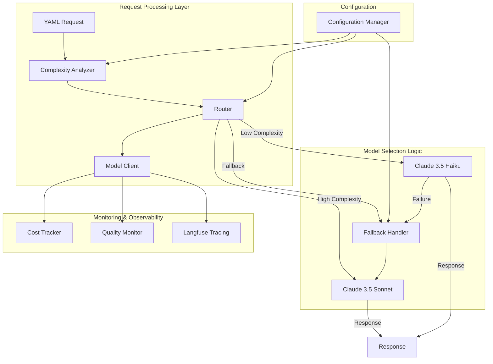

# Design Document

## Overview

The Multi-Model Routing system implements intelligent routing between Claude 3.5 Sonnet and Claude 3.5 Haiku models to optimize cost while maintaining quality. Based on research, Haiku costs approximately $0.80/$4.00 per million input/output tokens compared to Sonnet's $3.00/$15.00, representing a ~4x cost reduction for input tokens and ~3.75x for output tokens.

The system analyzes YAML input complexity using heuristic-based classification and routes simple validation cases to Haiku while reserving Sonnet for complex cases. This approach targets 30-50% cost reduction while maintaining >95% accuracy on the golden dataset.

## Architecture



## Components and Interfaces

### Complexity Analyzer

**Purpose**: Analyzes YAML input to determine routing complexity score.

**Interface**:
```typescript
interface ComplexityAnalyzer {
  analyzeComplexity(yamlInput: string): ComplexityAnalysis;
}

interface ComplexityAnalysis {
  score: number; // 0.0 - 1.0 (0 = simple, 1 = complex)
  confidence: number; // 0.0 - 1.0
  factors: ComplexityFactor[];
  recommendation: 'haiku' | 'sonnet';
  reasoning: string;
}

interface ComplexityFactor {
  name: string;
  weight: number;
  value: number;
  description: string;
}
```

**Complexity Factors**:
1. **Field Count**: Number of YAML fields (weight: 0.2)
2. **Nesting Depth**: Maximum depth of nested structures (weight: 0.15)
3. **Content Patterns**: Detection of obvious errors vs edge cases (weight: 0.3)
4. **Input Length**: Total character count (weight: 0.1)
5. **Special Characters**: Unicode, injection patterns (weight: 0.15)
6. **Value Range Complexity**: Numeric ranges and validation complexity (weight: 0.1)

**Classification Logic**:
- Score 0.0-0.3: Route to Haiku (simple cases)
- Score 0.3-0.7: Route based on confidence and configuration
- Score 0.7-1.0: Route to Sonnet (complex cases)

### Router

**Purpose**: Makes routing decisions based on complexity analysis and configuration.

**Interface**:
```typescript
interface Router {
  route(yamlInput: string, options?: RoutingOptions): RoutingDecision;
}

interface RoutingDecision {
  model: 'sonnet' | 'haiku';
  reasoning: string;
  complexityScore: number;
  confidence: number;
  fallbackStrategy: FallbackStrategy;
}

interface RoutingOptions {
  forceModel?: 'sonnet' | 'haiku';
  bypassComplexityAnalysis?: boolean;
  customThresholds?: ComplexityThresholds;
}

interface ComplexityThresholds {
  haikuMaxScore: number; // Default: 0.3
  sonnetMinScore: number; // Default: 0.7
  confidenceThreshold: number; // Default: 0.8
}
```

### Model Client

**Purpose**: Unified interface for both Claude models with automatic retry and error handling.

**Interface**:
```typescript
interface ModelClient {
  invoke(request: ModelRequest): Promise<ModelResponse>;
}

interface ModelRequest {
  model: 'sonnet' | 'haiku';
  prompt: string;
  parameters: ModelParameters;
  metadata: RequestMetadata;
}

interface ModelResponse {
  content: string;
  usage: TokenUsage;
  latencyMs: number;
  model: string;
  cost: number;
  metadata: ResponseMetadata;
}

interface TokenUsage {
  inputTokens: number;
  outputTokens: number;
  totalTokens: number;
}
```

**Model-Specific Configurations**:
```typescript
const MODEL_CONFIGS = {
  sonnet: {
    modelId: 'anthropic.claude-3-5-sonnet-20241022-v2:0',
    maxTokens: 2048,
    temperature: 0,
    timeout: 30000,
    retryAttempts: 3,
    costPerInputToken: 0.000003, // $3 per 1M tokens
    costPerOutputToken: 0.000015 // $15 per 1M tokens
  },
  haiku: {
    modelId: 'anthropic.claude-3-5-haiku-20241022:0',
    maxTokens: 2048,
    temperature: 0,
    timeout: 20000,
    retryAttempts: 3,
    costPerInputToken: 0.0000008, // $0.80 per 1M tokens
    costPerOutputToken: 0.000004 // $4 per 1M tokens
  }
};
```

### Fallback Handler

**Purpose**: Manages fallback scenarios when primary model fails or produces low-quality results.

**Interface**:
```typescript
interface FallbackHandler {
  handleFallback(
    originalRequest: ModelRequest,
    error: ModelError,
    attempt: number
  ): Promise<FallbackAction>;
}

interface FallbackAction {
  action: 'retry' | 'fallback_to_sonnet' | 'fail';
  delay?: number;
  newModel?: 'sonnet' | 'haiku';
  reasoning: string;
}

enum FallbackReason {
  MODEL_TIMEOUT = 'model_timeout',
  MODEL_ERROR = 'model_error',
  QUALITY_THRESHOLD = 'quality_threshold',
  RATE_LIMIT = 'rate_limit',
  INVALID_RESPONSE = 'invalid_response'
}
```

**Fallback Strategies**:
1. **Haiku Timeout**: Retry once, then fallback to Sonnet
2. **Haiku Quality Issues**: Immediate fallback to Sonnet
3. **Sonnet Failure**: Standard retry with exponential backoff
4. **Both Models Unavailable**: Return error with appropriate message

### Cost Tracker

**Purpose**: Monitors and reports cost savings from multi-model routing.

**Interface**:
```typescript
interface CostTracker {
  trackRequest(request: ModelRequest, response: ModelResponse): void;
  getCostSummary(timeRange: TimeRange): CostSummary;
  calculateSavings(): SavingsReport;
}

interface CostSummary {
  totalCost: number;
  haikuCost: number;
  sonnetCost: number;
  requestCount: number;
  haikuRequests: number;
  sonnetRequests: number;
  averageCostPerRequest: number;
}

interface SavingsReport {
  actualCost: number;
  theoreticalSonnetOnlyCost: number;
  savings: number;
  savingsPercentage: number;
  routingEfficiency: number;
}
```

### Quality Monitor

**Purpose**: Tracks accuracy and quality metrics across both models.

**Interface**:
```typescript
interface QualityMonitor {
  trackQuality(
    request: ModelRequest,
    response: ModelResponse,
    expectedResult?: ValidationResult
  ): void;
  getQualityMetrics(model: 'sonnet' | 'haiku'): QualityMetrics;
  checkQualityThresholds(): QualityAlert[];
}

interface QualityMetrics {
  accuracy: number;
  precision: number;
  recall: number;
  f1Score: number;
  averageLatency: number;
  errorRate: number;
  sampleSize: number;
}

interface QualityAlert {
  model: 'sonnet' | 'haiku';
  metric: string;
  currentValue: number;
  threshold: number;
  severity: 'warning' | 'critical';
  recommendation: string;
}
```

## Data Models

### Routing Configuration

```typescript
interface RoutingConfig {
  enabled: boolean;
  complexityThresholds: ComplexityThresholds;
  modelConfigs: Record<string, ModelConfig>;
  fallbackConfig: FallbackConfig;
  qualityThresholds: QualityThresholds;
  costTargets: CostTargets;
}

interface FallbackConfig {
  maxRetries: number;
  retryDelayMs: number;
  fallbackToSonnetOnHaikuFailure: boolean;
  qualityFallbackThreshold: number;
}

interface QualityThresholds {
  minAccuracy: number; // Default: 0.95
  maxErrorRate: number; // Default: 0.05
  minConfidence: number; // Default: 0.8
}

interface CostTargets {
  targetSavingsPercentage: number; // Default: 35%
  maxCostPerRequest: number; // Default: $0.05
  budgetAlertThreshold: number; // Default: 80%
}
```

### Routing Metadata

```typescript
interface RoutingMetadata {
  routingDecision: RoutingDecision;
  complexityAnalysis: ComplexityAnalysis;
  actualModel: 'sonnet' | 'haiku';
  fallbackOccurred: boolean;
  fallbackReason?: FallbackReason;
  costSavings: number;
  qualityScore?: number;
}
```

## Correctness Properties

*A property is a characteristic or behavior that should hold true across all valid executions of a system—essentially, a formal statement about what the system should do. Properties serve as the bridge between human-readable specifications and machine-verifiable correctness guarantees.*

### Property 1: Routing Decision Consistency
*For any* YAML input, the router should make consistent routing decisions based on complexity analysis, where low complexity inputs (score ≤ 0.3) route to Haiku and high complexity inputs (score ≥ 0.7) route to Sonnet
**Validates: Requirements 1.1, 1.2, 1.3**

### Property 2: Complexity Analysis Determinism
*For any* YAML input, the complexity analyzer should produce deterministic results with valid scores (0.0-1.0), confidence values (0.0-1.0), and consistent classification of obvious errors as low complexity and edge cases as high complexity
**Validates: Requirements 2.1, 2.2, 2.3, 2.4, 2.5**

### Property 3: Model Interface Consistency
*For any* valid model request, both Sonnet and Haiku models should be callable through the unified interface and return responses in consistent normalized format with proper usage tracking
**Validates: Requirements 3.1, 3.2, 3.3, 3.4**

### Property 4: Retry and Fallback Behavior
*For any* model failure scenario, the system should implement appropriate retry logic with exponential backoff and fallback to Sonnet when Haiku fails, while properly handling total system failures
**Validates: Requirements 3.5, 4.1, 4.2, 4.3**

### Property 5: Comprehensive Logging and Tracking
*For any* routing decision or fallback event, the system should generate appropriate log entries with reasoning and maintain accurate statistics for monitoring and analysis
**Validates: Requirements 1.4, 1.5, 4.4, 4.5**

### Property 6: Cost Tracking Accuracy
*For any* model request, the system should accurately track token usage and costs per model, calculate potential savings, and maintain running totals with proper separation in Langfuse
**Validates: Requirements 5.1, 5.2, 5.3, 5.4, 7.4**

### Property 7: Quality Monitoring Consistency
*For any* model response, the system should track accuracy metrics for both models, trigger alerts when thresholds are breached, and maintain quality metrics in Langfuse for dashboard visualization
**Validates: Requirements 6.1, 6.2, 6.3, 6.4, 6.5**

### Property 8: Langfuse Integration Completeness
*For any* routing decision, the system should create Langfuse traces with complete routing metadata, proper tagging, and routing statistics as scores for dashboard analysis
**Validates: Requirements 7.1, 7.2, 7.3, 7.5**

### Property 9: Configuration Management
*For any* configuration change, the system should apply new settings without restart, properly handle threshold adjustments, and support enabling/disabling routing functionality
**Validates: Requirements 8.1, 8.2, 8.3, 8.4, 8.5**

### Property 10: Golden Dataset Performance
*For any* golden dataset test run, the system should achieve >95% accuracy across both models, demonstrate 30-50% cost reduction, maintain quality parity with non-routed requests, and provide detailed routing analysis
**Validates: Requirements 9.1, 9.2, 9.3, 9.4, 9.5**

### Property 11: Performance and Scalability
*For any* request volume, the router should add <50ms latency, complexity analysis should complete within 10ms, the system should handle concurrent requests without degradation, cache identical inputs, and scale linearly
**Validates: Requirements 10.1, 10.2, 10.3, 10.4, 10.5**

### Property 12: Cost Alerting Behavior
*For any* cost tracking scenario, the system should generate appropriate alerts when savings targets are not met and provide accurate cost reports showing achieved savings
**Validates: Requirements 5.5**

## Error Handling

### Model Failure Scenarios

1. **Haiku Timeout**: Retry once with same model, then fallback to Sonnet
2. **Haiku Quality Issues**: Immediate fallback to Sonnet without retry
3. **Sonnet Failure**: Standard retry with exponential backoff (3 attempts)
4. **Both Models Unavailable**: Return structured error response with appropriate HTTP status

### Configuration Errors

1. **Invalid Thresholds**: Log warning and use default values
2. **Missing Model Configuration**: Fallback to Sonnet-only mode
3. **Langfuse Connection Issues**: Continue operation with local logging only

### Input Validation Errors

1. **Invalid YAML**: Route to Haiku (simple parsing error)
2. **Empty Input**: Return validation error without model call
3. **Oversized Input**: Route to Sonnet (complex case)

## Testing Strategy

### Dual Testing Approach

The system requires both unit tests and property-based tests for comprehensive coverage:

**Unit Tests** focus on:
- Specific complexity analysis scenarios with known inputs
- Model client configuration and parameter handling
- Error handling edge cases and fallback scenarios
- Integration points between components
- Configuration loading and validation

**Property-Based Tests** focus on:
- Universal routing behavior across all input types
- Consistency of complexity analysis across random inputs
- Cost tracking accuracy across various request patterns
- Quality monitoring behavior across different failure scenarios
- Performance characteristics under varying loads

### Property-Based Testing Configuration

- **Testing Framework**: fast-check for TypeScript
- **Minimum Iterations**: 100 per property test
- **Test Tagging**: Each property test references its design document property
- **Tag Format**: `Feature: multi-model-routing, Property {number}: {property_text}`

### Golden Dataset Integration

The routing system must be validated against the existing golden dataset:
- All 16 test cases should maintain >95% accuracy
- Cost reduction target of 30-50% should be achieved
- Routing decisions should be tracked and analyzed
- Quality parity between routed and non-routed modes must be maintained

Now I'll use the prework tool to analyze the acceptance criteria before writing the correctness properties.

<function_calls>
<invoke name="prework">
<parameter name="featureName">multi-model-routing