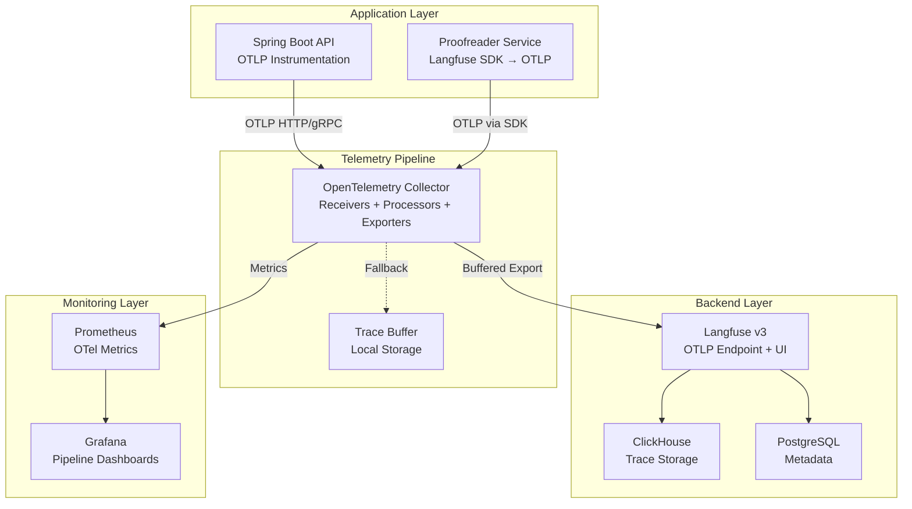
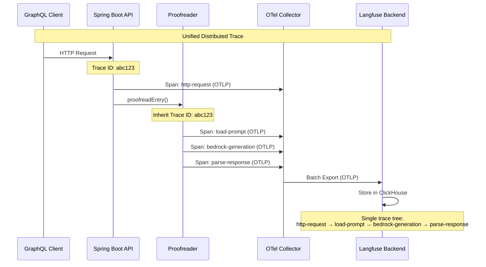

# Design Document

## Overview

The OpenTelemetry Integration feature creates a unified observability architecture by introducing an OpenTelemetry Collector as a central telemetry hub. This design routes both Spring Boot application traces and Langfuse LLM traces through a single pipeline, enabling complete end-to-end visibility while maintaining existing functionality and performance characteristics.

The integration leverages Langfuse v3's native OTLP endpoint support to create a seamless observability experience where HTTP requests, business logic, and LLM operations appear as a single distributed trace.

## Architecture

### High-Level Architecture



### Trace Flow Architecture



## Components and Interfaces

### OpenTelemetry Collector Configuration

The collector uses a pipeline architecture with three main components:

**Receivers**: Accept telemetry data in various formats
- OTLP HTTP Receiver (port 4318)
- OTLP gRPC Receiver (port 4317)
- Health Check Receiver (internal monitoring)

**Processors**: Transform and enrich telemetry data
- Batch Processor (performance optimization)
- Resource Processor (service metadata injection)
- Sampling Processor (volume control)
- Memory Limiter (resource protection)

**Exporters**: Send processed data to backends
- OTLP HTTP Exporter (to Langfuse)
- Prometheus Exporter (metrics)
- File Exporter (debugging/backup)

### Spring Boot Integration

**OpenTelemetry Java Agent**: Automatic instrumentation
- HTTP server/client spans
- Database query spans
- Method-level custom spans
- Exception tracking

**Manual Instrumentation**: Business logic spans
```java
@Component
public class ProofreadingService {
    private final Tracer tracer;
    
    public ProofreadResult proofread(String yamlEntry) {
        Span span = tracer.spanBuilder("proofreading.validate")
            .setAttribute("yaml.size", yamlEntry.length())
            .startSpan();
        
        try (Scope scope = span.makeCurrent()) {
            // Business logic with automatic context propagation
            return proofreader.proofreadEntry(yamlEntry);
        } finally {
            span.end();
        }
    }
}
```

### Langfuse SDK Modification

**OTLP Export Configuration**: Route traces through collector
```typescript
const langfuse = new Langfuse({
  publicKey: process.env.LANGFUSE_PUBLIC_KEY,
  secretKey: process.env.LANGFUSE_SECRET_KEY,
  baseUrl: process.env.LANGFUSE_BASE_URL,
  // New: Route through OTel Collector
  otlpEndpoint: process.env.OTLP_ENDPOINT || "http://otel-collector:4318/v1/traces",
  fallbackToDirectIngestion: true
});
```

**Trace Context Propagation**: Maintain correlation
```typescript
export async function proofreadEntry(yamlEntry: string, parentContext?: Context): Promise<ProofreadResult> {
  // Extract or create trace context
  const activeContext = parentContext || context.active();
  
  const trace = langfuse.trace({
    name: "veeds-proofreader",
    // Inherit trace ID from Spring Boot context
    traceId: getTraceId(activeContext),
    parentSpanId: getSpanId(activeContext)
  });
  
  // Continue with existing logic...
}
```

## Data Models

### OpenTelemetry Collector Configuration Schema

```yaml
# otel-collector-config.yaml
receivers:
  otlp:
    protocols:
      grpc:
        endpoint: 0.0.0.0:4317
      http:
        endpoint: 0.0.0.0:4318
        cors:
          allowed_origins: ["*"]
  
  prometheus:
    config:
      scrape_configs:
        - job_name: 'otel-collector'
          static_configs:
            - targets: ['localhost:8888']

processors:
  batch:
    timeout: 1s
    send_batch_size: 1024
    send_batch_max_size: 2048
  
  resource:
    attributes:
      - key: service.name
        value: veeds-llmops
        action: upsert
      - key: service.version
        from_attribute: service.version
        action: insert
  
  memory_limiter:
    limit_mib: 512
    spike_limit_mib: 128
  
  probabilistic_sampler:
    sampling_percentage: 100  # Start with 100%, adjust based on volume

exporters:
  otlphttp:
    endpoint: http://langfuse-web:3000/api/public/otlp/v1/traces
    headers:
      authorization: "Bearer ${LANGFUSE_SECRET_KEY}"
    retry_on_failure:
      enabled: true
      initial_interval: 1s
      max_interval: 30s
      max_elapsed_time: 300s
  
  prometheus:
    endpoint: "0.0.0.0:8889"
    namespace: otel_collector
  
  file:
    path: /tmp/traces.json
    format: json

service:
  pipelines:
    traces:
      receivers: [otlp]
      processors: [memory_limiter, resource, batch, probabilistic_sampler]
      exporters: [otlphttp, file]
    
    metrics:
      receivers: [prometheus]
      processors: [memory_limiter, resource, batch]
      exporters: [prometheus]
  
  extensions: [health_check, pprof, zpages]
  telemetry:
    logs:
      level: info
    metrics:
      address: 0.0.0.0:8888
```

### Docker Compose Integration

```yaml
# docker-compose.yml additions
services:
  otel-collector:
    image: otel/opentelemetry-collector-contrib:0.91.0
    container_name: veeds-otel-collector
    command: ["--config=/etc/otel-collector-config.yaml"]
    volumes:
      - ./config/otel-collector-config.yaml:/etc/otel-collector-config.yaml
      - ./logs:/tmp
    ports:
      - "4317:4317"   # OTLP gRPC
      - "4318:4318"   # OTLP HTTP
      - "8888:8888"   # Metrics
      - "8889:8889"   # Prometheus export
    environment:
      - LANGFUSE_SECRET_KEY=${LANGFUSE_SECRET_KEY}
    depends_on:
      - langfuse-web
    networks:
      - langfuse
    restart: unless-stopped
    healthcheck:
      test: ["CMD", "curl", "-f", "http://localhost:13133/"]
      interval: 30s
      timeout: 10s
      retries: 3
```

### Trace Correlation Data Model

```typescript
interface DistributedTraceContext {
  traceId: string;           // W3C Trace Context format
  spanId: string;            // Current span identifier
  traceFlags: number;        // Sampling and debug flags
  traceState?: string;       // Vendor-specific context
  baggage?: Record<string, string>; // Cross-cutting concerns
}

interface UnifiedSpan {
  traceId: string;
  spanId: string;
  parentSpanId?: string;
  operationName: string;
  startTime: number;
  endTime: number;
  duration: number;
  status: SpanStatus;
  attributes: Record<string, any>;
  events: SpanEvent[];
  links: SpanLink[];
  resource: Resource;
  instrumentationScope: InstrumentationScope;
}

interface LangfuseOTLPSpan extends UnifiedSpan {
  // Langfuse-specific extensions
  generation?: {
    model: string;
    usage: TokenUsage;
    modelParameters: Record<string, any>;
  };
  scores?: Score[];
  observations?: Observation[];
}
```

## Correctness Properties

*A property is a characteristic or behavior that should hold true across all valid executions of a system—essentially, a formal statement about what the system should do. Properties serve as the bridge between human-readable specifications and machine-verifiable correctness guarantees.*

Now I'll analyze the acceptance criteria to determine which are testable as properties:

<function_calls>
<invoke name="prework">
<parameter name="featureName">opentelemetry-integration

### Property Reflection

After analyzing all acceptance criteria, I identified several areas where properties can be consolidated for more comprehensive testing:

**Consolidation Opportunities:**
- Properties 1.1 and 1.5 both test endpoint availability - can be combined into one comprehensive endpoint availability property
- Properties 2.3, 2.4, and 2.5 all test Spring Boot trace generation - can be combined into one comprehensive trace generation property
- Properties 3.1, 3.2, and 3.3 all test Langfuse SDK routing through OTel - can be combined into one comprehensive routing property
- Properties 5.1, 5.2, 5.3, and 5.4 all test sampling functionality - can be combined into one comprehensive sampling property
- Properties 9.2, 9.3, and 9.4 all test security mechanisms - can be combined into one comprehensive security property

**Unique Value Properties:**
- Trace correlation properties (4.1, 4.2, 4.5) provide unique validation of distributed tracing
- Error handling properties (10.1, 10.2, 10.3, 10.4, 10.5) provide unique validation of resilience
- Monitoring properties (7.1, 7.2, 7.3, 7.4) provide unique validation of observability

Based on this analysis, I'll create consolidated properties that provide comprehensive coverage while eliminating redundancy.

### Correctness Properties

Property 1: **OTLP Endpoint Availability and Protocol Support**
*For any* Docker Compose stack deployment, both HTTP (port 4318) and gRPC (port 4317) OTLP endpoints should be available and accept valid OTLP-formatted trace data while rejecting invalid protocol data
**Validates: Requirements 1.1, 1.2, 1.5**

Property 2: **Spring Boot Trace Generation and Metadata**
*For any* HTTP request to Spring Boot, a root trace span should be created with proper OTLP format, required service metadata (name, version, environment), and appropriate child spans for business operations, with error spans marked correctly when exceptions occur
**Validates: Requirements 2.1, 2.2, 2.3, 2.4, 2.5**

Property 3: **Langfuse SDK OTLP Routing with Fallback**
*For any* Langfuse SDK trace operation, traces should be routed through the OTel Collector while preserving existing span structure and metadata, with automatic fallback to direct Langfuse ingestion when the collector is unavailable
**Validates: Requirements 3.1, 3.2, 3.3, 3.4, 3.5**

Property 4: **Distributed Trace Correlation**
*For any* HTTP request that triggers LLM processing, the same trace ID should be maintained across Spring Boot and Langfuse spans, with proper W3C Trace Context propagation and parent-child relationships preserved
**Validates: Requirements 4.1, 4.2, 4.5**

Property 5: **OTel Collector Processing and Export**
*For any* trace received by the OTel Collector, it should be processed according to configuration and exported to the Langfuse backend, with detailed error logging when processing fails
**Validates: Requirements 1.3, 1.4**

Property 6: **Comprehensive Sampling Behavior**
*For any* configured sampling rules, the OTel Collector should apply head-based and tail-based sampling consistently across all spans in a trace, with sampling decisions reducing data volume according to rules and exposing sampling metrics
**Validates: Requirements 5.1, 5.2, 5.3, 5.4, 5.5**

Property 7: **Configuration Management and Hot Reload**
*For any* configuration change to YAML files or environment variables, the OTel Collector should apply new settings without service restart and validate OTLP endpoint connectivity before processing requests
**Validates: Requirements 6.2, 6.3, 6.4**

Property 8: **Health Check and Monitoring**
*For any* OTLP component, health check endpoints should be available and return appropriate status, with metrics exposed for trace throughput, latency, and error rates
**Validates: Requirements 6.5, 7.1, 7.2**

Property 9: **Backward Compatibility Preservation**
*For any* existing Langfuse functionality (UI, SDK features, prompt management, datasets, experiments), behavior should remain identical when OpenTelemetry integration is enabled or disabled
**Validates: Requirements 8.1, 8.2, 8.3, 8.4, 8.5**

Property 10: **Security and Authentication**
*For any* OTLP data transmission, TLS encryption should be used with proper authentication mechanisms (API keys, tokens, RBAC), and sensitive data should be scrubbed according to configured redaction rules
**Validates: Requirements 9.1, 9.2, 9.3, 9.4, 9.5**

Property 11: **Error Handling and Resilience**
*For any* failure condition (collector unavailable, export failures, memory limits, invalid data), the system should handle errors gracefully with local buffering, exponential backoff retries, backpressure mechanisms, and circuit breaker functionality to prevent cascade failures
**Validates: Requirements 10.1, 10.2, 10.3, 10.4, 10.5**

Property 12: **Monitoring and Alerting**
*For any* trace correlation failure or significant sampling rate change, appropriate alerts should be generated with detailed information to enable quick issue resolution
**Validates: Requirements 7.3, 7.4**

## Error Handling

### Collector Failure Scenarios

**Collector Unavailable**: 
- Langfuse SDK automatically falls back to direct ingestion
- Spring Boot traces are buffered locally with configurable retention
- Health checks report degraded status
- Automatic reconnection attempts with exponential backoff

**Export Failures**:
- Retry with exponential backoff (1s, 2s, 4s, 8s, max 30s)
- Circuit breaker opens after consecutive failures
- Dead letter queue for failed exports
- Detailed error logging with trace/span IDs

**Memory Pressure**:
- Memory limiter processor applies backpressure
- Oldest traces dropped first (FIFO)
- Sampling rate automatically increased
- Alerts triggered at 80% memory usage

### Data Validation Errors

**Invalid OTLP Data**:
- Schema validation at receiver level
- Malformed traces logged and discarded
- Valid traces in same batch continue processing
- Metrics track validation failure rates

**Trace Correlation Failures**:
- Missing parent spans logged as warnings
- Orphaned spans linked to synthetic root
- Correlation metrics exposed for monitoring
- Manual correlation repair tools available

## Testing Strategy

### Dual Testing Approach

The OpenTelemetry Integration requires both **unit tests** and **property-based tests** for comprehensive coverage:

**Unit Tests** focus on:
- Specific configuration scenarios (YAML parsing, environment variable handling)
- Integration points between components (collector ↔ Langfuse, Spring Boot ↔ collector)
- Error conditions and edge cases (network failures, invalid data formats)
- UI functionality verification (dashboard displays, trace visualization)

**Property-Based Tests** focus on:
- Universal properties across all trace data (protocol compliance, metadata preservation)
- Comprehensive input coverage through randomization (various trace structures, sampling scenarios)
- Distributed system behaviors (correlation, consistency, resilience)
- Performance characteristics under load (throughput, latency, resource usage)

### Property-Based Testing Configuration

**Testing Framework**: Use **fast-check** for TypeScript/JavaScript components and **QuickCheck** for any Haskell components
- **Minimum 100 iterations** per property test to ensure statistical significance
- **Shrinking enabled** to find minimal failing examples
- **Seed-based reproducibility** for consistent CI/CD results

**Test Tagging Format**:
```typescript
// Example property test
test('Property 1: OTLP Endpoint Availability', async () => {
  // Feature: opentelemetry-integration, Property 1: OTLP Endpoint Availability and Protocol Support
  await fc.assert(fc.asyncProperty(
    fc.record({
      httpPort: fc.integer(1024, 65535),
      grpcPort: fc.integer(1024, 65535),
      traceData: fc.otlpTraceData()
    }),
    async ({ httpPort, grpcPort, traceData }) => {
      // Property implementation
    }
  ), { numRuns: 100 });
});
```

**Custom Generators**:
- **OTLP Trace Generator**: Creates valid and invalid OTLP trace data
- **Configuration Generator**: Generates various collector configurations
- **Network Scenario Generator**: Simulates network conditions and failures
- **Load Pattern Generator**: Creates realistic traffic patterns for performance testing

### Integration Testing Strategy

**End-to-End Trace Validation**:
1. Generate HTTP request to Spring Boot API
2. Verify trace creation and OTLP export
3. Confirm collector processing and Langfuse export
4. Validate unified trace display in Langfuse UI
5. Check all spans have correct correlation and metadata

**Performance Testing**:
- **Load Testing**: 1000 traces/second sustained for 10 minutes
- **Stress Testing**: Gradual increase to failure point
- **Memory Testing**: Verify memory limits and backpressure
- **Network Partition Testing**: Collector isolation scenarios

**Chaos Engineering**:
- Random collector restarts during trace processing
- Network latency injection between components
- Memory pressure simulation
- Configuration corruption scenarios