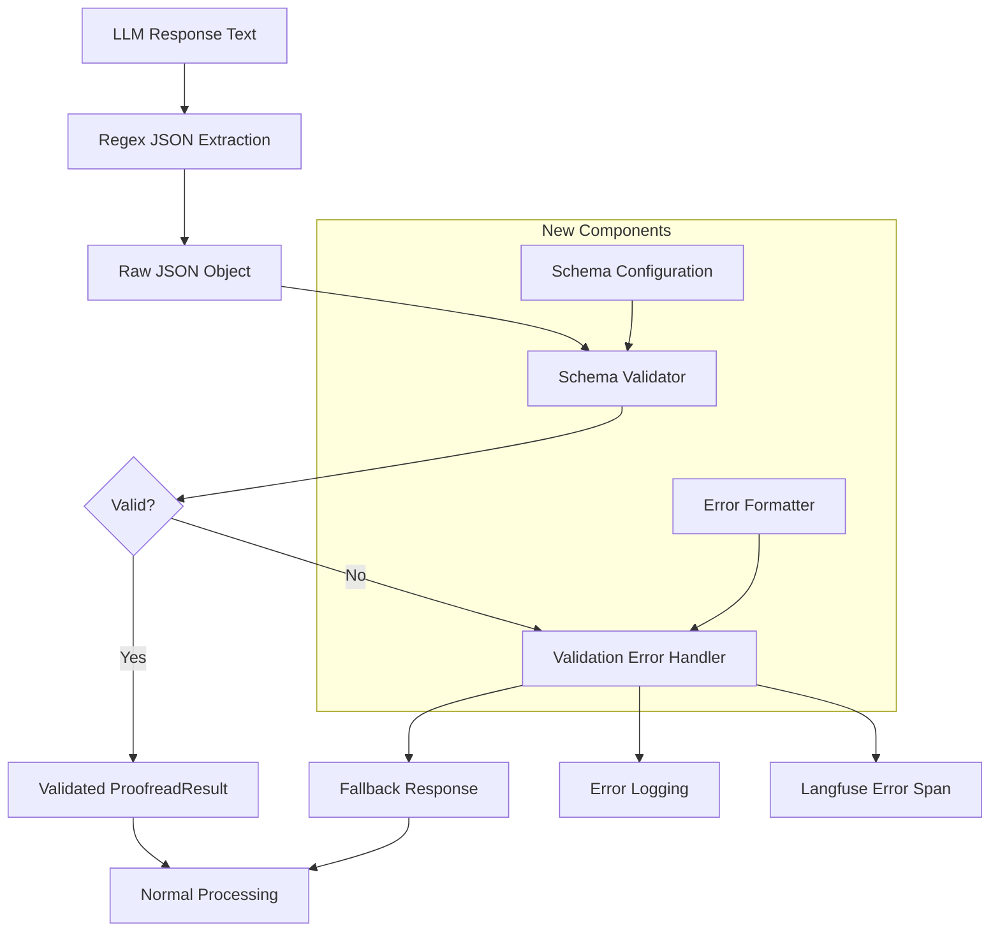

# Design Document

## Overview

The Output Schema Validation feature enhances the VEEDS LLMOps system by implementing robust JSON schema validation using the ajv library. This design replaces the current fragile regex-based JSON extraction with a comprehensive validation pipeline that ensures all LLM responses conform to the expected ProofreadResult structure. The solution integrates seamlessly with the existing proofreader workflow while adding validation layers, error handling, and observability through Langfuse tracing.

## Architecture

The validation system follows a pipeline architecture that intercepts the JSON processing flow between extraction and response handling:



The architecture maintains backward compatibility while adding validation as a transparent layer in the processing pipeline.

## Components and Interfaces

### SchemaValidator Class

The core validation component that handles JSON schema validation and error reporting:

```typescript
interface SchemaValidatorConfig {
  schemaPath: string;
  strictMode: boolean;
  enableHotReload: boolean;
  maxValidationTimeMs: number;
}

interface ValidationResult {
  isValid: boolean;
  data?: ProofreadResult;
  errors?: ValidationError[];
  validationTimeMs: number;
}

interface ValidationError {
  field: string;
  message: string;
  value: any;
  schemaPath: string;
}

class SchemaValidator {
  private ajv: Ajv;
  private compiledSchema: ValidateFunction;
  
  constructor(config: SchemaValidatorConfig);
  
  // Core validation method
  validate(data: unknown): ValidationResult;
  
  // Schema management
  loadSchema(schemaPath: string): void;
  reloadSchema(): void;
  
  // Error formatting
  formatErrors(errors: ErrorObject[]): ValidationError[];
}
```

### ValidationErrorHandler Class

Handles validation failures and generates appropriate fallback responses:

```typescript
interface FallbackConfig {
  defaultErrorMessage: string;
  includeValidationDetails: boolean;
  logLevel: 'error' | 'warn' | 'info';
}

class ValidationErrorHandler {
  constructor(
    private config: FallbackConfig,
    private langfuseClient: LangfuseClient
  );
  
  // Generate fallback response
  createFallbackResponse(
    originalResponse: string,
    validationErrors: ValidationError[]
  ): ProofreadResult;
  
  // Log validation failure
  logValidationFailure(
    trace: LangfuseTrace,
    originalResponse: string,
    errors: ValidationError[]
  ): void;
  
  // Create error metrics
  recordValidationMetrics(errors: ValidationError[]): void;
}
```

### Enhanced Proofreader Integration

The existing proofreader.ts will be enhanced with validation integration:

```typescript
// Enhanced proofreadEntry function signature
async function proofreadEntry(
  yamlEntry: string,
  options: ProofreadOptions = {}
): Promise<ProofreadResult> {
  const trace = langfuse.trace({
    name: "veeds-proofreader",
    input: { yaml_entry: yamlEntry }
  });
  
  try {
    // Existing prompt loading and Bedrock call logic...
    
    // NEW: Schema validation after JSON extraction
    const validationResult = schemaValidator.validate(extractedJson);
    
    if (!validationResult.isValid) {
      return validationErrorHandler.createFallbackResponse(
        rawResponse,
        validationResult.errors
      );
    }
    
    // Continue with validated data
    return validationResult.data;
    
  } catch (error) {
    // Enhanced error handling with validation context
  }
}
```

## Data Models

### JSON Schema Definition

The core schema that defines the expected ProofreadResult structure:

```json
{
  "$schema": "http://json-schema.org/draft-07/schema#",
  "type": "object",
  "required": ["isValid", "errors"],
  "additionalProperties": false,
  "properties": {
    "isValid": {
      "type": "boolean",
      "description": "Whether the YAML entry is valid"
    },
    "errors": {
      "type": "array",
      "description": "Array of validation errors found",
      "items": {
        "type": "object",
        "required": ["field", "message", "severity"],
        "additionalProperties": false,
        "properties": {
          "field": {
            "type": "string",
            "minLength": 1,
            "description": "The field name that has an error"
          },
          "message": {
            "type": "string",
            "minLength": 1,
            "description": "Human-readable error description"
          },
          "severity": {
            "type": "string",
            "enum": ["error", "warning", "info"],
            "description": "Error severity level"
          },
          "suggestion": {
            "type": "string",
            "description": "Optional suggestion for fixing the error"
          }
        }
      }
    },
    "metadata": {
      "type": "object",
      "description": "Optional metadata about the validation",
      "properties": {
        "processingTimeMs": {
          "type": "number",
          "minimum": 0
        },
        "modelVersion": {
          "type": "string"
        }
      }
    }
  }
}
```

### Configuration Schema

Schema for validator configuration to ensure proper setup:

```json
{
  "$schema": "http://json-schema.org/draft-07/schema#",
  "type": "object",
  "required": ["schemaPath", "strictMode"],
  "properties": {
    "schemaPath": {
      "type": "string",
      "description": "Path to the JSON schema file"
    },
    "strictMode": {
      "type": "boolean",
      "description": "Whether to reject additional properties"
    },
    "enableHotReload": {
      "type": "boolean",
      "default": false,
      "description": "Enable hot reloading of schema files"
    },
    "maxValidationTimeMs": {
      "type": "number",
      "minimum": 1,
      "maximum": 1000,
      "default": 10,
      "description": "Maximum time allowed for validation"
    },
    "fallback": {
      "type": "object",
      "properties": {
        "defaultErrorMessage": {
          "type": "string",
          "default": "Invalid response format from language model"
        },
        "includeValidationDetails": {
          "type": "boolean",
          "default": false
        },
        "logLevel": {
          "type": "string",
          "enum": ["error", "warn", "info"],
          "default": "error"
        }
      }
    }
  }
}
```

Now I need to use the prework tool to analyze the acceptance criteria before writing the correctness properties.

<function_calls>
<invoke name="prework">
<parameter name="featureName">output-schema-validation

## Correctness Properties

*A property is a characteristic or behavior that should hold true across all valid executions of a system—essentially, a formal statement about what the system should do. Properties serve as the bridge between human-readable specifications and machine-verifiable correctness guarantees.*

### Property 1: Schema Validation Correctness
*For any* JSON object that conforms to the ProofreadResult schema (with required `isValid` boolean and `errors` array containing valid error objects), the schema validator should accept it as valid
**Validates: Requirements 1.1, 1.2, 1.3, 1.4**

### Property 2: Severity Enum Validation
*For any* error object with a severity field, the schema validator should accept only "error", "warning", or "info" values and reject any other string values
**Validates: Requirements 1.5**

### Property 3: Additional Properties Rejection
*For any* JSON object that contains properties not defined in the ProofreadResult schema, the schema validator should reject it when running in strict mode
**Validates: Requirements 1.6**

### Property 4: Validation Pipeline Integration
*For any* extracted JSON from an LLM response, the validation should occur after JSON extraction but before any response processing or return to the client
**Validates: Requirements 2.1, 2.5**

### Property 5: Valid Response Processing
*For any* JSON object that passes schema validation, the system should continue with normal processing and return the validated ProofreadResult without modification
**Validates: Requirements 2.2**

### Property 6: Validation Error Generation
*For any* JSON object that fails schema validation, the system should generate detailed validation error messages that include field names, error descriptions, and JSON paths
**Validates: Requirements 2.3, 5.1, 5.2, 5.4**

### Property 7: Comprehensive Error Reporting
*For any* JSON object with multiple validation errors, the schema validator should report all validation errors, not just the first one encountered
**Validates: Requirements 5.5**

### Property 8: Fallback Response Validity
*For any* validation failure, the generated fallback response should itself conform to the ProofreadResult schema and be valid according to the same validation rules
**Validates: Requirements 3.1, 3.4**

### Property 9: Validation Performance
*For any* typical ProofreadResult JSON object (under 1KB), schema validation should complete within 10 milliseconds using a pre-compiled schema
**Validates: Requirements 4.1, 4.2, 4.3**

### Property 10: Langfuse Integration Completeness
*For any* validation operation (success or failure), appropriate Langfuse spans and scores should be created with validation metadata and proper trace levels
**Validates: Requirements 6.1, 6.2, 6.3, 6.5**

### Property 11: Configuration Hot Reload
*For any* schema configuration file change, when hot reload is enabled, the validator should reload and use the new schema without requiring application restart
**Validates: Requirements 7.2**

### Property 12: Backward Compatibility Preservation
*For any* valid ProofreadResult that was accepted by a previous schema version, it should continue to be accepted when the schema is extended with optional fields
**Validates: Requirements 7.4**

## Error Handling

The validation system implements comprehensive error handling at multiple levels:

### Validation Failure Handling
- **Schema Validation Errors**: When JSON doesn't conform to schema, detailed field-level errors are generated
- **Performance Timeout**: If validation exceeds configured time limit, fast-fail with timeout error
- **Schema Loading Errors**: If schema file is invalid or missing, fallback to embedded default schema
- **Configuration Errors**: Invalid configuration triggers startup failure with detailed error messages

### Fallback Response Strategy
```typescript
// Fallback response structure for validation failures
const fallbackResponse: ProofreadResult = {
  isValid: false,
  errors: [{
    field: "system",
    message: "Invalid response format from language model",
    severity: "error"
  }]
};
```

### Error Context Preservation
- Original LLM response preserved in logs for debugging
- Validation error details logged with full context
- Langfuse traces marked with ERROR level for failed validations
- Metrics incremented for monitoring validation failure rates

### Graceful Degradation
- If Langfuse is unavailable, validation continues with local logging
- If schema file is corrupted, embedded backup schema is used
- If ajv library fails, basic JSON structure validation is performed

## Testing Strategy

The validation system requires comprehensive testing using both unit tests and property-based testing to ensure correctness across all input variations.

### Unit Testing Approach
Unit tests focus on specific examples and integration points:
- **Schema Definition Tests**: Verify schema structure and required fields
- **Integration Tests**: Test validation pipeline integration points
- **Configuration Tests**: Verify configuration loading and validation
- **Error Handling Tests**: Test specific error scenarios and fallback responses
- **Langfuse Integration Tests**: Verify trace and score creation

### Property-Based Testing Approach
Property tests verify universal behaviors across generated inputs:
- **Schema Validation Properties**: Test validation correctness with generated valid/invalid JSON objects
- **Performance Properties**: Test validation timing with various input sizes
- **Error Reporting Properties**: Test comprehensive error reporting with generated invalid inputs
- **Fallback Response Properties**: Test that all generated fallback responses are valid
- **Integration Properties**: Test pipeline behavior with generated LLM responses

### Test Configuration
- **Property Test Iterations**: Minimum 100 iterations per property test
- **Test Data Generation**: Use JSON schema-based generators for realistic test data
- **Performance Benchmarks**: Validate 10ms performance requirement with realistic payloads
- **Error Injection**: Systematically test all error paths and recovery mechanisms

Each property-based test must reference its corresponding design property and run with sufficient iterations to provide confidence in the universal behavior being tested.