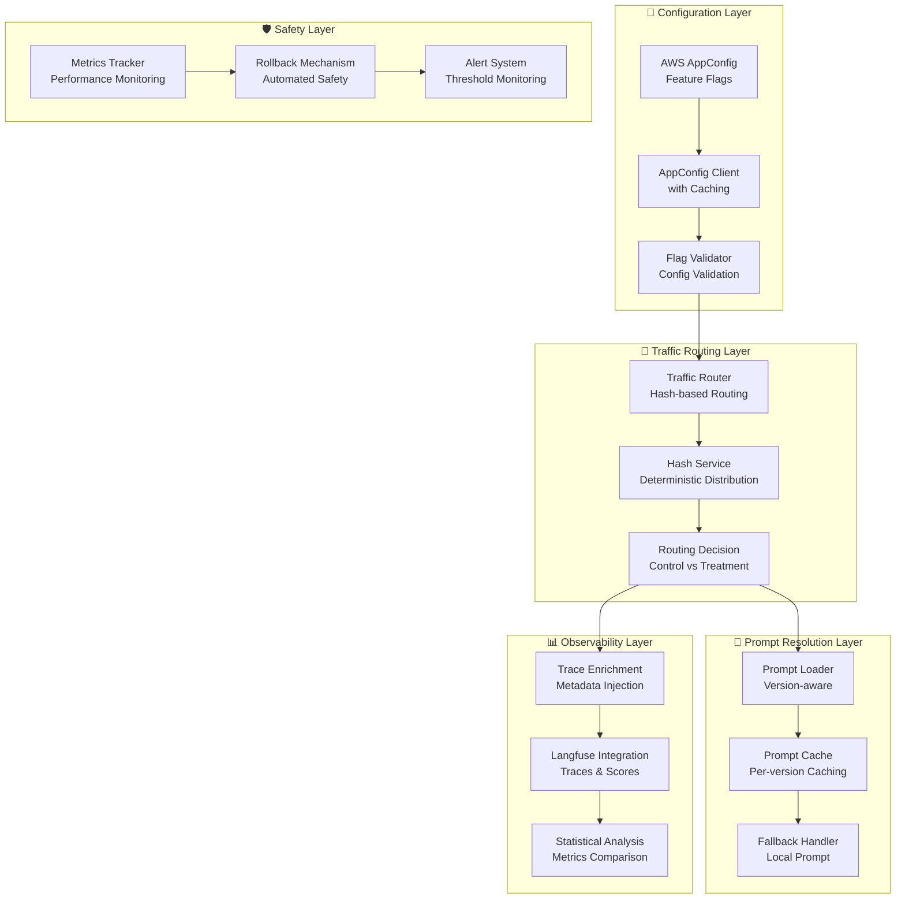

# Design Document: Prompt A/B Testing in Production

## Overview

The Prompt A/B Testing in Production feature enables controlled experimentation with different prompt versions in the VEEDS LLMOps system. The system uses AWS AppConfig for feature flag management, implements deterministic traffic routing, and provides comprehensive experiment tracking through Langfuse integration.

The design follows a layered architecture with clear separation between configuration management, traffic routing, prompt resolution, and observability. This ensures reliable experimentation with automatic rollback capabilities and statistical analysis support.

## Architecture



## Components and Interfaces

### AppConfig Client

**Purpose**: Manages feature flag retrieval and caching from AWS AppConfig.

**Interface**:
```typescript
interface AppConfigClient {
  getExperimentConfig(applicationId: string, environmentId: string, configurationProfileId: string): Promise<ExperimentConfig>;
  invalidateCache(): void;
  isHealthy(): boolean;
}

interface ExperimentConfig {
  enabled: boolean;
  experimentName: string;
  trafficSplit: {
    control: number;
    treatment: number;
  };
  promptVersions: {
    control: string;
    treatment: string;
  };
  rollbackThresholds: {
    errorRatePercent: number;
    latencyMultiplier: number;
  };
  minSampleSize: number;
  maxDurationHours: number;
}
```

**Key Features**:
- 60-second configuration caching to minimize API calls
- Exponential backoff retry logic for AppConfig API failures
- Health check endpoint for monitoring
- Graceful degradation when AppConfig is unavailable

### Traffic Router

**Purpose**: Implements deterministic traffic routing based on request characteristics.

**Interface**:
```typescript
interface TrafficRouter {
  routeRequest(requestId: string, config: ExperimentConfig): RoutingDecision;
  getTrafficDistribution(): TrafficStats;
}

interface RoutingDecision {
  group: 'control' | 'treatment';
  promptVersion: string;
  experimentName: string;
  routingHash: string;
}

interface TrafficStats {
  controlPercentage: number;
  treatmentPercentage: number;
  totalRequests: number;
  lastUpdated: Date;
}
```

**Routing Algorithm**:
1. Generate deterministic hash from request ID using SHA-256
2. Convert hash to percentage (0-99)
3. Route based on configured traffic split thresholds
4. Ensure consistent routing for same request ID

### Prompt Loader

**Purpose**: Loads appropriate prompt version based on routing decision with fallback support.

**Interface**:
```typescript
interface PromptLoader {
  loadPrompt(version: string, fallbackToLocal: boolean): Promise<PromptContent>;
  getCachedPrompt(version: string): PromptContent | null;
  invalidateCache(version?: string): void;
}

interface PromptContent {
  content: string;
  version: string;
  label: string;
  loadedFrom: 'langfuse' | 'local' | 'cache';
  timestamp: Date;
}
```

**Caching Strategy**:
- Separate cache entries per prompt version
- 5-minute TTL for prompt content
- LRU eviction with maximum 10 cached versions
- Cache warming for active experiment versions

### Trace Enrichment Service

**Purpose**: Adds experiment metadata to Langfuse traces for filtering and analysis.

**Interface**:
```typescript
interface TraceEnrichmentService {
  enrichTrace(trace: LangfuseTrace, decision: RoutingDecision, config: ExperimentConfig): void;
  createExperimentMetadata(decision: RoutingDecision, config: ExperimentConfig): ExperimentMetadata;
}

interface ExperimentMetadata {
  experimentName: string;
  experimentGroup: 'control' | 'treatment';
  promptVersion: string;
  trafficSplit: string;
  routingHash: string;
  timestamp: string;
}
```

**Metadata Structure**:
- Structured for efficient Langfuse filtering
- Includes experiment context and routing information
- Supports statistical analysis requirements
- Limited to 200 characters per field per Langfuse constraints

## Data Models

### Experiment Configuration Schema

```typescript
interface ExperimentConfigSchema {
  version: string;
  experiments: {
    [experimentName: string]: {
      enabled: boolean;
      description: string;
      trafficSplit: {
        control: number; // 0-100
        treatment: number; // 0-100
      };
      promptVersions: {
        control: string; // Langfuse prompt label
        treatment: string; // Langfuse prompt label
      };
      rollbackThresholds: {
        errorRatePercent: number; // Auto-rollback threshold
        latencyMultiplier: number; // Latency degradation threshold
      };
      constraints: {
        minSampleSize: number; // Minimum samples per group
        maxDurationHours: number; // Maximum experiment duration
        startTime?: string; // ISO timestamp
        endTime?: string; // ISO timestamp
      };
      metadata: {
        owner: string;
        hypothesis: string;
        successMetrics: string[];
      };
    };
  };
}
```

### Routing State Model

```typescript
interface RoutingState {
  requestId: string;
  timestamp: Date;
  experimentName: string;
  routingDecision: RoutingDecision;
  promptLoadResult: {
    version: string;
    loadedFrom: 'langfuse' | 'local' | 'cache';
    loadTimeMs: number;
    success: boolean;
    error?: string;
  };
  traceId: string;
  metadata: ExperimentMetadata;
}
```

### Statistical Analysis Model

```typescript
interface ExperimentStats {
  experimentName: string;
  startTime: Date;
  endTime?: Date;
  groups: {
    control: GroupStats;
    treatment: GroupStats;
  };
  significance: {
    pValue: number;
    confidenceLevel: number;
    statisticallySignificant: boolean;
    recommendedAction: 'continue' | 'rollback' | 'promote';
  };
}

interface GroupStats {
  sampleSize: number;
  successRate: number;
  averageLatencyMs: number;
  averageCostUsd: number;
  errorRate: number;
  confidenceInterval: {
    lower: number;
    upper: number;
  };
}
```

Now I need to use the prework tool to analyze the acceptance criteria before writing the correctness properties.

<function_calls>
<invoke name="prework">
<parameter name="featureName">prompt-ab-testing-production
## Correctness Properties

*A property is a characteristic or behavior that should hold true across all valid executions of a system-essentially, a formal statement about what the system should do. Properties serve as the bridge between human-readable specifications and machine-verifiable correctness guarantees.*

Based on the prework analysis, the following properties ensure the correctness of the prompt A/B testing system:

### Property 1: AppConfig Configuration Retrieval and Caching
*For any* valid AppConfig application, environment, and configuration profile, retrieving the configuration should return valid experiment settings and subsequent calls within 60 seconds should use cached data without additional API calls.
**Validates: Requirements 1.1, 1.5**

### Property 2: Traffic Distribution Accuracy
*For any* configured traffic split percentages and large sample of requests, the actual routing distribution should match the expected percentages within statistical confidence intervals (±2% for 95% confidence).
**Validates: Requirements 2.2, 2.3, 2.5**

### Property 3: Deterministic Routing Consistency
*For any* request ID, multiple routing calls should always return the same group assignment (control or treatment) regardless of when the calls are made.
**Validates: Requirements 2.2**

### Property 4: Fallback Behavior Under Failures
*For any* system failure scenario (AppConfig unreachable, experimental prompt missing, Langfuse offline), the system should fallback to production prompt and continue processing while logging appropriate error information.
**Validates: Requirements 1.3, 3.3, 3.5**

### Property 5: Prompt Version Resolution Accuracy
*For any* routing decision (control or treatment), the prompt loader should fetch the correct prompt version as specified in the experiment configuration, with proper caching isolation between versions.
**Validates: Requirements 3.1, 3.2, 3.4**

### Property 6: Experiment Metadata Completeness
*For any* processed request, the Langfuse trace should contain complete experiment metadata including experiment name, group assignment, prompt version, and traffic split information in the expected structured format.
**Validates: Requirements 4.1, 4.2, 4.3, 4.4, 4.5**

### Property 7: Statistical Metrics Collection
*For any* running experiment with sufficient sample size, the system should collect and aggregate all required metrics (success rate, latency, cost, error patterns) for both control and treatment groups.
**Validates: Requirements 5.1, 5.2, 5.4**

### Property 8: Automated Rollback Triggers
*For any* experiment where treatment group performance degrades beyond configured thresholds (error rate or latency), the rollback mechanism should automatically disable the experiment and route all traffic to production.
**Validates: Requirements 6.1, 6.2, 6.3**

### Property 9: Configuration Validation Completeness
*For any* experiment configuration, the validator should verify that traffic percentages sum to 100%, prompt versions exist in Langfuse, duration is within reasonable bounds, and reject invalid configurations with detailed error messages.
**Validates: Requirements 8.1, 8.2, 8.3, 8.4, 8.5**

### Property 10: Multi-Variant Traffic Distribution
*For any* experiment configuration with multiple treatment variants, traffic should be distributed according to configured weights while maintaining statistical validity across all groups.
**Validates: Requirements 2.4**

## Error Handling

### AppConfig Integration Errors
- **Connection Failures**: Exponential backoff with maximum 3 retries
- **Invalid Configurations**: Validation errors logged with detailed messages
- **Cache Misses**: Graceful degradation to production prompt
- **Timeout Handling**: 5-second timeout with fallback to cached configuration

### Prompt Loading Errors
- **Langfuse API Failures**: Automatic fallback to local prompt file
- **Missing Prompt Versions**: Log error and use production prompt
- **Cache Corruption**: Invalidate cache and reload from source
- **Network Timeouts**: Use cached version if available, otherwise fallback

### Statistical Analysis Errors
- **Insufficient Sample Size**: Delay significance testing until minimum samples reached
- **Data Quality Issues**: Flag anomalous metrics for manual review
- **Calculation Errors**: Log errors and continue with available metrics
- **Rollback Failures**: Manual intervention required with alerting

### Rollback Mechanism Errors
- **AppConfig Update Failures**: Retry with exponential backoff
- **Partial Rollback States**: Force complete rollback to safe state
- **Concurrent Rollbacks**: Use distributed locking to prevent conflicts
- **Notification Failures**: Log rollback events locally for audit trail

## Testing Strategy

### Unit Testing Approach
- **Configuration Validation**: Test all validation rules with edge cases
- **Traffic Routing Logic**: Verify hash-based distribution accuracy
- **Prompt Loading**: Test caching, fallbacks, and error scenarios
- **Metadata Injection**: Verify complete and correct trace enrichment
- **Statistical Calculations**: Test metrics aggregation and significance testing

### Property-Based Testing Configuration
- **Minimum 100 iterations** per property test due to randomization
- **Statistical Distribution Tests**: Use large sample sizes (10,000+ requests) for traffic routing validation
- **Hash Consistency Tests**: Verify deterministic routing across multiple test runs
- **Fallback Scenario Tests**: Simulate various failure modes systematically
- **Configuration Validation Tests**: Generate invalid configurations to test rejection logic

### Integration Testing Strategy
- **End-to-End Experiment Flow**: Full request lifecycle with real AWS AppConfig
- **Langfuse Integration**: Verify trace creation and metadata filtering
- **Rollback Testing**: Simulate performance degradation and verify automatic rollback
- **Multi-Variant Testing**: Test complex traffic splitting scenarios
- **Performance Testing**: Verify system performance under experiment load

### Test Data Generation
- **Synthetic Request IDs**: Generate diverse request patterns for routing tests
- **Configuration Variations**: Create valid and invalid experiment configurations
- **Performance Scenarios**: Simulate various latency and error rate patterns
- **Statistical Edge Cases**: Test boundary conditions for significance testing
- **Failure Scenarios**: Comprehensive error injection testing

Each property test must reference its design document property using the tag format:
**Feature: prompt-ab-testing-production, Property {number}: {property_text}**