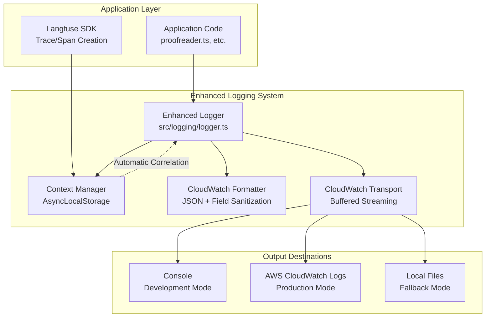
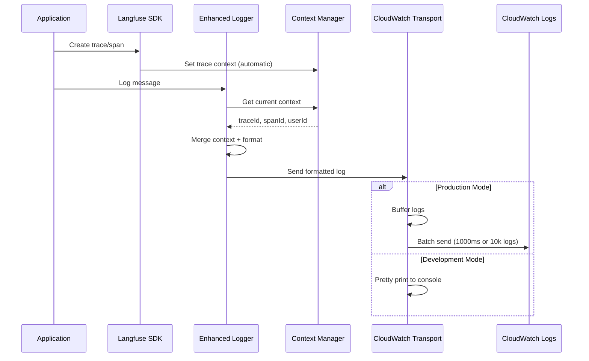

# Design Document

## Overview

The Structured Logging Enhancement extends the existing Pino-based logging system in the VEEDS LLMOps stack to provide automatic Langfuse trace correlation, CloudWatch integration, and performance-optimized JSON serialization. This enhancement builds upon the current logging infrastructure in `src/logging/` while adding production-ready observability features.

The design focuses on maintaining the existing high-performance characteristics of Pino while adding enterprise-grade features for production monitoring and debugging. The system will automatically correlate logs with Langfuse traces, format logs for CloudWatch compatibility, and provide resilient error handling.

## Architecture

### System Architecture



### Component Interaction Flow



## Components and Interfaces

### Enhanced Logger Interface

```typescript
interface EnhancedLogger extends Logger {
  // Existing methods remain unchanged
  trace(message: string, context?: LogContext): void;
  debug(message: string, context?: LogContext): void;
  info(message: string, context?: LogContext): void;
  warn(message: string, context?: LogContext): void;
  error(message: string | Error, context?: LogContext): void;
  fatal(message: string | Error, context?: LogContext): void;
  
  // Enhanced context methods
  withLangfuseTrace(trace: LangfuseTrace): EnhancedLogger;
  withLangfuseSpan(span: LangfuseSpan): EnhancedLogger;
  withRequestId(requestId: string): EnhancedLogger;
  
  // CloudWatch specific methods
  flush(): Promise<void>;
  getCloudWatchStatus(): CloudWatchStatus;
}
```

### CloudWatch Transport Interface

```typescript
interface CloudWatchTransport {
  write(logEntry: LogEntry): void;
  flush(): Promise<void>;
  getStatus(): CloudWatchStatus;
  configure(config: CloudWatchConfig): void;
}

interface CloudWatchConfig {
  logGroup: string;
  logStream: string;
  region: string;
  batchSize: number;
  flushInterval: number;
  maxRetries: number;
  credentials?: AWSCredentials;
}

interface CloudWatchStatus {
  connected: boolean;
  lastFlush: Date;
  pendingLogs: number;
  errors: CloudWatchError[];
}
```

### Enhanced Context Manager

```typescript
interface EnhancedContextManager extends ContextManager {
  // Automatic Langfuse integration
  setLangfuseTrace(trace: LangfuseTrace, userId?: string): void;
  setLangfuseSpan(span: LangfuseSpan, traceId?: string): void;
  
  // Request correlation
  setRequestContext(requestId: string, userId?: string): void;
  
  // Performance tracking
  startOperation(operationName: string): OperationTimer;
  endOperation(timer: OperationTimer): void;
  
  // Context extraction
  extractFromLangfuse(): LogContext | null;
  extractFromRequest(): LogContext | null;
}
```

## Data Models

### Enhanced Log Entry Structure

```typescript
interface EnhancedLogEntry extends LogEntry {
  // CloudWatch required fields
  '@timestamp': string;
  '@message': string;
  '@level': string;
  
  // Service identification
  service: string;
  version: string;
  environment: string;
  
  // Trace correlation (automatic)
  traceId?: string;
  spanId?: string;
  userId?: string;
  requestId?: string;
  
  // Operation context
  operation?: string;
  component?: string;
  duration?: number;
  
  // Langfuse specific
  'langfuse.traceId'?: string;
  'langfuse.spanId'?: string;
  'langfuse.userId'?: string;
  'langfuse.sessionId'?: string;
  
  // Performance metrics
  'performance.duration'?: number;
  'performance.memoryUsage'?: MemoryUsage;
  'performance.cpuUsage'?: CPUUsage;
  
  // Bedrock operations
  'bedrock.model'?: string;
  'bedrock.inputTokens'?: number;
  'bedrock.outputTokens'?: number;
  'bedrock.cost'?: number;
  'bedrock.retryCount'?: number;
  
  // Error details
  'error.name'?: string;
  'error.message'?: string;
  'error.stack'?: string;
  'error.code'?: string;
  
  // CloudWatch metadata
  '@logGroup'?: string;
  '@logStream'?: string;
  '@requestId'?: string;
}
```

### CloudWatch Batch Structure

```typescript
interface CloudWatchBatch {
  logGroupName: string;
  logStreamName: string;
  logEvents: CloudWatchLogEvent[];
  sequenceToken?: string;
}

interface CloudWatchLogEvent {
  timestamp: number;
  message: string;
}
```

## Correctness Properties

*A property is a characteristic or behavior that should hold true across all valid executions of a system-essentially, a formal statement about what the system should do. Properties serve as the bridge between human-readable specifications and machine-verifiable correctness guarantees.*

### Property 1: Automatic Langfuse Context Correlation
*For any* active Langfuse trace or span, when a log entry is created, the log entry should automatically include the correct traceId and spanId from the current context, with nested spans taking precedence
**Validates: Requirements 1.1, 1.2, 1.3, 7.1, 7.2**

### Property 2: CloudWatch Compatibility and Field Sanitization
*For any* log entry with special characters in field names or nested objects, the CloudWatch formatter should sanitize field names and flatten nested objects to dot notation while maintaining CloudWatch compatibility
**Validates: Requirements 2.2, 2.4, 2.5**

### Property 3: Log Size Management and Truncation
*For any* log entry exceeding 256KB, the system should truncate the content, add truncation metadata, and maintain valid JSON structure while staying within CloudWatch limits
**Validates: Requirements 2.3**

### Property 4: Performance Constraint and Optimization
*For any* log operation under normal conditions, the serialization and formatting should complete within 5ms, with efficient JSON serialization for high-frequency events
**Validates: Requirements 3.1, 3.2**

### Property 5: Async Context Preservation
*For any* async operation with established log context (traceId, spanId, requestId, userId), the context should be preserved across all async boundaries using AsyncLocalStorage
**Validates: Requirements 1.5, 4.1, 4.2**

### Property 6: Comprehensive Error Resilience
*For any* error condition (CloudWatch unavailable, JSON serialization failure, circular references, memory pressure), the system should handle it gracefully without throwing exceptions that could crash the application
**Validates: Requirements 8.1, 8.2, 8.4, 8.5**

### Property 7: Environment-Based Formatting
*For any* environment setting (development, production, test), the system should use appropriate log formatting and behavior based on NODE_ENV configuration
**Validates: Requirements 6.1, 6.2, 6.4**

### Property 8: Configuration Support and Validation
*For any* environment variable configuration (LOG_LEVEL, CLOUDWATCH_LOG_GROUP, etc.), the system should validate the configuration and provide sensible defaults when variables are not set
**Validates: Requirements 6.5, 9.1, 9.2, 9.3, 9.4, 9.5**

### Property 9: CloudWatch Integration and Fallback
*For any* CloudWatch operation (log group creation, stream creation, batch sending), the system should handle failures gracefully with automatic fallback to local logging and respect rate limits
**Validates: Requirements 5.1, 5.2, 5.3, 5.4, 5.5**

### Property 10: Performance Monitoring and Metrics
*For any* logging operation, the system should track performance metrics (latency, throughput, errors) and expose them in a monitoring-compatible format with warnings for performance degradation
**Validates: Requirements 10.1, 10.2, 10.3, 10.4, 10.5**

## Error Handling

### Error Categories and Strategies

#### 1. CloudWatch API Errors
- **Throttling**: Exponential backoff with jitter (1s, 2s, 4s, 8s)
- **Authentication**: Log warning and fallback to local logging
- **Network**: Retry with circuit breaker pattern
- **Rate Limits**: Batch size reduction and interval increase

#### 2. JSON Serialization Errors
- **Circular References**: Use JSON.stringify replacer function
- **BigInt/Symbol**: Convert to string representation
- **Functions**: Exclude from serialization
- **Undefined**: Convert to null

#### 3. Context Management Errors
- **AsyncLocalStorage Failures**: Continue without context correlation
- **Langfuse SDK Errors**: Log warning and use manual context
- **Memory Pressure**: Reduce context detail level

#### 4. Configuration Errors
- **Invalid Environment Variables**: Use defaults with warnings
- **Missing AWS Credentials**: Fallback to local logging
- **Invalid Log Levels**: Default to 'info' level

### Circuit Breaker Implementation

```typescript
interface CircuitBreakerState {
  state: 'CLOSED' | 'OPEN' | 'HALF_OPEN';
  failureCount: number;
  lastFailureTime: number;
  successCount: number;
}

class CloudWatchCircuitBreaker {
  private state: CircuitBreakerState = {
    state: 'CLOSED',
    failureCount: 0,
    lastFailureTime: 0,
    successCount: 0
  };
  
  async execute<T>(operation: () => Promise<T>): Promise<T> {
    if (this.state.state === 'OPEN') {
      if (Date.now() - this.state.lastFailureTime > 60000) { // 1 minute
        this.state.state = 'HALF_OPEN';
      } else {
        throw new Error('Circuit breaker is OPEN');
      }
    }
    
    try {
      const result = await operation();
      this.onSuccess();
      return result;
    } catch (error) {
      this.onFailure();
      throw error;
    }
  }
  
  private onSuccess(): void {
    this.state.failureCount = 0;
    this.state.successCount++;
    if (this.state.state === 'HALF_OPEN' && this.state.successCount >= 3) {
      this.state.state = 'CLOSED';
    }
  }
  
  private onFailure(): void {
    this.state.failureCount++;
    this.state.lastFailureTime = Date.now();
    if (this.state.failureCount >= 5) {
      this.state.state = 'OPEN';
    }
  }
}
```

## Testing Strategy

### Dual Testing Approach

The testing strategy combines unit tests for specific functionality and property-based tests for universal correctness properties:

**Unit Tests:**
- CloudWatch transport connection and batching
- JSON formatter edge cases (circular references, large objects)
- Context manager AsyncLocalStorage behavior
- Configuration validation and defaults
- Error handling scenarios

**Property-Based Tests:**
- Trace correlation across random async operations
- CloudWatch field name sanitization with random inputs
- Log size truncation with various content types
- Performance constraints under load
- Fallback behavior with random failure scenarios

### Property Test Configuration

Each property test will run a minimum of 100 iterations using the fast-check library. Tests will be tagged with:
- **Feature: structured-logging-enhancement, Property 1**: Automatic trace correlation
- **Feature: structured-logging-enhancement, Property 2**: CloudWatch field compatibility
- **Feature: structured-logging-enhancement, Property 3**: Log size limitation
- And so on for each property

### Integration Testing

- End-to-end logging flow from application to CloudWatch
- Langfuse trace correlation in realistic scenarios
- Performance testing under high log volume
- Failover testing with CloudWatch unavailable
- Memory usage testing with large context objects

### Performance Testing

- Benchmark logging performance with and without CloudWatch transport
- Memory usage profiling with different batch sizes
- CPU usage measurement during high-frequency logging
- Network usage optimization for CloudWatch API calls