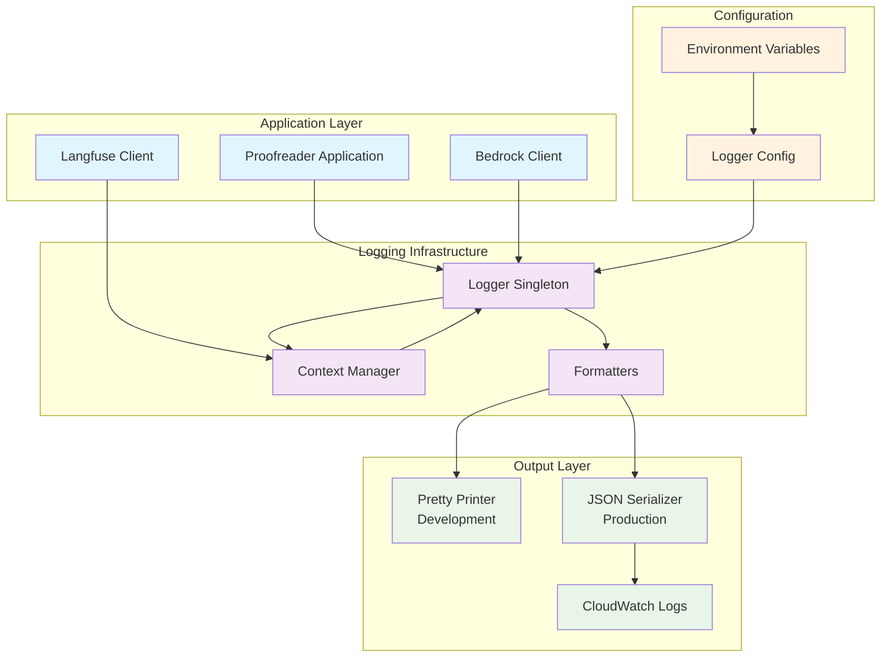

# Design Document

## Overview

The Structured Logging with Pino implementation provides a comprehensive logging infrastructure that replaces the current console-based logging with production-ready structured JSON logs. The design centers around a singleton logger instance that automatically correlates with Langfuse traces, optimizes for CloudWatch Insights queries, and provides excellent development experience through pretty printing.

The solution integrates seamlessly with the existing VEEDS architecture by wrapping the Langfuse client to extract trace context and providing drop-in replacements for console methods. Performance is prioritized through Pino's fast JSON serialization and minimal overhead design.

## Architecture



The architecture follows a layered approach where the Logger Singleton acts as the central coordination point. The Context Manager extracts trace information from Langfuse, while Formatters handle environment-specific output formatting. Configuration is environment-driven with sensible defaults.

## Components and Interfaces

### Logger Singleton (`src/logger.ts`)

The core logger component that provides the main logging interface:

```typescript
interface Logger {
  // Standard logging methods
  trace(message: string, context?: LogContext): void;
  debug(message: string, context?: LogContext): void;
  info(message: string, context?: LogContext): void;
  warn(message: string, context?: LogContext): void;
  error(message: string | Error, context?: LogContext): void;
  fatal(message: string | Error, context?: LogContext): void;
  
  // Performance logging
  time(label: string): Timer;
  timeEnd(label: string, context?: LogContext): void;
  
  // Cost and metrics logging
  logBedrock(operation: BedrockOperation): void;
  logPerformance(metrics: PerformanceMetrics): void;
  
  // Context management
  child(context: LogContext): Logger;
  withTrace(traceId: string, spanId?: string): Logger;
}

interface LogContext {
  traceId?: string;
  spanId?: string;
  userId?: string;
  requestId?: string;
  operation?: string;
  [key: string]: any;
}
```

### Context Manager (`src/logging/context-manager.ts`)

Handles automatic extraction of trace context from Langfuse:

```typescript
interface ContextManager {
  getCurrentContext(): LogContext;
  setTraceContext(traceId: string, spanId?: string): void;
  clearContext(): void;
  withContext<T>(context: LogContext, fn: () => T): T;
}

interface TraceExtractor {
  extractFromLangfuse(): LogContext | null;
  extractFromAsyncStorage(): LogContext | null;
}
```

### Formatters (`src/logging/formatters.ts`)

Environment-specific log formatting:

```typescript
interface LogFormatter {
  format(logEntry: LogEntry): string;
}

interface PrettyFormatter extends LogFormatter {
  colorize: boolean;
  includeTimestamp: boolean;
  maxDepth: number;
}

interface JSONFormatter extends LogFormatter {
  flattenObjects: boolean;
  maxFieldLength: number;
  cloudWatchCompatible: boolean;
}
```

### Configuration (`src/logging/config.ts`)

Environment-driven configuration management:

```typescript
interface LoggerConfig {
  level: LogLevel;
  environment: 'development' | 'production' | 'test';
  format: 'pretty' | 'json';
  outputs: LogOutput[];
  correlation: CorrelationConfig;
  performance: PerformanceConfig;
  cloudWatch: CloudWatchConfig;
}

interface CorrelationConfig {
  enableLangfuseCorrelation: boolean;
  enableRequestCorrelation: boolean;
  traceHeaderName: string;
}
```

## Data Models

### Log Entry Structure

The core log entry follows a standardized structure optimized for CloudWatch Insights:

```typescript
interface LogEntry {
  // Standard fields
  '@timestamp': string;           // ISO 8601 timestamp
  level: LogLevel;               // trace, debug, info, warn, error, fatal
  message: string;               // Primary log message
  service: string;               // 'veeds-proofreader'
  version: string;               // Application version
  
  // Correlation fields
  traceId?: string;              // Langfuse trace ID
  spanId?: string;               // Langfuse span ID
  requestId?: string;            // Request correlation ID
  userId?: string;               // User identifier
  
  // Context fields
  operation?: string;            // Current operation name
  component?: string;            // Component/module name
  environment: string;           // deployment environment
  
  // Performance fields (when applicable)
  duration?: number;             // Operation duration in ms
  tokenUsage?: TokenUsage;       // LLM token consumption
  cost?: number;                 // Operation cost in USD
  
  // Error fields (when applicable)
  error?: {
    name: string;
    message: string;
    stack?: string;
    code?: string;
  };
  
  // Additional context
  [key: string]: any;
}
```

### Performance Metrics Model

Structured performance data for monitoring and optimization:

```typescript
interface PerformanceMetrics {
  operation: string;
  startTime: number;
  endTime: number;
  duration: number;
  memoryUsage?: {
    heapUsed: number;
    heapTotal: number;
    external: number;
  };
  cpuUsage?: {
    user: number;
    system: number;
  };
}

interface BedrockOperation {
  model: string;
  operation: 'invoke' | 'stream';
  duration: number;
  tokenUsage: {
    inputTokens: number;
    outputTokens: number;
  };
  cost: number;
  retryCount?: number;
  error?: string;
}
```

### Configuration Schema

Environment-based configuration with validation:

```typescript
interface EnvironmentConfig {
  // Core logging
  LOG_LEVEL: LogLevel;                    // Default: 'info'
  LOG_FORMAT: 'pretty' | 'json';         // Default: 'json' in prod
  LOG_SERVICE_NAME: string;               // Default: 'veeds-proofreader'
  
  // Correlation
  ENABLE_LANGFUSE_CORRELATION: boolean;   // Default: true
  ENABLE_REQUEST_CORRELATION: boolean;    // Default: true
  TRACE_HEADER_NAME: string;              // Default: 'x-trace-id'
  
  // Performance
  ENABLE_PERFORMANCE_LOGGING: boolean;    // Default: true
  LOG_MEMORY_USAGE: boolean;              // Default: false
  LOG_CPU_USAGE: boolean;                 // Default: false
  
  // CloudWatch
  CLOUDWATCH_LOG_GROUP: string;           // Default: '/veeds/proofreader'
  CLOUDWATCH_LOG_STREAM: string;          // Default: container ID
  MAX_LOG_SIZE: number;                   // Default: 256000 (256KB)
}
```

## Correctness Properties

*A property is a characteristic or behavior that should hold true across all valid executions of a system—essentially, a formal statement about what the system should do. Properties serve as the bridge between human-readable specifications and machine-verifiable correctness guarantees.*

### Converting EARS to Properties

Based on the prework analysis, I'll convert the acceptance criteria into testable properties, consolidating redundant properties for efficiency:

**Property 1: Log Format Consistency**
*For any* log entry, the output format should be JSON in production environments and pretty-printed in development environments, while maintaining identical structured data in both formats
**Validates: Requirements 1.1, 1.2, 6.5**

**Property 2: Standard Field Completeness**
*For any* log entry, it should contain all required standard fields: @timestamp (ISO 8601), level, message, service, and version
**Validates: Requirements 1.4, 3.3**

**Property 3: Log Level API Completeness**
*For any* supported log level (trace, debug, info, warn, error, fatal), the logger should provide a working method that produces correctly leveled output
**Validates: Requirements 1.5**

**Property 4: Performance Constraint**
*For any* log call, the execution time should be under 5ms to maintain application performance
**Validates: Requirements 1.6**

**Property 5: Trace Correlation Completeness**
*For any* active Langfuse trace context, log entries should automatically include the trace ID, and when spans are active, both trace ID and span ID should be included
**Validates: Requirements 2.1, 2.2, 2.6**

**Property 6: Trace Context Preservation**
*For any* async operation sequence, trace context should be maintained across all async boundaries when initially present
**Validates: Requirements 2.5**

**Property 7: Graceful Context Degradation**
*For any* logging operation without trace context, the logger should function normally and produce valid log entries without trace fields
**Validates: Requirements 2.4**

**Property 8: CloudWatch Optimization**
*For any* log entry, it should comply with CloudWatch Insights requirements: compatible field names, maximum 2-level nesting, size under 256KB, and flattened complex objects
**Validates: Requirements 3.1, 3.2, 3.4, 3.5**

**Property 9: Performance Metrics Logging**
*For any* Bedrock operation or YAML processing operation, the logger should capture and log structured performance metrics including duration, token usage, cost, and memory usage when enabled
**Validates: Requirements 4.1, 4.2, 4.3, 4.5, 4.6**

**Property 10: Comprehensive Error Context**
*For any* error condition, the logger should capture complete error context including stack traces, request context, retry details, and raw responses for parsing failures
**Validates: Requirements 5.1, 5.2, 5.3, 5.4, 5.7**

**Property 11: Development Experience Enhancement**
*For any* development environment configuration, the logger should provide pretty-printed output with colors, readable timestamps, highlighted errors/warnings, and maintain all structured data
**Validates: Requirements 6.1, 6.2, 6.3**

**Property 12: Configuration Flexibility**
*For any* configuration method (environment variables, config files, runtime changes), the logger should apply the configuration correctly and validate it on startup
**Validates: Requirements 1.7, 8.1, 8.2, 8.7**

**Property 13: API Compatibility**
*For any* existing console.* call pattern, the logger should provide drop-in replacement methods that maintain equivalent functionality
**Validates: Requirements 7.1**

**Property 14: Integration Compatibility**
*For any* existing system component (Langfuse client, TypeScript/ESM modules, error handling), the logger should integrate without requiring modifications to existing code
**Validates: Requirements 7.2, 7.3, 7.4, 7.5, 7.7**

## Error Handling

The logging system implements comprehensive error handling to ensure reliability and debuggability:

### Logger Initialization Errors
- **Configuration Validation**: Invalid configuration causes immediate startup failure with detailed error messages
- **Environment Detection**: Automatic fallback to safe defaults when environment detection fails
- **Dependency Failures**: Graceful degradation when optional dependencies (like Langfuse) are unavailable

### Runtime Error Handling
- **Serialization Errors**: Circular references and non-serializable objects are handled with safe fallbacks
- **Output Stream Errors**: Failed writes to output streams are retried with exponential backoff
- **Context Extraction Errors**: Langfuse context extraction failures don't prevent logging

### Performance Safeguards
- **Memory Pressure**: Automatic log level reduction under high memory usage
- **CPU Throttling**: Log sampling activation when CPU usage exceeds thresholds
- **Queue Overflow**: Oldest log entries are dropped when internal queues overflow

### Error Recovery Patterns
```typescript
// Graceful serialization with fallback
try {
  return JSON.stringify(obj);
} catch (error) {
  return JSON.stringify({
    error: 'Serialization failed',
    originalType: typeof obj,
    fallback: String(obj)
  });
}

// Context extraction with fallback
try {
  return langfuseClient.getCurrentTrace();
} catch (error) {
  logger.warn('Failed to extract Langfuse context', { error: error.message });
  return null;
}
```

## Testing Strategy

The testing strategy employs a dual approach combining unit tests for specific functionality and property-based tests for universal correctness guarantees.

### Unit Testing Focus
- **Configuration parsing and validation**
- **Error handling edge cases**
- **Integration points with Langfuse client**
- **Environment-specific behavior**
- **Migration utility functionality**

### Property-Based Testing Focus
- **Log format consistency across environments**
- **Trace correlation under various async patterns**
- **Performance constraints under load**
- **CloudWatch compliance with diverse data**
- **Error context completeness**

### Testing Configuration
- **Minimum 100 iterations per property test** for comprehensive coverage
- **Mock Langfuse client** for isolated testing
- **Performance benchmarks** with realistic data volumes
- **Integration tests** with actual CloudWatch log groups

### Test Environment Setup
```typescript
// Property test configuration
const propertyTestConfig = {
  iterations: 100,
  timeout: 5000,
  shrinkLimit: 100
};

// Mock Langfuse for testing
const mockLangfuse = {
  getCurrentTrace: () => ({ id: 'test-trace-123' }),
  getCurrentSpan: () => ({ id: 'test-span-456' })
};
```

Each property test references its corresponding design property using the tag format:
**Feature: structured-logging-pino, Property {number}: {property_text}**