# VEEDS LLMOps Stack — Detaillierte Architektur

**Langfuse v3 · Promptfoo · k6 · AWS Bedrock · GitLab CI/CD — Version 2.0, Februar 2026**

---

## Inhalt

1. [Gesamtarchitektur](#1-gesamtarchitektur)
2. [Infrastruktur: Docker Compose (6 Container)](#2-infrastruktur-docker-compose-6-container)
3. [Golden Dataset: Aufbau & Erstellung](#3-golden-dataset-aufbau--erstellung)
4. [Transformation: Golden Dataset → Promptfoo Tests](#4-transformation-golden-dataset--promptfoo-tests)
5. [Langfuse Integration: Prompts, Datasets, Traces, Scores](#5-langfuse-integration-prompts-datasets-traces-scores)
6. [Production-Request Durchlauf](#6-production-request-durchlauf)
7. [GitLab CI/CD Pipeline im Detail](#7-gitlab-cicd-pipeline-im-detail)
8. [Wo landen die Ergebnisse?](#8-wo-landen-die-ergebnisse)
9. [Verbesserungsvorschläge](#9-verbesserungsvorschläge)

---

## 1. Gesamtarchitektur

Der VEEDS LLMOps Stack hat drei Hauptpfade: **Production** (Echtzeit-Tracing), **Evaluation** (Qualitätssicherung im CI) und **Performance** (Lasttests). Alle drei konvergieren in Langfuse als zentralem Dashboard.

```mermaid
graph TB
    subgraph "🔵 Datenquellen (Single Source of Truth)"
        GD["📋 golden_dataset.json<br/><i>16 Test Cases</i>"]
        PT["📝 eval/prompt.txt<br/><i>Prompt Template</i>"]
    end

    subgraph "🟢 Production-Pfad"
        APP["🚀 Proofreader<br/><i>proofreadEntry()</i>"]
        BED["☁️ AWS Bedrock<br/><i>Claude 3.5 Sonnet</i>"]
        APP -->|"InvokeModel<br/>(mit Retry)"| BED
    end

    subgraph "🟠 Evaluation-Pfad (CI/CD)"
        GEN["⚙️ generate-promptfoo-tests.ts"]
        YAML["📄 generated-tests.yaml"]
        PF["🧪 Promptfoo eval --assert"]
        JSON["📊 results/ci-{id}.json"]
        GEN --> YAML
        YAML --> PF
        PF -->|"Bedrock Calls"| BED
        PF --> JSON
    end

    subgraph "🔴 Performance-Pfad"
        K6["🏋️ k6 Load Test"]
        K6J["📊 k6-results.json"]
        K6 -->|"GraphQL Mutation"| API["🌐 VEEDS API"]
        API --> APP
        K6 --> K6J
    end

    subgraph "🟣 Langfuse v3 (Zentral-Dashboard)"
        LF["🔮 Langfuse Web<br/><i>:3000</i>"]
        CH["📦 ClickHouse<br/><i>OLAP Traces</i>"]
        LF --> CH
    end

    GD -->|"Liest"| GEN
    PT -->|"Liest"| GEN
    PT -->|"Fallback"| APP
    APP -->|"Traces + Scores"| LF
    JSON -->|"push-scores-to-langfuse.ts"| LF
    GD -->|"upload-dataset-to-langfuse.ts"| LF
    PT -->|"seed-langfuse.ts"| LF
    LF -->|"Prompt laden<br/>(production label)"| APP
```



*Abb. 1: Gesamtarchitektur — Drei Pfade konvergieren in Langfuse*

> **💡 Kernprinzip: Single Source of Truth**
> Alle Test Cases leben in `golden_dataset.json`. Alle Prompts leben in `eval/prompt.txt` (lokal) bzw. Langfuse (remote). Nirgends im System wird ein Test Case oder Prompt dupliziert.

---

## 2. Infrastruktur: Docker Compose (6 Container)


*Abb. 2: Docker Compose — 6 Container auf Bridge-Netzwerk*

### Datenfluss innerhalb Langfuse

Wenn das Langfuse TypeScript SDK einen Trace sendet, passiert folgendes:


*Abb. 3: Interner Datenfluss — SDK → Web → Redis/MinIO → Worker → ClickHouse*

> **Warum diese Architektur?**
> Langfuse v3 hat die Read-Queries für Traces auf ClickHouse migriert (Column-Oriented, OLAP). Dadurch sind Dashboard-Queries 10-100x schneller als in v2 (PostgreSQL). Der asynchrone Pfad über Redis + Worker entkoppelt das Trace-Ingestion vom Processing — das SDK bekommt sofort 200 OK zurück, auch wenn ClickHouse gerade busy ist.

### Container-Details

| Container | Image | Port | Rolle | RAM (idle) |
|---|---|---|---|---|
| `langfuse-web` | `langfuse/langfuse:3` | 3000 (extern) | Web UI, REST API, Trace-Empfang, Prompt-Mgmt | ~300 MB |
| `langfuse-worker` | `langfuse/langfuse-worker:3` | 3030 (localhost) | Queue-Processing, ClickHouse-Writes | ~200 MB |
| `langfuse-postgres` | `postgres:16-alpine` | 5432 (localhost) | ACID: Users, Orgs, Projects, API Keys, Prompts | ~100 MB |
| `langfuse-clickhouse` | `clickhouse/clickhouse-server:24.3` | 8123+9000 (localhost) | OLAP: Traces, Observations, Scores | ~200 MB |
| `langfuse-redis` | `redis:7-alpine` | 6379 (localhost) | Message Queue + Client Cache, 256MB LRU | ~30 MB |
| `langfuse-minio` | `minio/minio` | 9090+9091 (localhost) | S3 Blob Storage für Event-Payloads | ~50 MB |

---

## 3. Golden Dataset: Aufbau & Erstellung

### Was ist das Golden Dataset?

Eine kuratierte Sammlung von 16 YAML-Einträgen mit **exakt definierten erwarteten Ergebnissen**. Es ist die Quelle der Wahrheit für die gesamte Evaluations-Infrastruktur — Promptfoo-Tests und Langfuse-Experiments werden daraus abgeleitet.

```mermaid
graph TD
    subgraph "golden_dataset.json"
        META["📋 Metadaten<br/>version: 1.0.0<br/>specVersion: 2.1"]

        subgraph "🔴 True Positives - 6 Cases"
            TP1["tp-001: Ungültiges materialNumber-Format<br/>INVALID → field: materialNumber, severity: error"]
            TP2["tp-002: Leere Description<br/>'' → field: description, severity: error"]
            TP3["tp-003: Ungültige Einheit<br/>bananas → field: unit, severity: error"]
            TP4["tp-004: min > max<br/>100/5 → field: valueRange, severity: error"]
            TP5["tp-005: 4 Fehler gleichzeitig<br/>materialNumber + description + unit + range"]
            TP6["tp-006: Description > 200 Zeichen<br/>field: description, severity: error"]
        end

        subgraph "🟢 True Negatives - 4 Cases"
            TN1["tn-001: Perfekte Bremsscheibe<br/>expectedIsValid: true, errors: empty"]
            TN2["tn-002: Ölfilter mit bar<br/>expectedIsValid: true, errors: empty"]
            TN3["tn-003: Minimale Felder<br/>expectedIsValid: true, errors: empty"]
            TN4["tn-004: Nm Einheit Drehmoment<br/>expectedIsValid: true, errors: empty"]
        end

        subgraph "🟡 Edge Cases - 3 Cases"
            EC1["ec-001: Kleinbuchstaben abc-12345<br/>severity: warning - nicht error!"]
            EC2["ec-002: min == max<br/>severity: warning"]
            EC3["ec-003: Exakt 200 Zeichen<br/>expectedIsValid: true - Grenzwert!"]
        end

        subgraph "⚠️ Adversarial - 3 Cases"
            ADV1["adv-001: YAML Injection<br/>--- in Description → trotzdem valid"]
            ADV2["adv-002: Prompt Injection<br/>Ignore all instructions → trotzdem valid"]
            ADV3["adv-003: Unicode ÄÖÜ-12345<br/>→ severity: error"]
        end
    end
```



*Abb. 4: Golden Dataset — 16 Test Cases in 4 Kategorien*

### Struktur eines einzelnen Test Cases

```json
{
  "id": "tp-001",                              // Eindeutige ID
  "category": "true_positive",                  // Bestimmt Assertion-Typ
  "description": "Invalid materialNumber",      // Menschenlesbarer Name
  "input": "materialNumber: INVALID\n...",      // YAML-String → wird an LLM geschickt
  "expectedErrors": [{                          // Was das LLM finden MUSS
    "field": "materialNumber",                  //   Welches Feld
    "severity": "error",                        //   Welche Schwere
    "pattern": "format|Format|XXX-NNNNN|..."    //   Regex für Fehlermeldung
  }],
  "expectedIsValid": false                      // Erwarteter isValid-Wert
}
```

> **⚠️ Designentscheidungen im Golden Dataset**
> - `pattern` ist ein Regex, der sowohl deutsche als auch englische Fehlermeldungen akzeptiert (z.B. `"leer|empty"`) — weil Claude je nach Kontext in beiden Sprachen antworten kann.
> - Edge Cases haben `severity: "warning"` statt `"error"` — ein Grenzfall wie Kleinbuchstaben ist nicht zwingend falsch, aber verdächtig.
> - Adversarial Cases `adv-001` und `adv-002` haben `expectedIsValid: true` und `expectedErrors: []` — die YAML-Einträge sind technisch valide, sie versuchen nur das LLM zu manipulieren.

---

## 4. Transformation: Golden Dataset → Promptfoo Tests

Das ist der kritische Übersetzungsschritt: Das menschenlesbare Golden Dataset wird in maschinenausführbare Promptfoo-Assertions konvertiert.

```mermaid
flowchart LR
    subgraph Input
        GD["📋 golden_dataset.json<br/>16 Test Cases<br/>mit expectedErrors,<br/>expectedIsValid, patterns"]
    end

    subgraph "generate-promptfoo-tests.ts"
        READ["1️⃣ JSON lesen<br/>+ parsen"]
        MAP["2️⃣ Pro Test Case:<br/>Assertions generieren<br/>basierend auf category"]
        WRITE["3️⃣ YAML-Datei<br/>schreiben"]
        READ --> MAP --> WRITE
    end

    subgraph Output
        YAML["📄 generated-tests.yaml<br/>16 Tests mit<br/>~70 Assertions total"]
    end

    subgraph "promptfooconfig.yaml"
        CFG["tests: file://eval/<br/>generated-tests.yaml"]
    end

    GD --> READ
    WRITE --> YAML
    YAML --> CFG
```



*Abb. 5: Golden Dataset → Promptfoo Test-Generierung*

### Schritt-für-Schritt: Was der Generator pro Test Case erzeugt

Der Generator liest jeden Test Case und erzeugt basierend auf `category` und `expectedErrors` unterschiedliche Assertion-Kombinationen:


*Abb. 6: Assertion-Generierung — Entscheidungsbaum pro Test Case*

### Konkretes Beispiel: tp-001 → generierte Assertions

Eingabe aus `golden_dataset.json`:

```json
{
  "id": "tp-001",
  "category": "true_positive",
  "input": "materialNumber: INVALID\ndescription: Bremsscheibe\nunit: mm",
  "expectedErrors": [{ "field": "materialNumber", "severity": "error",
                       "pattern": "format|Format|XXX-NNNNN|ungültig|invalid" }],
  "expectedIsValid": false
}
```

Generierte Assertions in `generated-tests.yaml`:

```yaml
- description: "[tp-001] Invalid materialNumber format"
  vars:
    yaml_entry: |
      materialNumber: INVALID
      description: Bremsscheibe
      unit: mm
  assert:
    # 1. isValid muss false sein
    - type: javascript
      value: "const p = JSON.parse(output); return p.isValid === false;"
      metric: correctness/is_valid

    # 2. Feld "materialNumber" muss in errors vorkommen
    - type: javascript
      value: "const p = JSON.parse(output); return p.errors.some(e => ...);"
      metric: correctness/field_materialNumber

    # 3. Severity muss "error" sein
    - type: javascript
      value: "... return !e || e.severity === 'error';"
      metric: correctness/severity_materialNumber

    # 4. Fehlermeldung muss Pattern matchen (DE oder EN)
    - type: javascript
      value: "... return e && new RegExp('format|Format|XXX-NNNNN|...', 'i').test(e.message);"
      metric: correctness/message_materialNumber

    # 5. Mindestens 1 Fehler erwartet
    - type: javascript
      value: "const p = JSON.parse(output); return p.errors.length >= 1;"
      metric: correctness/error_count
  metadata:
    goldenId: "tp-001"
    category: "true_positive"
```

### Zusätzlich: Default-Assertions (für JEDEN Test)

Die `promptfooconfig.yaml` definiert Assertions, die auf jeden einzelnen Test Case angewandt werden, egal aus welcher Kategorie:

| Assertion | Typ | Threshold | Zweck |
|---|---|---|---|
| is-json | `is-json` | — | Response muss valides JSON sein |
| Latenz | `latency` | 5000ms | Antwort unter 5 Sekunden |
| Kosten | `cost` | $0.05 | Pro Call unter 5 Cent |
| Struktur | `javascript` | — | Response hat `isValid` und `errors` Felder |

---

## 5. Langfuse Integration: Prompts, Datasets, Traces, Scores

Langfuse spielt vier verschiedene Rollen im Stack. Jede hat einen eigenen Datenfluss:


*Abb. 7: Langfuse — Vier Rollen im Stack*

### Rolle 1: Prompt Management

Der Prompt `veeds-proofreader` wird mit dem Label `production` in Langfuse gespeichert. Das ermöglicht:

- **Versionierung:** Jede Änderung am Prompt erzeugt eine neue Version. Alte Versionen bleiben erhalten.
- **Label-basiertes Deployment:** Das Label `production` zeigt auf die aktive Version. Man kann eine neue Version mit Label `staging` testen, bevor man `production` umhängt.
- **Client-Side Caching:** Der Proofreader cached den Prompt 5 Minuten lokal (`cacheTtlSeconds: 300`), sodass nicht bei jedem Request ein HTTP-Call nach Langfuse geht.
- **Fallback:** Wenn Langfuse nicht erreichbar ist, lädt der Proofreader `eval/prompt.txt` als Fallback. Der Langfuse-Span wird als WARNING geloggt.

### Rolle 2: Dataset & Experiments

Nach dem Upload der Golden Dataset-Items kann man in der Langfuse UI unter Datasets → New Experiment eine Prompt-Version und ein Model wählen und die gesamte Golden Suite dagegen laufen lassen. Langfuse zeigt dann pro Item einen Vergleich: Expected vs. Actual Output, mit Scores. Das ist ideal für:

- **Prompt-Vergleich:** "Ist Prompt v3 besser als v2?" → Experiment mit beiden Versionen gegen dasselbe Dataset
- **Model-Vergleich:** "Sonnet vs. Haiku auf dem Golden Dataset"
- **Regression Detection:** "Hat die neue Prompt-Version bestehende True Negatives kaputt gemacht?"

### Rolle 3: Production Tracing

Jeder `proofreadEntry()`-Aufruf erzeugt einen vollständigen Trace mit Spans:


*Abb. 8: Trace Waterfall — drei Spans pro Proofreader-Call*

Die **Generation** (Span `bedrock-claude`) ist ein spezieller Span-Typ in Langfuse mit zusätzlichen Feldern:

- `model`: `anthropic.claude-3-5-sonnet-20241022-v2:0`
- `usage.input`: Input Tokens (für Kostenberechnung)
- `usage.output`: Output Tokens
- `modelParameters`: `{ temperature: 0, max_tokens: 2048 }`

### Rolle 4: Score Aggregation

Der Score-Bridge (`push-scores-to-langfuse.ts`) nimmt Promptfoo JSON-Ergebnisse und erzeugt in Langfuse:

| Score | Ebene | Wert | Beispiel |
|---|---|---|---|
| `eval_pass` | Pro Span (Test Case) | 0 oder 1 | 1 = alle Assertions bestanden |
| `eval_latency_ms` | Pro Span | Millisekunden | 2340 |
| `eval_cost_usd` | Pro Span | USD | 0.0087 |
| `eval_pass_rate` | Trace (Gesamt) | 0.0 – 1.0 | 0.875 = 14/16 bestanden |
| `eval_total_cost_usd` | Trace (Gesamt) | USD | 0.1392 |
| `eval_avg_latency_ms` | Trace (Gesamt) | Millisekunden | 2150 |

---

## 6. Production-Request Durchlauf


*Abb. 9: Vollständiger Production-Request mit Tracing und Retry*

---

## 7. GitLab CI/CD Pipeline im Detail

### Pipeline-Übersicht

```mermaid
graph LR
    subgraph "Stage: quality"
        PFE["promptfoo-eval<br/>🔴 blocking<br/>MR + Main + Nightly"]
        PFC["promptfoo-compare<br/>🟢 optional<br/>Nur Nightly"]
    end

    subgraph "Stage: performance"
        K6L["k6-load-test<br/>🟠 required<br/>Main + Nightly"]
        K6S["k6-stress-test<br/>🟢 optional<br/>Nur Nightly"]
    end

    subgraph "Stage: report"
        SUM["pipeline-summary<br/>Main + Nightly"]
    end

    PFE -->|"needs"| K6L
    K6L --> SUM
    PFC --> SUM
    K6S --> SUM
```



*Abb. 10: GitLab Pipeline-Architektur — 3 Stages*

### Detaillierter Ablauf: promptfoo-eval Job

Dieser Job ist der **Quality Gate** — er blockiert den Merge Request, wenn Tests fehlschlagen:

```mermaid
sequenceDiagram
    participant GL as GitLab Runner
    participant NODE as node:20-slim Container
    participant GD as golden_dataset.json
    participant GEN as generate-promptfoo-tests.ts
    participant PF as Promptfoo CLI
    participant BED as AWS Bedrock
    participant PS as push-scores-to-langfuse.ts
    participant LF as Langfuse

    GL->>NODE: docker run node:20-slim

    Note over NODE: Phase 1: Setup
    NODE->>NODE: npm ci --prefer-offline

    Note over NODE,GD: Phase 2: Test-Generierung
    NODE->>GEN: npx tsx eval/generate-promptfoo-tests.ts
    GEN->>GD: Liest golden_dataset.json (16 Test Cases)
    GEN->>GEN: Pro Test Case: Assertions generieren
    GEN->>NODE: Schreibt eval/generated-tests.yaml

    Note over NODE,BED: Phase 3: Evaluation
    NODE->>PF: npx promptfoo eval --assert
    PF->>PF: Lädt promptfooconfig.yaml
    PF->>PF: Lädt generated-tests.yaml (16 Tests)
    PF->>PF: Lädt eval/prompt.txt (Prompt Template)

    loop 16 Test Cases (maxConcurrency: 5)
        PF->>PF: Setzt yaml_entry in Prompt ein
        PF->>BED: Bedrock InvokeModel
        BED-->>PF: LLM Response
        PF->>PF: Assertions prüfen:<br/>is-json, latency, cost,<br/>javascript checks, g-eval
    end

    PF->>NODE: Exit 0 (alle bestanden) oder Exit 1 (Fehler)
    PF->>NODE: Schreibt eval/results/ci-{pipeline}.json

    Note over NODE,LF: Phase 4: Score-Push (optional)
    NODE->>PS: npx tsx scripts/push-scores-to-langfuse.ts
    PS->>PS: Liest ci-{pipeline}.json
    PS->>LF: Trace "promptfoo-evaluation" + 16 Spans + Scores
    PS->>LF: Aggregate: pass_rate, cost, latency

    Note over GL: Phase 5: Artefakte
    NODE-->>GL: eval/results/ci-{pipeline}.json (30 Tage)

    alt Exit 0
        GL->>GL: ✅ Job passed → MR kann gemerged werden
    else Exit 1
        GL->>GL: ❌ Job failed → MR blockiert
    end
```



*Abb. 11: promptfoo-eval Job — Schritt für Schritt*

### Pipeline-Trigger-Matrix

| Event | promptfoo-eval | promptfoo-compare | k6-load | k6-stress | summary |
|---|---|---|---|---|---|
| Merge Request erstellt/updated | ✅ **blocking** | — | — | — | — |
| Push auf `main` | ✅ **blocking** | — | ✅ nach eval | — | ✅ |
| Nightly Schedule | ✅ **blocking** | ✅ optional | ✅ nach eval | ✅ optional | ✅ |

> **Warum der k6-Job von promptfoo-eval abhängt**
> Der k6-Load-Test hat `needs: [promptfoo-eval]`. Dadurch wird sichergestellt, dass Lasttests nur laufen, wenn die Qualität stimmt. Es macht keinen Sinn, 200 VUs gegen eine API zu feuern, die falsche Ergebnisse liefert.

---

## 8. Wo landen die Ergebnisse?


*Abb. 12: Ergebnis-Landkarte — Wo man was findet*

### Ergebnis-Referenz

| Was suche ich? | Wo finde ich es? | Format |
|---|---|---|
| Ist mein MR-Prompt korrekt? | GitLab MR → Pipeline Status | ✅/❌ auf dem MR |
| Welche Tests sind fehlgeschlagen? | GitLab → Pipeline → Artefakt `ci-{id}.json` | JSON mit Assertion-Details |
| Wie ist die Pass-Rate über Zeit? | Langfuse → Scores → `eval_pass_rate` filtern | Score-Graph (Trend) |
| Was kostet ein Prompt pro Call? | Langfuse → Traces → Generation → Usage | Input/Output Tokens + USD |
| Wie schnell ist die API unter Last? | GitLab MR → Load Performance Tab | p95/p99 Vergleich |
| Sonnet vs. Haiku Qualität? | Langfuse → Datasets → Experiments | Side-by-side Vergleich |
| Trace eines Production-Requests? | Langfuse → Traces → Filter by Tag/User | Waterfall mit Spans |
| Prompt-History & Label-Zuordnung? | Langfuse → Prompts → veeds-proofreader | Versionsliste |

---

## 9. Verbesserungsvorschläge

### 🔴 Hohe Priorität

#### 1. Headless Init (Zero-Click Setup)

Die auskommentierte `LANGFUSE_INIT_*` Konfiguration in `docker-compose.yml` kann das manuelle Account-Erstellen eliminieren. Das `setup.sh` würde zusätzlich API Keys, Org und Projekt vorgenerieren. Dann geht der gesamte Flow ohne Browser:

```bash
./setup.sh && docker compose up -d && npm run seed
```

#### 2. dotenv in Scripts

Aktuell: Die Scripts lesen `process.env`, aber laden die `.env` nicht automatisch. Man muss `source .env` vorher aufrufen oder ein Wrapper-Tool nutzen.

Fix: `import "dotenv/config"` als erste Zeile in jedem Script, oder `dotenv-cli` in package.json:

```json
"seed": "dotenv -- npx tsx scripts/seed-langfuse.ts"
```

#### 3. Output Schema Validation

Die JSON-Extraktion per Regex (`/\{[\s\S]*\}/`) ist fragil. Ein `ajv` JSON-Schema-Validator nach dem Parsing würde Halluzinationen sofort erkennen:

```typescript
const schema = {
  type: "object",
  required: ["isValid", "errors"],
  properties: {
    isValid: { type: "boolean" },
    errors: { type: "array", items: {
      required: ["field", "message", "severity"],
      properties: {
        field: { type: "string" },
        message: { type: "string" },
        severity: { enum: ["error", "warning", "info"] }
      }
    }}
  }
};
```

#### 4. Structured Logging (pino)

JSON-Logs mit automatischer Langfuse `traceId`-Korrelation für CloudWatch.

### 🟠 Mittlere Priorität

#### 5. Cost Alerting

Nightly-Script, das die Langfuse Daily Metrics API abfragt. Alert bei Kosten > X/Tag oder > Y% Anstieg. Slack/Teams Webhook.

#### 6. Prompt A/B Testing in Production

Feature-Flag (AppConfig) routet 10% des Traffics auf neue Prompt-Version. Langfuse-Trace hat Prompt-Version als Metadata → im Dashboard nach Version filtern und Scores vergleichen.

#### 7. E2E Integration Test

Automatischer Durchlauf: Docker Health → Seed → Proofreader Call → Trace via Langfuse API verifizieren → Promptfoo Eval → Scores pushen → Score verifizieren. Als `npm run test:integration`.

#### 8. k6 Testdaten aus Golden Dataset

Die k6-Tests haben eigene hardcoded Testdaten. Ein Build-Step könnte `golden_dataset.json` in ein k6-kompatibles Format konvertieren → auch hier Single Source of Truth.

### 🟢 Niedrige Priorität / Langfristig

#### 9. OpenTelemetry Integration

Langfuse v3 hat OTLP-Endpoint. Wenn die Langfuse-Traces über den OTel Collector geroutet würden, könntest du Spring Boot Application-Traces und LLM-Traces in einem Backend zusammenführen.

#### 10. Multi-Model Routing

Einfache True-Positive-Fälle (offensichtlich falsche materialNumber) an Haiku statt Sonnet → ~10x günstiger bei gleicher Qualität. Router basierend auf Input-Komplexität.

#### 11. Circuit Breaker

Zusätzlich zum Retry: Nach N aufeinanderfolgenden Fehlern sofort mit Fallback antworten statt Bedrock weiter zu bombardieren (`cockatiel` oder `opossum` Library).

#### 12. Human-in-the-Loop (Langfuse Annotations)

Traces mit niedriger Confidence → Langfuse Annotation Queue → Domain-Experte reviewed → Score fließt als Ground Truth ins Golden Dataset zurück. Schließt den Feedback-Loop.
