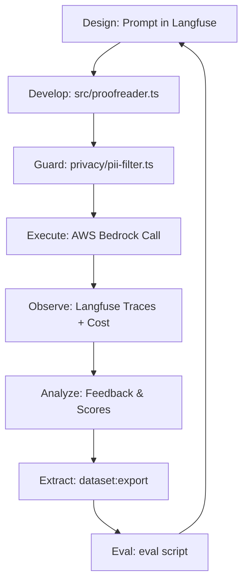

# 🏎️ VEEDS LLMOps Stack

Ein hochmoderner Enterprise-LLMOps-Stack zur Absicherung, Überwachung und kontinuierlichen Verbesserung von Bedrock-basierten LLM-Anwendungen.

---

## 🛠️ NPM Script Referenz

Hier sind alle verfügbaren Befehle und ihr Zweck im LLMOps-Lifecycle:

### **1. Setup & Infrastruktur**
| Befehl | Aktion | Warum? |
| :--- | :--- | :--- |
| `npm run setup` | Führt `./setup.sh` aus | Generiert sichere Secrets für Langfuse und DBs. |
| `npm run up` | `docker compose up -d` | Startet den kompletten Stack (Langfuse, DBs, Presidio). |
| `npm run down` | `docker compose down` | Stoppt alle Dienste und gibt Ressourcen frei. |
| `npm run status` | `docker compose ps` | Zeigt den Gesundheitszustand aller Container an. |
| `npm run health` | `./scripts/health-check.sh` | Prüft, ob APIs (Langfuse, Clickhouse) wirklich antworten. |

### **2. Entwicklung & Kern-Funktion**
| Befehl | Aktion | Warum? |
| :--- | :--- | :--- |
| `npm run build` | `tsc` | Kompiliert TypeScript nach JavaScript (`dist/`). |
| `npm run dev` | `tsx watch src/index.ts` | Startet Entwicklung mit Auto-Reload. |
| `npm run demo` | `npx tsx scripts/demo-proofreader.ts` | **End-to-End Test**: Führt PII-Filter, Bedrock-Call und Cost-Tracking aus. |

### **3. Evaluation & Qualität (Promptfoo)**
| Befehl | Aktion | Warum? |
| :--- | :--- | :--- |
| `npm run eval` | Generiert Tests & führt Eval aus | Prüft Modell-Korrektheit gegen das Golden Dataset. |
| `npm run eval:view` | `promptfoo view` | Startet das Web-Dashboard zum Ergebnisvergleich. |
| `npm run eval:assert` | Eval mit Schwellenwerten | Ideal für CI/CD: bricht bei schlechter Qualität ab. |
| `npm run eval:push` | Sendet Scores an Langfuse | Verknüpft Evaluierungsergebnisse mit Langfuse-Experimenten. |

### **4. Sicherheit & Performance**
| Befehl | Aktion | Warum? |
| :--- | :--- | :--- |
| `npm run redteam` | Startet Promptfoo Red Teaming | Sucht nach PII-Leaks, Injections und Halluzinationen. |
| `npm run test:load` | Führt k6 Lasttest aus | Misst Latenz (p95) und Stabilität unter Last. |
| `npm run test:verify` | `scripts/verify-security.ts` | **Sicherheitscheck**: Validiert PII-Redaction und Injection-Filter. |

### **5. Feedback-Loop & Daten**
| Befehl | Aktion | Warum? |
| :--- | :--- | :--- |
| `npm run dataset:export` | `scripts/export-production-traces.ts` | **Full Circle**: Extrahiert reale Traces als neue Testcases. |
| `npm run dataset:upload`| Lädt Dataset in Langfuse hoch | Macht lokale Testdaten in der Cloud/UI verfügbar. |
| `npm run seed` | Initialisiert Langfuse-Org | Bereitet die DB für den ersten Login vor. |

---

## 🔄 LLMOps Workflow & Datenfluss

### **Der VEEDS "Full Circle" Lifecycle**

### **Datenfluss-Architektur**

1.  **Input**: Ein YAML-Fahrzeugdatensatz kommt rein.
2.  **Privacy**: `pii-filter.ts` sendet den Text an **MS Presidio**. Namen/Telefonnummern werden ersetzt.
3.  **LLM**: Der anonymisierte Text geht an **AWS Bedrock**.
4.  **Monitoring**: `cost-calculator.ts` berechnet Dollar-Kosten basierend auf Token-Usage.
5.  **Observability**: Der Log (Pino) und der Trace (Langfuse) werden mit der gleichen **Trace-ID** gespeichert.
6.  **Refinement**: Fehlerhafte Produktions-Traces werden per `dataset:export` in das `golden_dataset.json` überführt, um die Testabdeckung permanent zu erhöhen.

---

## 📊 Automatisch generierte Dateien

Die folgende Tabelle zeigt, welche Dateien vom System erzeugt werden und warum:

| Pfad | Erzeugt durch | Zweck |
| :--- | :--- | :--- |
| `/dist/` | `npm run build` | Kompilierter Produktionscode. |
| `eval/results/*.json` | `npm run eval` | Rohe Testergebnisse für Historie. |
| `eval/golden_dataset.json`| `npm run eval:generate` | KI-generierte Test-Datenbasis. |
| `promptfoo_data/` | Jede Evaluation | Lokale Cache-DB für schnellere/günstigere Tests. |
| `adversarial_tests.json` | `npm run redteam` | Generierte Angriffs-Vektoren. |
| `package-lock.json` | `npm install` | Fixierte Dependency-Versionen. |

---

## 🚀 Schnellstart-Workflow

Wenn du das System im Alltag nutzt, ist dies dein empfohlener Workflow:

1.  **Infrastruktur starten**: `npm run up`
2.  **Prompt anpassen**: In der Langfuse UI (http://localhost:3000)
3.  **Lokal testen**: `npm run demo` (Prüfe Kosten & PII Schutz)
4.  **Qualität sichern**: `npm run eval` (Prüfe Regressionen)
5.  **Sicherheit prüfen**: `npm run test:verify` (Checke Injections)
6.  **Deploy**: Merge in `main` (CI/CD Automatisierung)

---
© 2026 VEEDS CORP - Advanced LLMOps Infrastructure
