# 🚀 VEEDS LLMOps - Kompletter Workflow Guide

---

## 📊 Gesamtübersicht: Wie alles zusammenhängt

```mermaid
flowchart TB
    subgraph "🔵 Setup (Einmalig)"
        A1[1. docker compose up] --> A2[2. Langfuse Account erstellen]
        A2 --> A3[3. API Keys in .env]
        A3 --> A4[4. npm run seed]
    end

    subgraph "🟢 Development Loop (Täglich)"
        B1[Golden Dataset bearbeiten] --> B2[npm run eval]
        B2 --> B3{Tests OK?}
        B3 -->|Ja| B4[npm run eval:push]
        B3 -->|Nein| B5[Prompt anpassen]
        B5 --> B2
        B4 --> B6[Langfuse Dashboard]
    end

    subgraph "🟠 Security (Wöchentlich)"
        C1[npm run redteam:full] --> C2[Security Report prüfen]
    end

    subgraph "🔴 Performance (Bei Releases)"
        D1[npm run test:load] --> D2[Latency OK?]
        D2 -->|Ja| D3[npm run test:load:stress]
    end

    subgraph "🟣 Observability (Kontinuierlich)"
        E1[npm run tracing:start] --> E2[Jaeger UI]
        E1 --> E3[npm run xray:start]
        E3 --> E4[AWS X-Ray Console]
    end

    subgraph "🔥 Evolution (Advanced)"
        F1[Production Traces] --> F2[npm run dataset:export]
        F2 --> B1
        F3[Presidio PII Protection] --> PF
    end

    A4 --> B1
    B6 --> C1
    C2 --> D1
    E4 --> F1
    F1 --> F3
```



---

## 🎯 Phase 1: Initiales Setup (Einmalig)

```mermaid
sequenceDiagram
    participant DEV as Developer
    participant DOCKER as Docker
    participant LF as Langfuse UI
    participant ENV as .env File

    Note over DEV: Tag 1: Setup

    DEV->>DOCKER: npm run up
    DOCKER-->>DEV: 6 Container starten
    
    DEV->>LF: http://localhost:9222 öffnen
    LF-->>DEV: Login-Screen
    
    DEV->>LF: Account + Org + Projekt erstellen
    LF-->>DEV: API Keys generieren
    
    DEV->>ENV: LANGFUSE_PUBLIC_KEY=pk-lf-...
    DEV->>ENV: LANGFUSE_SECRET_KEY=sk-lf-...
    DEV->>ENV: LANGFUSE_HOST=http://localhost:9222
    
    DEV->>DEV: npm run seed
    Note over DEV: Prompt + Dataset hochgeladen
```



### Befehle:

```bash
# 1. Langfuse Stack starten
npm run up
# Warte bis Container healthy sind
npm run status

# 2. Browser öffnen
start http://localhost:9222

# 3. Account erstellen
# → E-Mail + Passwort eingeben
# → Organisation anlegen (z.B. "VEEDS")
# → Projekt anlegen (z.B. "Proofreader")
# → Settings → API Keys → Create Key → Kopieren

# 4. API Keys in .env eintragen
# LANGFUSE_PUBLIC_KEY=pk-lf-xxxxxxxx
# LANGFUSE_SECRET_KEY=sk-lf-xxxxxxxx
# LANGFUSE_HOST=http://localhost:9222

# 5. Prompts + Dataset hochladen
npm run seed
```

---

## 🧪 Phase 2: Development Workflow (Täglich)

```mermaid
flowchart LR
    subgraph "📋 Single Source of Truth"
        GD[golden_dataset.json<br/>16 Test Cases]
        PT[eval/prompt.txt<br/>Prompt Template]
    end

    subgraph "⚙️ Generierung"
        GEN[generate-promptfoo-tests.ts]
        GD --> GEN
        GEN --> YAML[generated-tests.yaml]
    end

    subgraph "🧪 Evaluation"
        YAML --> PF[Promptfoo eval]
        PT --> PF
        PF --> BED[AWS Bedrock<br/>Claude 3.5 Sonnet]
        BED --> RES[eval-results.json]
    end

    subgraph "📊 Analyse"
        RES --> VIEW[npm run eval:view<br/>Port 3210]
        RES --> PUSH[push-scores-to-langfuse.ts]
        PUSH --> LF[Langfuse Dashboard<br/>Port 9222]
    end
```



### Workflow:

```bash
# Option A: Schnelle Iteration
npm run eval           # Generiert Tests + führt Evaluation aus
npm run eval:view      # Ergebnisse im Browser

# Option B: Mit Langfuse Integration
npm run eval:full      # eval + push zu Langfuse
start http://localhost:9222  # Dashboard öffnen

# Option C: Nur Generierung (für Debugging)
npm run eval:generate  # Nur Tests generieren
cat eval/generated-tests.yaml  # Tests prüfen
```

### Was prüft Promptfoo?


---

## 📦 Phase 3: Dataset Management


### Befehle:

```bash
# Golden Dataset bearbeiten
code eval/golden_dataset.json

# Neue Test Cases generieren (KI)
npm run generate:de

# Rule-based Tests generieren
npx tsx scripts/generate-test-data.ts

# Dataset zu Langfuse hochladen
npm run dataset:upload

# Dann im Browser: Langfuse → Datasets → New Experiment
```

---

## 🔴 Phase 4: Security Testing (Red Team)


### Befehle:

```bash
# Kompletter Security Audit
npm run redteam:full

# Nur Tests (ohne Report)
npm run redteam

# Nur Report
npm run redteam:report

# Ergebnisse anzeigen
npm run eval:view
```

---

## 🏋️ Phase 5: Load Testing

```mermaid
flowchart LR
    subgraph "📊 Szenarien"
        S1[Smoke<br/>1 VU, 10s]
        S2[Default<br/>20 VU, 2min]
        S3[Stress<br/>200 VU, 6min]
        S4[Soak<br/>30 VU, 14min]
    end

    subgraph "🎯 Targets"
        T1[GraphQL API<br/>proofreadYamlEntry]
    end

    subgraph "📈 Metriken"
        M1[p95 Latency]
        M2[Error Rate]
        M3[Throughput]
        M4[Valid/Invalid Ratio]
    end

    S1 --> T1
    S2 --> T1
    S3 --> T1
    S4 --> T1
    T1 --> M1
    T1 --> M2
    T1 --> M3
    T1 --> M4
```



### Befehle:

```bash
# Quick Check (10 Sekunden)
npm run test:load:smoke

# Standard Load Test (2 Minuten)
npm run test:load

# Stress Test (6 Minuten, find breaking point)
npm run test:load:stress

# Soak Test (14 Minuten, Endurance)
k6 run -e K6_SCENARIO=soak tests/load/graphql-test.js
```

### Thresholds:

| Metrik | Target | Failure |
|--------|--------|---------|
| p95 Latency | < 3s | > 5s |
| Error Rate | < 1% | > 5% |
| p99 Latency | < 5s | > 10s |

---

## 🔍 Phase 6: Observability (Tracing)

```mermaid
flowchart TB
    subgraph "🔵 OTEL Sources"
        PF[Promptfoo Eval]
        APP[Proofreader App]
    end

    subgraph "🟢 Local Tracing"
        JAE[Jaeger<br/>Port 16686]
    end

    subgraph "🟠 Grafana Stack"
        TEM[Tempo<br/>Port 3200]
        GRA[Grafana<br/>Port 8222]
        TEM --> GRA
    end

    subgraph "🔴 AWS Cloud"
        ADOT[ADOT Collector]
        XRAY[AWS X-Ray Console]
        ADOT --> XRAY
        ADOT --> JAE
    end

    PF -->|OTLP| JAE
    PF -->|OTLP| ADOT
    APP -->|Langfuse SDK| LF[Langfuse<br/>Port 9222]
```



### Befehle:

```bash
# Option 1: Nur Jaeger (einfach)
npm run tracing:start
npm run eval:astro-tracing
npm run tracing:jaeger   # Browser öffnen

# Option 2: Grafana + Tempo
npm run tempo:start
npm run grafana:open

# Option 3: AWS X-Ray (Dual Export)
eval $(aws configure export-credentials --profile YOUR_PROFILE --format env)
npm run xray:start
npm run eval:astro-dual
# → AWS Console → X-Ray → Traces
```

---

## 🔥 Phase 7: Full Circle Feedback Loop (Data Flywheel)

Der "Full Circle" Workflow ermöglicht es, echte Nutzerinteraktionen aus der Produktion automatisch in Testfälle umzuwandeln.

```mermaid
sequenceDiagram
    participant USER as User
    participant APP as Proofreader App
    participant LF as Langfuse Traces
    participant EXP as Export Script
    participant GD as Golden Dataset
    participant EVAL as npm run eval

    USER->>APP: Schickt YAML
    APP->>LF: Erstellt Trace (mit Trace-ID)
    Note over APP: Structured Log mit Trace-ID gespeichert

    Note over LF: Traces sammeln...

    EXP->>LF: npm run dataset:export
    LF-->>EXP: Holt 50 neueste Traces
    EXP->>GD: Fügt neue Testfälle hinzu
    
    DEV->>EVAL: Regression Testing
    EVAL-->>DEV: Bestätigt Qualität
```



### Befehle:

```bash
# 1. Traces aus Langfuse exportieren und Dataset erweitern
npm run dataset:export

# 2. Golden Dataset prüfen
cat eval/golden_dataset.json

# 3. Evaluation mit neuen Cases starten
npm run eval
```

---

## 🪵 Structured Logging (Pino + Trace-ID)

Das System nutzt einen hochperformanten **Pino-Logger**, der automatisch die **Trace-ID** aus Langfuse in jeden Log-Eintrag injiziert.

### Warum das wichtig ist:
Wenn in den Logs ein Fehler auftaucht, kannst du die Trace-ID kopieren und in Langfuse direkt den gesamten Modell-Call, die Latenz und die Kosten für genau diesen Request sehen.

### Beispiel Log Output:
```json
{"level":30,"time":1738948716200,"msg":"YAML proofreading completed","traceId":"e968f...","userId":"demo-user","processingTimeMs":1420}
```

---

## 🔄 Kompletter End-to-End Workflow

```mermaid
flowchart TB
    subgraph "📅 Täglich"
        D1[1. Golden Dataset prüfen/erweitern]
        D2[2. npm run eval]
        D3[3. Fehler fixen]
        D4[4. npm run eval:push]
        D1 --> D2 --> D3 --> D2
        D2 -->|OK| D4
    end

    subgraph "📅 Wöchentlich"
        W1[1. npm run redteam:full]
        W2[2. Security Issues fixen]
        W3[3. npm run test:load]
        W4[4. Performance optimieren]
        W1 --> W2 --> W3 --> W4
    end

    subgraph "📅 Bei Release"
        R1[1. npm run test:load:stress]
        R2[2. Langfuse Experiments vergleichen]
        R3[3. Prompt Version promoten]
        R4[4. Git Tag + Deploy]
        R1 --> R2 --> R3 --> R4
    end

    D4 --> W1
    W4 --> R1
```



---

## 🎯 Quick Reference: Alle Befehle

### Setup
```bash
npm run up              # Docker starten
npm run seed            # Prompts + Dataset hochladen
npm run status          # Container Status
npm run health          # Health Check
```

### Evaluation
```bash
npm run eval            # Standard Evaluation
npm run eval:view       # Ergebnisse anzeigen
npm run eval:full       # Eval + Langfuse Push
npm run eval:assert     # CI Mode (Exit 1 bei Failure)
```

### Dataset
```bash
npm run dataset:upload  # Zu Langfuse hochladen
npm run generate:de     # Deutsche Tests generieren
npm run eval:generate   # Promptfoo Tests generieren
```

### Security
```bash
npm run redteam         # Red Team Tests
npm run redteam:full    # Tests + Report + Viewer
```

### Performance
```bash
npm run test:load:smoke  # 10s Smoke Test
npm run test:load        # 2min Standard
npm run test:load:stress # 6min Stress
```

### Tracing
```bash
npm run tracing:start    # Jaeger starten
npm run tracing:jaeger   # Jaeger UI öffnen
npm run xray:start       # AWS X-Ray aktivieren
npm run tempo:start      # Grafana Tempo starten
```

### Logs & Debug
```bash
npm run logs            # Alle Container Logs
npm run logs:web        # Nur Langfuse Web
npm run cache:clear     # Promptfoo Cache löschen
```

---

## 🌐 Port Übersicht

| Service | Port | URL | Wann nutzen |
|---------|------|-----|-------------|
| **Langfuse** | 9222 | http://localhost:9222 | Immer |
| **Promptfoo UI** | 3210 | http://localhost:3210 | Nach eval |
| **Jaeger** | 16686 | http://localhost:16686 | Für Tracing |
| **Grafana** | 8222 | http://localhost:8222 | Dashboards |
| **MinIO** | 9223 | http://localhost:9223 | Blob Storage |

---

## ✅ Checkliste: Täglicher Workflow

- [ ] `npm run up` - Docker läuft?
- [ ] `npm run status` - Alle Container healthy?
- [ ] Golden Dataset aktualisiert?
- [ ] `npm run eval` - Alle Tests grün?
- [ ] `npm run eval:push` - Scores in Langfuse?
- [ ] Langfuse Dashboard gecheckt?

## ✅ Checkliste: Vor Release

- [ ] `npm run redteam:full` - Security OK?
- [ ] `npm run test:load:stress` - Performance OK?
- [ ] Langfuse Experiments verglichen?
- [ ] Prompt Version auf "production" gelabelt?
- [ ] Git Tag erstellt?

---

## 🛡️ Phase 8: PII Protection (Microsoft Presidio)

Das System schützt automatisch sensible Daten (Namen, Orte, Telefonnummern), bevor sie an die Cloud-KI gesendet werden.

### Workflow:
1. **Analyze**: Microsoft Presidio Analyzer nutzt ein deutsches spaCy Modell, um Entitäten zu finden.
2. **Anonymize**: Der Anonymizer ersetzt diese Daten durch Platzhalter wie `<PERSON>`.
3. **Trace Update**: Das anonymisierte YAML wird in Langfuse als Input gespeichert, sodass keine Klardaten die Datenbank verlassen.

### Befehle:
```bash
# Services starten
docker-compose up -d presidio-analyzer presidio-anonymizer

# Test mit PII
npm run demo # Prüfe Traces in Langfuse auf <PERSON> Tags
```
