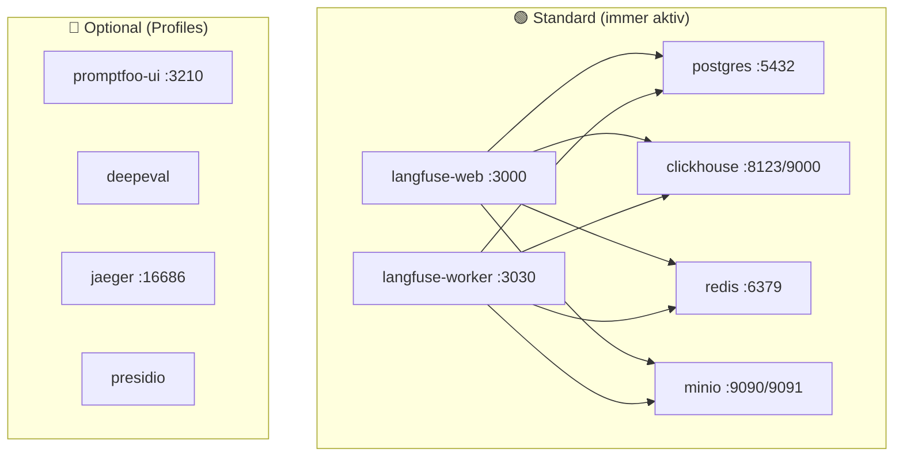

# VEEDS LLMOps - Docker Compose Container-Übersicht

**Stand:** 2026-02-08  
**Quelle:** [docker-compose.yml](file:///c:/Dev/ai/projects/llmqu/llm-toolkit/veeds-llmops/docker-compose.yml)

---

## 📋 Inhaltsverzeichnis

1. [Übersicht](#übersicht)
2. [Langfuse Stack (6 Container)](#langfuse-stack-6-container)
3. [Promptfoo Services (5 Container)](#promptfoo-services-5-container)
4. [Observability Stack (6 Container)](#observability-stack-6-container)
5. [Security & Privacy (2 Container)](#security--privacy-2-container)
6. [DeepEval (2 Container)](#deepeval-2-container)
7. [Profiles & Verwendung](#profiles--verwendung)
8. [Port-Übersicht](#port-übersicht)

---

## 📊 Übersicht

**Gesamt: 21 Container** (6 immer aktiv, 15 optional via Profiles)



---

## 🟢 Langfuse Stack (6 Container)

Diese Container laufen **immer** mit `docker compose up -d`.

### 1. **langfuse-web** 
**Image:** `langfuse/langfuse:3`  
**Port:** `3000` (extern erreichbar)  
**Rolle:** Hauptanwendung - Web UI + REST API

**Funktionen:**
- 🌐 Web-Interface für Langfuse Dashboard
- 📡 REST API für SDK-Ingestion (`/api/public/ingestion`)
- 📝 Prompt Management (Versionen, Labels)
- 📊 Dataset Management
- 👥 User & Organization Management

**Abhängigkeiten:**
- PostgreSQL (Metadaten)
- ClickHouse (Traces lesen)
- Redis (Event Queue)
- MinIO (Blob Storage)

**Health Check:** `http://localhost:3000/api/public/health`

---

### 2. **langfuse-worker**
**Image:** `langfuse/langfuse-worker:3`  
**Port:** `3030` (nur localhost)  
**Rolle:** Asynchrone Event-Verarbeitung

**Funktionen:**
- 📥 Liest Events aus Redis Queue
- 📦 Liest Event-Payloads aus MinIO
- 🔄 Verarbeitet und aggregiert Traces
- 💾 Schreibt Traces in ClickHouse
- 💰 Berechnet Kosten

**Workflow:**
```
SDK → langfuse-web → Redis Queue → langfuse-worker → ClickHouse
```

---

### 3. **postgres**
**Image:** `postgres:16-alpine`  
**Port:** `5432` (nur localhost)  
**Rolle:** Transaktionale Datenbank (ACID)

**Speichert:**
- 👥 Users, Organizations, Projects
- 🔑 API Keys
- 📝 Prompt-Versionen
- 📋 Dataset-Metadaten

**Volume:** `langfuse_postgres_data`

---

### 4. **clickhouse**
**Image:** `clickhouse/clickhouse-server:24.3`  
**Ports:** `8123` (HTTP), `9000` (Native)  
**Rolle:** OLAP-Datenbank für Analytics

**Speichert:**
- 🔍 Traces (Execution Records)
- 📊 Observations (Spans, Generations)
- 📈 Scores (Metrics)

**Warum ClickHouse?**
- Spaltenorientiert → 10-100x schneller für Analytics
- Optimiert für Time-Series-Daten
- Effiziente Aggregationen

**Volumes:**
- `langfuse_clickhouse_data` (Daten)
- `langfuse_clickhouse_logs` (Logs)

---

### 5. **redis**
**Image:** `redis:7-alpine`  
**Port:** `6379` (nur localhost)  
**Rolle:** Message Queue + Cache

**Funktionen:**
- 📬 Event Queue (Web → Worker)
- 🚀 Client-Side Cache (Prompts, etc.)
- ⚙️ Konfiguration: 256MB LRU (Least Recently Used)

**Volume:** `langfuse_redis_data`

---

### 6. **minio**
**Image:** `minio/minio`  
**Ports:** `9090` (S3 API), `9091` (Console)  
**Rolle:** S3-kompatible Blob Storage

**Speichert:**
- 📦 Event-Payloads (von SDK)
- 🖼️ Media Uploads
- 📁 Bucket: `langfuse`

**Volume:** `langfuse_minio_data`

---

## 🧪 Promptfoo Services (5 Container)

Alle Promptfoo-Container sind **optional** und werden via Profiles aktiviert.

### 7. **promptfoo-ui**
**Image:** `ghcr.io/promptfoo/promptfoo:latest`  
**Port:** `3210`  
**Profile:** `llm-eval-observability-toolkit`  
**Rolle:** Web-UI für Evaluation-Ergebnisse

**Verwendung:**
```bash
docker compose --profile llm-eval-observability-toolkit up -d promptfoo-ui
# → http://localhost:3210
```

---

### 8. **eval** (promptfoo-eval)
**Image:** `ghcr.io/promptfoo/promptfoo:latest`  
**Profile:** `eval`  
**Rolle:** Führt Promptfoo-Evaluationen aus

**Volumes:**
- `./promptfooconfig.yaml` (Config)
- `./datasets` (Test-Daten)
- `~/.aws` (AWS Credentials für Bedrock)

**Verwendung:**
```bash
docker compose --profile eval run --rm eval
```

---

### 9. **eval-traced**
**Image:** `ghcr.io/promptfoo/promptfoo:latest`  
**Profile:** `tracing`  
**Rolle:** Evaluation mit OpenTelemetry Tracing

**Zusätzlich:**
- Sendet Traces an Jaeger (`OTEL_EXPORTER_OTLP_ENDPOINT`)
- Verwendet spezielle Config mit Tracing

---

### 10. **redteam**
**Image:** `ghcr.io/promptfoo/promptfoo:latest`  
**Profile:** `redteam`  
**Rolle:** Security Red Team Tests

**Tests:**
- 🔓 Prompt Injection
- 🚫 Jailbreaking
- 🔐 PII Leakage
- 💭 Hallucination

**Verwendung:**
```bash
docker compose --profile redteam run --rm redteam
```

---

### 11. **redteam-report**
**Image:** `ghcr.io/promptfoo/promptfoo:latest`  
**Profile:** `report`  
**Rolle:** Generiert Security-Report aus Red Team Ergebnissen

---

## 🔭 Observability Stack (6 Container)

Alle für **Distributed Tracing** und **Monitoring**.

### 12. **jaeger**
**Image:** `jaegertracing/all-in-one:1.54`  
**Ports:** `16686` (UI), `4317` (OTLP gRPC), `4318` (OTLP HTTP)  
**Profile:** `tracing`, `llm-eval-observability-toolkit`  
**Rolle:** Distributed Tracing UI

**Verwendung:**
```bash
docker compose --profile tracing up -d
# → http://localhost:16686
```

---

### 13. **tempo**
**Image:** `grafana/tempo:2.3.1`  
**Port:** `3200` (HTTP API)  
**Profile:** `tempo`  
**Rolle:** Scalable Tracing Backend (Alternative zu Jaeger)

**Wann verwenden:** Für größere Deployments mit hohem Trace-Volumen

---

### 14. **grafana**
**Image:** `grafana/grafana:10.3.1`  
**Port:** `8222` (konfigurierbar via `GRAFANA_PORT`)  
**Profile:** `monitor`  
**Rolle:** Dashboards & Visualisierung

**Login:** `admin` / `admin`

---

### 15. **otel-collector**
**Image:** `otel/opentelemetry-collector-contrib:0.93.0`  
**Ports:** `4321` (gRPC), `4322` (HTTP), `8888` (Metrics)  
**Profile:** `collector`, `llm-eval-observability-toolkit`  
**Rolle:** OpenTelemetry Collector (Trace-Routing)

**Use Case:** Komplexe Setups mit mehreren Backends

---

### 16. **adot-collector**
**Image:** `amazon/aws-otel-collector:v0.40.0`  
**Ports:** `4317` (gRPC), `4318` (HTTP)  
**Profile:** `xray`  
**Rolle:** AWS Distro für OpenTelemetry

**Funktionen:**
- Exportiert Traces zu **AWS X-Ray**
- Gleichzeitig zu **Jaeger**

**Voraussetzung:** AWS Credentials als Env-Vars

---

### 17. **jaeger-backend**
**Image:** `jaegertracing/all-in-one:1.54`  
**Port:** `16686` (UI)  
**Profile:** `xray`  
**Rolle:** Jaeger Query/UI für ADOT-Setup

---

## 🛡️ Security & Privacy (2 Container)

### 18. **presidio-analyzer**
**Image:** `mcr.microsoft.com/presidio-analyzer:latest`  
**Port:** `5001`  
**Rolle:** PII-Erkennung (Analyzer)

**Funktionen:**
- 🔍 Erkennt PII in Text (Namen, Adressen, Telefonnummern)
- 🇩🇪 Deutsche Sprache unterstützt
- 📋 Konfiguration via `languages-config.yml`

---

### 19. **presidio-anonymizer**
**Image:** `mcr.microsoft.com/presidio-anonymizer:latest`  
**Port:** `5003`  
**Rolle:** PII-Anonymisierung

**Funktionen:**
- 🔒 Ersetzt erkannte PII mit Platzhaltern
- 🎭 Verschiedene Anonymisierungs-Strategien

**Workflow:**
```
Text → presidio-analyzer → PII-Entities → presidio-anonymizer → Anonymisierter Text
```

---

## 🔬 DeepEval (2 Container)

### 20. **deepeval**
**Image:** `python:3.10-slim`  
**Profile:** `deepeval`  
**Rolle:** Führt DeepEval-Tests aus

**Metriken:**
- 📊 Faithfulness (Hallucination-Check)
- 🎯 Answer Relevancy
- 📈 Contextual Precision/Recall

**Verwendung:**
```bash
docker compose --profile deepeval run --rm deepeval
```

---

### 21. **deepeval-ui**
**Image:** `python:3.10-slim`  
**Port:** `8080`  
**Profile:** `deepeval-ui`  
**Rolle:** DeepEval Dashboard (Streamlit)

**Verwendung:**
```bash
docker compose --profile deepeval-ui up
# → http://localhost:8080
```

---

## 🎯 Profiles & Verwendung

### Standard (ohne Profile)
```bash
docker compose up -d
```
**Startet:** Langfuse Stack (6 Container)

### Mit Promptfoo UI
```bash
docker compose --profile llm-eval-observability-toolkit up -d
```
**Zusätzlich:** promptfoo-ui, jaeger, otel-collector

### Evaluation ausführen
```bash
docker compose --profile eval run --rm eval
```

### Red Team Tests
```bash
docker compose --profile redteam run --rm redteam
```

### DeepEval
```bash
docker compose --profile deepeval run --rm deepeval
```

### Tracing (Jaeger)
```bash
docker compose --profile tracing up -d
```
**Zusätzlich:** jaeger

### Monitoring (Grafana + Tempo)
```bash
docker compose --profile monitor up -d
```
**Zusätzlich:** grafana, tempo

---

## 🌐 Port-Übersicht

| Service | Port | Zugriff | Beschreibung |
|---------|------|---------|--------------|
| **Langfuse Web** | 3000 | Extern | Langfuse Dashboard |
| **Langfuse Worker** | 3030 | Localhost | Worker Health |
| **PostgreSQL** | 5432 | Localhost | Datenbank |
| **ClickHouse HTTP** | 8123 | Localhost | ClickHouse API |
| **ClickHouse Native** | 9000 | Localhost | ClickHouse Native |
| **Redis** | 6379 | Localhost | Redis |
| **MinIO S3** | 9090 | Extern | S3 API |
| **MinIO Console** | 9091 | Localhost | MinIO UI |
| **Promptfoo UI** | 3210 | Extern | Evaluation Results |
| **Jaeger UI** | 16686 | Extern | Tracing UI |
| **Jaeger OTLP gRPC** | 4317 | Extern | Trace Ingestion |
| **Jaeger OTLP HTTP** | 4318 | Extern | Trace Ingestion |
| **Grafana** | 8222 | Extern | Dashboards |
| **Tempo** | 3200 | Extern | Tempo API |
| **Presidio Analyzer** | 5001 | Extern | PII Detection |
| **Presidio Anonymizer** | 5003 | Extern | PII Anonymization |
| **DeepEval UI** | 8080 | Extern | DeepEval Dashboard |

---

## 💾 Volumes

| Volume | Zweck |
|--------|-------|
| `langfuse_postgres_data` | PostgreSQL Daten |
| `langfuse_clickhouse_data` | ClickHouse Daten |
| `langfuse_clickhouse_logs` | ClickHouse Logs |
| `langfuse_redis_data` | Redis Persistence |
| `langfuse_minio_data` | MinIO Blob Storage |
| `tempo-data` | Tempo Traces |
| `grafana-data` | Grafana Dashboards |

---

## 🔄 Typische Workflows

### Komplettes Setup
```bash
# 1. Langfuse Stack starten
docker compose up -d

# 2. Warten bis healthy
docker compose ps

# 3. Langfuse seeden
npm run seed

# 4. Promptfoo UI starten (optional)
docker compose --profile llm-eval-observability-toolkit up -d
```

### Evaluation mit Tracing
```bash
# 1. Tracing-Stack starten
docker compose --profile tracing up -d

# 2. Evaluation mit Tracing ausführen
docker compose --profile tracing run --rm eval-traced

# 3. Traces ansehen
# → http://localhost:16686 (Jaeger)
```

### Security Audit
```bash
# Red Team Tests ausführen
docker compose --profile redteam run --rm redteam

# Report generieren
docker compose --profile report run --rm redteam-report
```

---

## 🗑️ Cleanup

```bash
# Container stoppen
docker compose down

# Container + Volumes löschen (⚠️ Datenverlust!)
docker compose down -v

# Nur bestimmte Profile stoppen
docker compose --profile tracing down
```

---

**Letzte Aktualisierung:** 2026-02-08  
**Quelle:** [docker-compose.yml](file:///c:/Dev/ai/projects/llmqu/llm-toolkit/veeds-llmops/docker-compose.yml)
