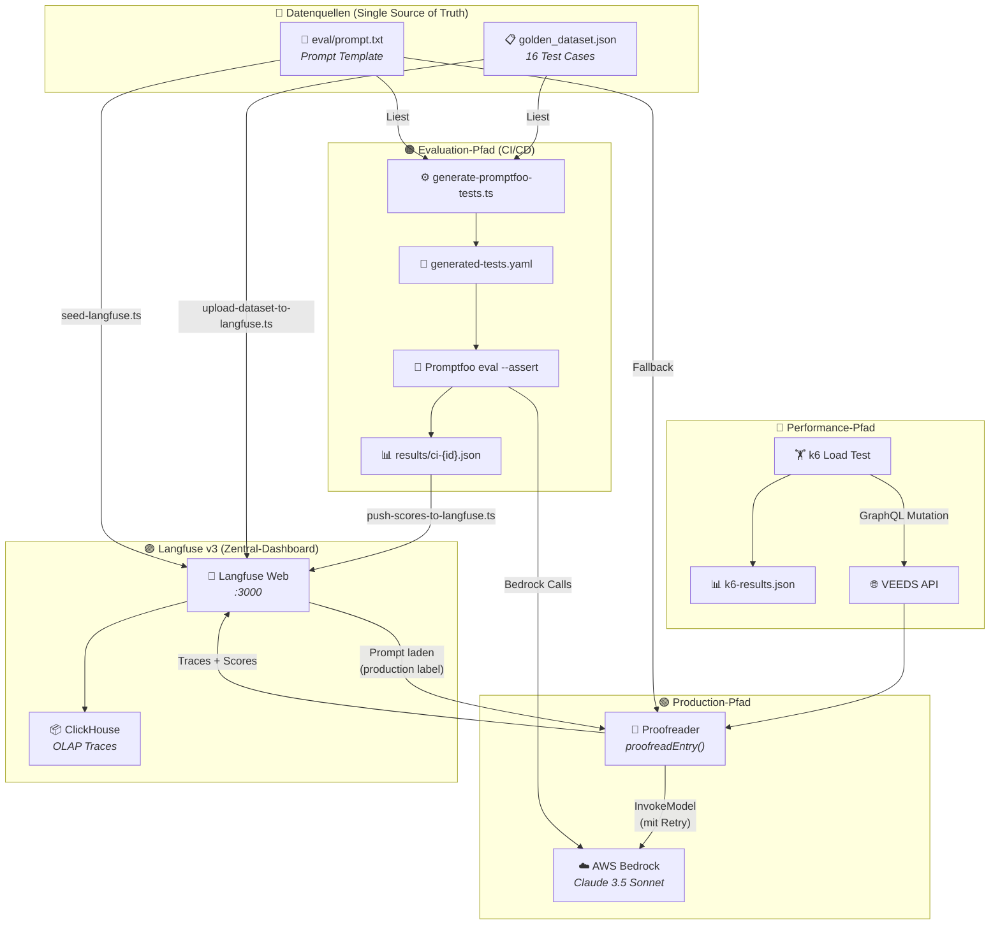
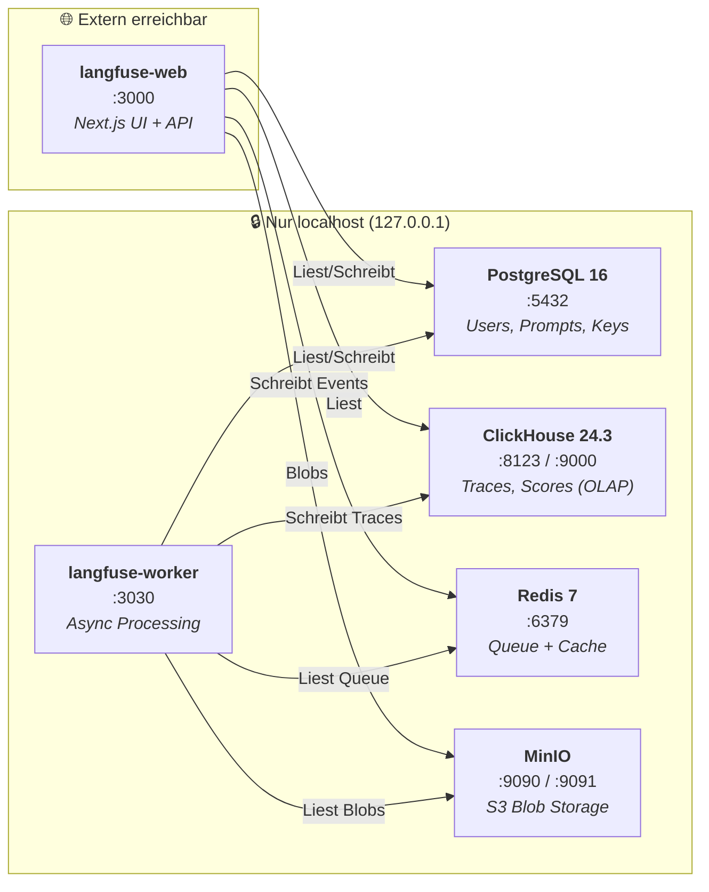
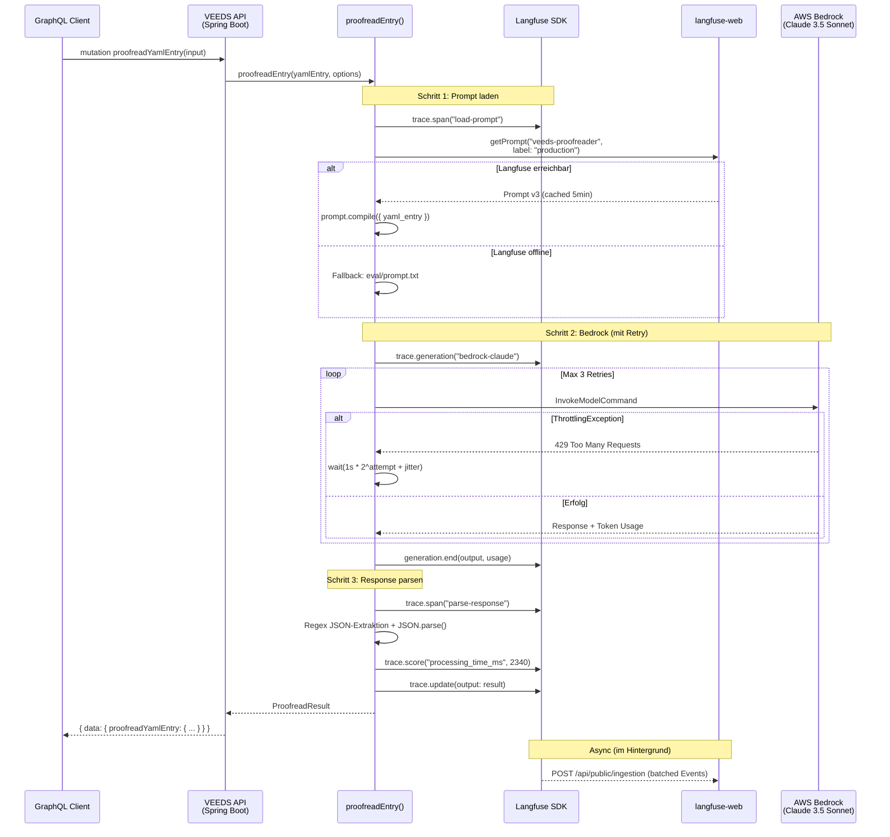
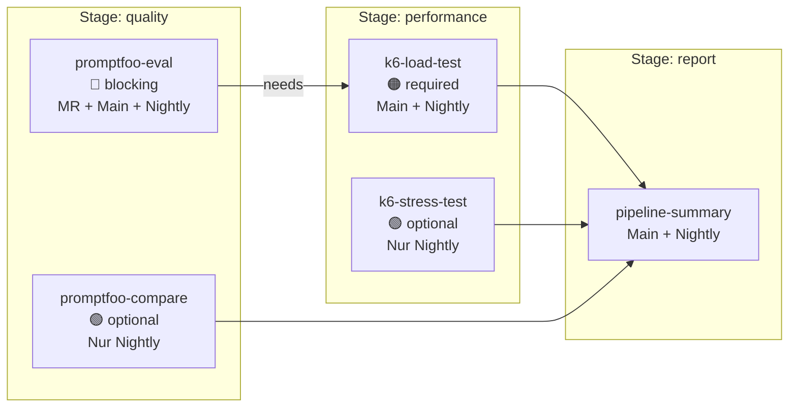

# VEEDS LLMOps - Workflow & Architektur-Übersicht

**Stand:** 2026-02-08  
**Version:** 2.0 (Nach Cleanup)  
**Stack:** Langfuse v3 · Promptfoo · DeepEval · k6 · AWS Bedrock · GitLab CI/CD

---

## 📚 Gültige Dokumentationen

Diese Dokumentationen sind aktuell und sollten als Referenz verwendet werden.

### 1. 📖 [README.md](file:///c:/Dev/ai/projects/llmqu/llm-toolkit/veeds-llmops/README.md)
**Status:** ✅ **Hauptdokumentation - IMMER AKTUELL**

**Inhalt:**
- Komplette Step-by-Step Anleitung
- Setup und Dependencies
- Alle npm-Scripts erklärt
- Tier 2+ Features (DeepEval, Arena Battles, Prompt Sync)
- Troubleshooting Guide
- Projektstruktur-Übersicht

**Wann verwenden:** Als erste Anlaufstelle für alle Fragen

---

### 2. 🧪 [TEST-DATA-GENERATION.md](file:///c:/Dev/ai/projects/llmqu/llm-toolkit/veeds-llmops/docs/TEST-DATA-GENERATION.md)
**Status:** ✅ **Technische Referenz**

**Inhalt:**
- Automatische Test-Generierung im Detail
- Fuzzing-Techniken
- Validation-Prozess
- CI/CD Integration
- Troubleshooting für Test-Generierung

**Wann verwenden:** Bei Arbeit an Test-Generierung oder Debugging von Tests

---

### 3. 🏗️ [GOLDEN-DATASET-ARCHITECTURE.md](file:///c:/Dev/ai/projects/llmqu/llm-toolkit/veeds-llmops/docs/GOLDEN-DATASET-ARCHITECTURE.md)
**Status:** ✅ **Architektur-Referenz**

**Inhalt:**
- Vollständige Architektur des Golden Dataset Systems
- Mermaid-Diagramme für Datenfluss
- Promptfoo Integration Details
- Langfuse Integration Details
- CI/CD Pipeline-Erklärung

**Wann verwenden:** Für tiefes Verständnis der Test-Architektur

---

### 4. 💰 [COST_ALERTING_IMPLEMENTATION_SUMMARY.md](file:///c:/Dev/ai/projects/llmqu/llm-toolkit/veeds-llmops/docs/COST_ALERTING_IMPLEMENTATION_SUMMARY.md)
**Status:** ✅ **Feature-Dokumentation**

**Inhalt:**
- Cost Tracking Implementation
- Monitoring und Alerting
- Budget-Management

**Wann verwenden:** Bei Arbeit an Cost-Tracking Features

---

### 5. 🏛️ [veeds-llmops-architecture-detail.md](file:///c:/Dev/ai/projects/llmqu/llm-toolkit/veeds-llmops/docs/veeds-llmops-architecture-detail.md)
**Status:** ✅ **Architektur-Details**

**Inhalt:**
- Detaillierte System-Architektur
- Komponenten-Übersicht
- Integration-Patterns

**Wann verwenden:** Für System-Design und Architektur-Entscheidungen

---

### 6. 📝 [walkthrough.md](file:///c:/Dev/ai/projects/llmqu/llm-toolkit/veeds-llmops/docs/walkthrough.md)
**Status:** ✅ **Projekt-Walkthrough**

**Inhalt:**
- Projekt-Übersicht
- Implementierungs-Historie
- Meilensteine

**Wann verwenden:** Für Onboarding neuer Team-Mitglieder

---

## 🏗️ System-Architektur

### Gesamtarchitektur

Der VEEDS LLMOps Stack hat drei Hauptpfade: **Production** (Echtzeit-Tracing), **Evaluation** (Qualitätssicherung im CI) und **Performance** (Lasttests). Alle drei konvergieren in Langfuse als zentralem Dashboard.



> **💡 Kernprinzip: Single Source of Truth**  
> Alle Test Cases leben in `golden_dataset.json`. Alle Prompts leben in `eval/prompt.txt` (lokal) bzw. Langfuse (remote). Nirgends im System wird ein Test Case oder Prompt dupliziert.

---

## 🐳 Docker Infrastruktur (6 Container)



### Container-Details

| Container | Image | Port | Rolle | RAM (idle) |
|---|---|---|---|---|
| `langfuse-web` | `langfuse/langfuse:3` | 3000 (extern) | Web UI, REST API, Trace-Empfang, Prompt-Mgmt | ~300 MB |
| `langfuse-worker` | `langfuse/langfuse-worker:3` | 3030 (localhost) | Queue-Processing, ClickHouse-Writes | ~200 MB |
| `langfuse-postgres` | `postgres:16-alpine` | 5432 (localhost) | ACID: Users, Orgs, Projects, API Keys, Prompts | ~100 MB |
| `langfuse-clickhouse` | `clickhouse/clickhouse-server:24.3` | 8123+9000 (localhost) | OLAP: Traces, Observations, Scores | ~200 MB |
| `langfuse-redis` | `redis:7-alpine` | 6379 (localhost) | Message Queue + Client Cache, 256MB LRU | ~30 MB |
| `langfuse-minio` | `minio/minio` | 9090+9091 (localhost) | S3 Blob Storage für Event-Payloads | ~50 MB |

---

## 🔄 Production-Request Workflow



---

## 🧪 GitLab CI/CD Pipeline

### Pipeline-Übersicht



### Pipeline-Trigger-Matrix

| Event | promptfoo-eval | promptfoo-compare | k6-load | k6-stress | summary |
|---|---|---|---|---|---|
| Merge Request erstellt/updated | ✅ **blocking** | — | — | — | — |
| Push auf `main` | ✅ **blocking** | — | ✅ nach eval | — | ✅ |
| Nightly Schedule | ✅ **blocking** | ✅ optional | ✅ nach eval | ✅ optional | ✅ |

> **Warum der k6-Job von promptfoo-eval abhängt**  
> Der k6-Load-Test hat `needs: [promptfoo-eval]`. Dadurch wird sichergestellt, dass Lasttests nur laufen, wenn die Qualität stimmt.

---

## 📊 Wo landen die Ergebnisse?

| Was suche ich? | Wo finde ich es? | Format |
|---|---|---|
| Ist mein MR-Prompt korrekt? | GitLab MR → Pipeline Status | ✅/❌ auf dem MR |
| Welche Tests sind fehlgeschlagen? | GitLab → Pipeline → Artefakt `ci-{id}.json` | JSON mit Assertion-Details |
| Wie ist die Pass-Rate über Zeit? | Langfuse → Scores → `eval_pass_rate` filtern | Score-Graph (Trend) |
| Was kostet ein Prompt pro Call? | Langfuse → Traces → Generation → Usage | Input/Output Tokens + USD |
| Wie schnell ist die API unter Last? | GitLab MR → Load Performance Tab | p95/p99 Vergleich |
| Sonnet vs. Haiku Qualität? | Langfuse → Datasets → Experiments | Side-by-side Vergleich |
| Trace eines Production-Requests? | Langfuse → Traces → Filter by Tag/User | Waterfall mit Spans |
| Prompt-History & Label-Zuordnung? | Langfuse → Prompts → veeds-proofreader | Versionsliste |

---

## 🗑️ Gelöschte Dokumentationen

Die folgenden Dateien wurden entfernt, da sie veraltet oder redundant waren:

### Historische Planungsdokumente (Implementiert)
- ❌ `implementation_plan.md` - Tier 1 Features sind implementiert
- ❌ `deepeval-integration-plan.md` - DeepEval ist integriert
- ❌ `deepeval-tasks.md` - Tasks sind abgeschlossen

### Veraltete Guides (Ersetzt durch README.md)
- ❌ `veeds-llmops-guide.md` - Veraltete Ports und fehlende Features
- ❌ `complete-workflow.md` - Redundant zu README.md
- ❌ `PROMPTFOO-TEST-GENERATION.md` - Redundant zu TEST-DATA-GENERATION.md

### Historische Reports
- ❌ `codebase-prime-report.md` - Historischer Snapshot
- ❌ `llmops-evolution-report.md` - Historischer Bericht

---

## 🎯 Dokumentations-Hierarchie

```
📖 README.md (Start hier!)
    ├── 🧪 TEST-DATA-GENERATION.md (Für Test-Details)
    ├── 🏗️ GOLDEN-DATASET-ARCHITECTURE.md (Für Architektur-Details)
    ├── 💰 COST_ALERTING_IMPLEMENTATION_SUMMARY.md (Für Cost-Features)
    ├── 🏛️ veeds-llmops-architecture-detail.md (Für System-Design)
    └── 📝 walkthrough.md (Für Projekt-Historie)
```

---

## 📋 Quick Reference

### Für Entwickler (Neu im Projekt)
1. Start: [README.md](file:///c:/Dev/ai/projects/llmqu/llm-toolkit/veeds-llmops/README.md)
2. Dann: [walkthrough.md](file:///c:/Dev/ai/projects/llmqu/llm-toolkit/veeds-llmops/docs/walkthrough.md)
3. Bei Bedarf: Spezifische Docs aus der Liste oben

### Für Test-Engineering
1. [TEST-DATA-GENERATION.md](file:///c:/Dev/ai/projects/llmqu/llm-toolkit/veeds-llmops/docs/TEST-DATA-GENERATION.md)
2. [GOLDEN-DATASET-ARCHITECTURE.md](file:///c:/Dev/ai/projects/llmqu/llm-toolkit/veeds-llmops/docs/GOLDEN-DATASET-ARCHITECTURE.md)

### Für Architektur-Entscheidungen
1. [GOLDEN-DATASET-ARCHITECTURE.md](file:///c:/Dev/ai/projects/llmqu/llm-toolkit/veeds-llmops/docs/GOLDEN-DATASET-ARCHITECTURE.md)
2. [veeds-llmops-architecture-detail.md](file:///c:/Dev/ai/projects/llmqu/llm-toolkit/veeds-llmops/docs/veeds-llmops-architecture-detail.md)

---

## ✅ Wartungs-Richtlinien

### Bei Feature-Änderungen
1. **IMMER** `README.md` aktualisieren
2. Relevante technische Docs aktualisieren
3. Veraltete Docs löschen oder archivieren

### Quarterly Review
- Alle Docs auf Aktualität prüfen
- Veraltete Inhalte entfernen
- Neue Features dokumentieren

### Neue Dokumentation erstellen
- Nur wenn README.md nicht ausreicht
- Fokus auf technische Details
- Immer auf README.md verweisen

---

## 📞 Dokumentations-Support

**Fragen zur Dokumentation?**
1. Prüfe zuerst [README.md](file:///c:/Dev/ai/projects/llmqu/llm-toolkit/veeds-llmops/README.md)
2. Suche in den spezifischen Docs
3. Bei Unklarheiten: Issue erstellen

**Dokumentation veraltet?**
1. Issue mit "docs" Label erstellen
2. Konkrete Änderungsvorschläge machen
3. Pull Request mit Updates

---

**Letzte Aktualisierung:** 2026-02-08  
**Nächster Review:** 2026-05-08 (Quarterly)
